## __🚀 01. 추천시스템 Basic__
<br>

### __🦖 (1) 추천 시스템이란__

### __☑ 추천 시스템의 필요성__  
* 과거에는 유저가 접할 수 있는 상품 및 컨텐츠가 제한적이였는데,  
  웹/모바일 환경이 활성화 되면서 다양한 상품 및 컨텐츠가 등장하게 됨  
    ( 정보의 부족 -> 풍요, Few Popular items -> Long Tail Phenomenon )  
* 하지만 이로 인해 정보를 찾는 데 시간이 오래 걸리게 되는 문제가 발생함  
  ( 유저가 원하는 걸 어떤 키워드로 찾아야 하는지 모를 수 있음 )  
<br>

### __☑ Long-Tail Recommendation__
* 추천 시스템의 본질 중 하나임
* Long-Tail Recommendation이 잘 될수록 사용자는 개인화 추천이 잘 된다고 느낌  
  ex)  
  __유튜브 동영상 추천__  
  : 조회수가 급상승한 영상이 등장할 경우, 해당 영상과 관련이 있거나 / 해당 영상이 업로드 되어 있는 채널의 영상을 추천함 ( 조회수가 적은 경우에도! )  
  __SNS 친구 추천__  
  : 수천만 혹은 수십억명의 유저들 가운데 내가 알만한 사람들을 추천  
  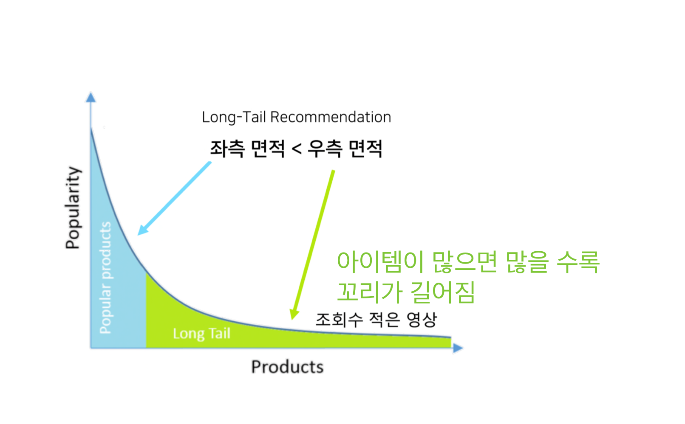
<br>

### __☑ 추천 시스템에서 사용하는 정보__  
__1. 유저 관련 정보__  
  * User profile: 유저와 관련된 설정 및 정보의 모음, 추천 대상 유저에 관련된 정보를 구축하여 개별 유저 혹은 유저 그룹별로 추천함(User profiling)  
  * Identifier(식별자): 유저ID, 디바이스 ID, 브라우저 쿠키  
  * Demographic 정보: 인구에 대한 통계학적 정보 ( 성별, 연령, 지역, 관심사 ) 
  * 유저 행동 정보: 페이지 방문 기록, 아이템 평가, 구매 등의 피드백 기록  
  > : 요즘에는 개인정보 수집이 까다롭기 때문에 이런 정보를 유저로부터 직접 받는게 어려워져서 사용자의 성별이나 연령은 추정을 통해 생성해서 추천에 활용하기도 함

  > 브라우저 쿠키(웹 쿠키, HTTP 쿠키)  
  > : 인터넷 웹사이트의 방문 기록을 남겨 사용자와 웹사이트 사이를 매개해주는 정보.  
  >  이 기록 파일에 담긴 정보는 인터넷 사용자가 같은 웹사이트를 방문할 때마다 읽히고 수시로 새로운 정보로 바뀜  
<br>

__2. 아이템 관련 정보__  
  * Item profile: 아이템과 관련된 정보의 모음
  * Item ID: 아이템 정보 가운데 가장 중요한 데이터,  
    추천을 수행하는 서비스에서 제공하는 ID이며 아이템ID 없이는 추천을 수행할 수가 없음  
  * 아이템의 고유 정보  
    : 상품 ( 상품 카테고리, 브랜드, 출시일, 상품 이미지 )  
    : 영화 ( 영화 장르, 출연 배우 및 감독, 영화 소개글, 개봉년도 )  
    : 음악 ( 아티스트, 작곡가, 장르, 음악, 신호 그 자체 )  
  * 추천 아이템의 종류  
    : 포탈 ( 뉴스, 블로그, 웹툰 등 컨텐츠 추천 )  
    : 광고/커머스 ( 광고 소재, 상품 추천 )  
    : 미디어 ( 영화, 음악, 동영상 추천 )  

  > 이러한 아이템 관련 정보들은 아이템ID 외에는 추천하는 아이템 별로 크게 다르기 때문에 보통 추천시스템에서는 공통으로 아이템ID를 사용하고 그 외에 다른 정보는 추천의 케이스와 서비스마다 사용하는 방법이 크게 달라지게 됨
<br>

__3. 유저-아이템 상호작용 정보(유저가 소비하는 아이템 정보)__  
  * __Explicit Feedback__  
    : 유저에게 아이템에 대한 만족도를 직접 물어본 경우  
      ( ex. 영화에 대한 1~5점 사이의 평점 )
  * __Implicit Feedback__  
    : 유저가 아이템을 클릭하거나 구매한 경우  
      ( ex. 쿠팡에서 유저가 상품을 구매하면 implicit feedback = Y )  
    : Explicit Feecback에 비해 압도적으로 많기 때문에 이를 잘 활용하는 것이 핵심!  
  > 유저가 오프라인 혹은 온라인에서 아이템과 상호작용 할 때 정보가 로그로 남음  
  > 이는 추천 시스템을 학습하는 데이터의 Feedback이 됨
  > 
  > 
  > #뒤에서 더 자세히 다룰거기 때문에 아래 내용은 참고만하기
  >  
  > M과 N이 각각 user와 item 개수라고 할 때 user-item 행렬 Y는 아래와 같다.  
  > 여기서 y u,i = 1 은 user 와 item 간의 상호작용이 있음을 나타낸다. 상호작용이란 user가 item을 열람했거나, 구매했거나 등의 암시적인(implicit) 정보를 의미하며, 주의할 점은 이것이 명시적인(explicit) 선호를 뜻하진 않는다는 것이다. 
  > 따라서 은 상호작용이 없는 것이지, 해당 item을 비선호 한다는 의미는 아니다.  
  >

<br>

### __☑ 추천 시스템의 목적__
* 특정 유저에게 적합한 아이템 추천 or 특정 아이템에게 적합한 유저 추천  
=> 이를 위해서는 유저-아이템 상호 작용을 평가할 score 값이 필요함  
=> 그렇다면 추천을 위한 score는 어떻게 구해지고 사용될까?
<br>
<br>

### __☑ 추천 문제: 랭킹 또는 예측__  
* __랭킹(Ranking)__  
  : 유저에게 적합한 아이템 Top K개를 추천하는 문제  
  : Top K개를 선정하기 위한 기준 혹은 스코어가 필요하지만,  
    유저(X)가 아이템(Y)에 가지는 정확한 선호도를 구할 필요는 없음  
    ( 스코어 스케일이 달라도 됨. 1-5 또는 1-100 )  
  : 평가지표. Precision@K, Recall@K, MAP@K, nDCG@K  
* __예측(Prediction)__  
  : 유저가 아이템을 가질 선호도를 정확하게 예측(평점 or 클릭/구매 확률)  
  : 유저-아이템 행렬을 채우는 문제  
  : Explicit Feedback: 철수가 아이어맨에 대해 내릴 평점 값을 예측  
    Implicit Feedback: 영희가 아이폰12를 조회하거나 구매할 확률 값을 예측  
  : 평가지표. MAE, RMSE, AUC  
<br>

### __🦖 (2) 평가 지표와 인기도 기반 추천__

### __☑ 추천 시스템의 평가 지표__  
#### __Offline Test__  
  : 새로운 추천 모델을 검증하기 위해 가장 우선적으로 수행되는 단계  
  : 유저로부터 수집한 데이터를 train/valid/test로 나누어 모델의 성능을 객관적인 지표로 평가  
  : 보통 offline test에서 좋은 성능을 보여아 online 서빙에 투입되지만,  
    실제 서비스 상황에서는 다양한 양상을 보임(serving bias 존재)  
  : 랭킹 문제 성능 지표. Precision@K, Recall@K, MAP@K, NDCG@K, Hit Rate  
    예측 문제 성능 지표. RMSE, MAE  
  * __Precision@K__  
    : 우리가 추천한 K개의 아이템 가운데 실제 유저가 관심있는 아이템의 비율  
  * __Recall@K__  
    : 유저가 관심있는 전체 아이템 가운데 우리가 추천한 아이템의 비율  
  * __AP@K__  
    : Precision@1 ~ Precision@K 까지의 평균값.  
    : Precision@K와 달리 관련 아이템을 더 높은 순위에 추천할 수록 점수가 상승함  
  * __MAP@K__  
    : 모든 유저에 대한 Average Precision 값의 평균  
  * __NDCG__  
    : 추천 시스템에서 가장 많이 사용되는 지표 중 하나.  
    : 원래는 검색(Information Retreval)에서 등장한 지표.  
    : MAP@K와 마찬가지로 추천의 순서에 가중치를 더 많이 두어 성능을 평가하며 1에 가까울 수록 좋음  
    : MAP와 달리, 연관성을 이진값(binary, 관련이 있는지 없는지)이 아닌 수치로도 사용할 수 있기 때문에 유저에게 얼마나 더 관련 있는 아이템을 상위로 노출시키는지 알 수 있음  
      * __CG(Cumulative Gain)__  
        : 상위 K개 아이템에 대하여 관련도(rel, relevance)를 합한 것  
        : 순서에 따라 Discount 하지 않고 동일하게 더한 값  
        : 즉, 상위 K개의 추천 결과들을 모두 동일한 비중으로 계산  
      * __DCG(Discounted Cumulative Gain)__  
        : 기존의 CG에서 랭킹 순서에 따라 점점 비중을 줄여 Discount된 관련도를 계산하는 방법  
        : 랭킹 순서에 대한 로그함수를 분모로 두면, 하위권으로 갈수록 rel대비 작은 DCG값을 가짐  
        : 즉, 하위권 결과에 패널티를 주는 방식임  
        : 식(1)이 standard한 형태이지만, 랭킹의 순서보다 관련성에 더 비중을 주고싶은 경우에는 식(2)를 사용  
        : rel이 binary value이면 두 식이 같아짐  
        : 특정 순위까지는 Discount를 하지 않는 방법 등의 다양한 변형식을 사용하기도 함  
      * __IDCG(Ideal DCG)__  
        : 이상적인 추천이 일어났을 때의 DCG값  
        : rel가 큰 순서대로 재배열한 후 상위 K개를 선택한 rel_opt에 대해서 DCG를 계산한 결과  
        : 선택된 K개 결과로 가질 수 있는 가장 큰 DCG값  
        : 즉, 가능한 DCG 값 중에 가장 큼  
      * __NDCG(Normalized DCG)__  
        : 기존의 DCG는 랭킹 결과의 길이 K에 따라 값이 많이 변함(K가 커질수록 누적합인 DCG는 커짐)  
        : K에 상관없이 일정 스케일의 값을 가지도록 normalize가 필요함  
        : 평가하려는 추천 시스템의 DCG가 IDCG와 같으면 NDCG는 1, rel이 모두 0이면 NDCGsms 0  
        => NDCG는 항상 0~1 값으로 normalize  
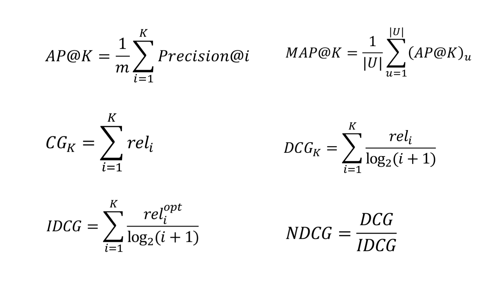
<br>

#### __Online Test__  
  : Online A/B Test란?  
    Offline Test에서 검증된 가설이나 모델을 이용해 실제 추천 결과를 서빙하는 단계를 말함  
  : 추천 시스템 변경 전후의 성능을 비교하는 것이 아니라, 동시에 대조군(A)과 실험군(B)의 성능을 평가함  
    ( 대조군과 실험군의 환경은 최대한 동일해야 함 )  
  : 대부분 현업에서 의사결정에 사용하는 최종 지표는 모델 성능이 아닌 매출, CTR 등의 비즈니스/서비스 지표  
<br>


### __☑ 인기도 기반 추천__  
  : 말 그대로 가장 인기있는 아이템을 추천 ( 네이버 쇼핑 랭킹 순, 다음 뉴스, 댓글 추천, 랭킹 추천 등 )  
  : 인기도의 척도는 조회수, 평점 평균, 리뷰 개수, 좋아요/싫어요 수  
  : score 만드는 방법: Most Popular, Highly Rated  

#### __Most Popular__  
  * Score Formula  
    : 가장 많이 조회된 뉴스를 추천 or 좋아요가 가장 많은 게시글 추천 ( 뉴스의 가장 중요한 속성은 최신성! )  
    : score = f(popularity, age)  
              (upvote - downvote)-time_elasped = pageviews - time_elasped  
    => 이런 경우 pageview가 1페이지 2페이지가 아니라 10-20페이지씩 확확 늘어나면 1~2년이 지나도 같은 글이 계속 Top Rank에 보일 것.  
    따라서 더 정교한 수식이 필요함  
  * Hacker News Formula   
    : 많이 조회된 뉴스를 추천해주되, 시간이 지날수록 age값이 점점 증가하므로 score는 작아짐  
    : 시간에 따라 줄어드는 score를 조정하기 위해 gravity라는 상수를 사용 ( gravity=1.8 )  
  * Reddit Formula  
    : 미국판 디시인사이드인 Reddit의 스코어 공식  
    : 해커스 뉴스 스코어 공식과의 가장 큰 차이점은 시간이 지날 수록 스코어를 분모에 넣어 감점시키는 방식이 아니라 최근에 포스팅 된 글에 더 높은 점수를 부여함  
    : 첫번째 term은 popularity, 두번째 term은 글 포스팅이 게시된 절대 시간  
      ( 나중에 게시된 포스팅일 수록 절대시간이 크기 때문에 더 높은 score를 가짐 )  
    : 첫번째 vote에 대해서 가장 높은 가치를 부여하며, vote가 늘어날 수록 score의 증가 폭이 작아짐 ( 오래된 포스팅일 수록 상대적으로 아주 많은 vote가 있어야 높은 score를 가짐 )  
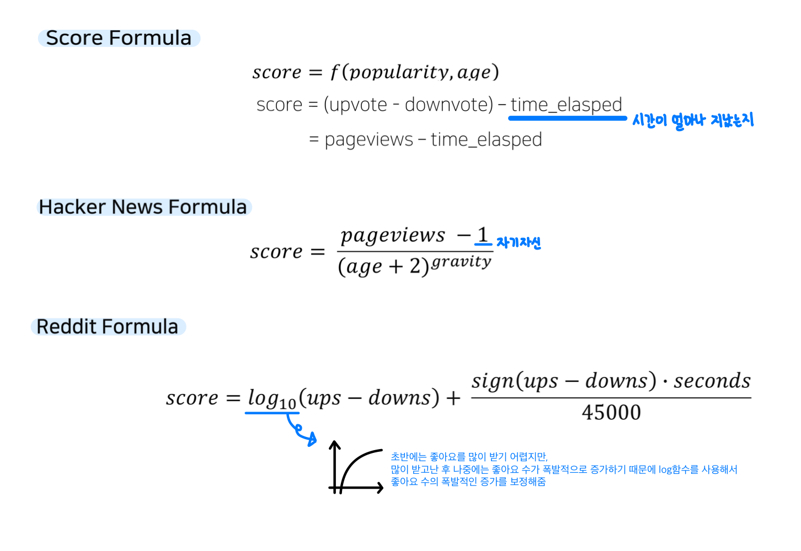
<br>

#### __Highly Rated__  
  * Score Formula  
    : 가장 높은 평점을 받은 영화 혹은 맛집을 추천  
      ( 평가의 개수가 충분한지, 신뢰할 수 있는 평점인지 주의해야 함 )  
    : 따라서 단순히 rating을 가지고 평가하는 게 아니라 얼마나 많은 rating이 구성되어 있는지가 스코어 계산에 중요하게 작용함  
    : score = f(rating, # of ratings)  
  * Steam Rating Formula  
    : Steam은 다양한 게임이 모여있는 사이트. 게임을 인기도 기반으로 스코어링할 때 다음과 같은 수식을 사용함  
    : rating은 평균값을 사용하되, 전체 review 개수에 따라 rating을 보정  
    => review 개수가 너무 적을 경우에, score가 0.5보다 낮으면 조금 높게 보정되고 높으면 조금 낮게 보정됨 ( 즉, 리뷰가 많이 쌓이지 않았을 경우 중간값으로 보정을 해준다는 말)  
    : 물론 rating의 개수가 아주 많을 경우, 두번째 term은 0에 가까워지기 때문에 score는 평균 rating과 거의 유사해짐  
  * Steam Rating Formula -> Movie Rating  
    : 영화 평점은 positive, negative가 아닌 1.0-5.0의 rating을 사용함 ( 0.5 대신 영화 평점 1.0-5.0 사이의 중앙값인 3.0을 사용 3.0 대신 모든 평점 데이터의 평균 값을 사용해도 됨 )  
    : 마찬가지로 전체 review 개수가 많아질 수록, 두번째 term은 0에 가까워지기 때문에 score는 평균 rating에 가까워짐  
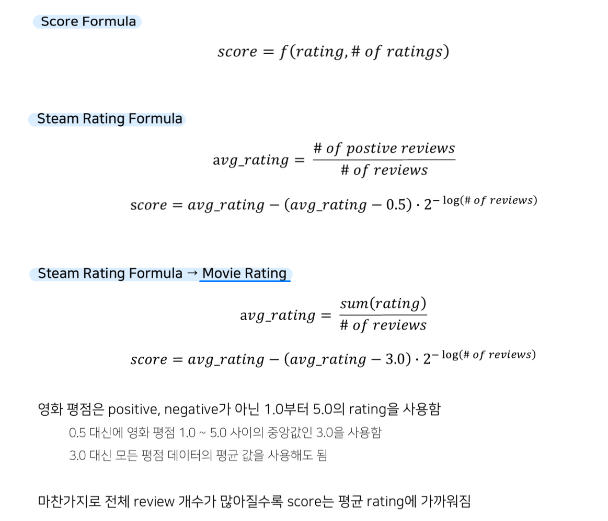
<br>


### __🦖 (3) 추천 시스템 기법과 연관분석__

### __☑ 추천 시스템 기법__  
추천 시스템 종류  
- Simple Aggregate(popularity, average score, recent uploads). 인기도 기반 추천  
- Association Analysis. 연관 분석  
- Content-based Recommendation. 컨텐츠 기반 추천  
- Collaborative Filtering  
- Item2Vec Recommendation and ANN  
- Deep Learning-based Recommendation  
- Context-aware Recommendation  
- Multi-Armed Bandit(MAB)-based Recommendation  

추천 시스템은 컴퓨터비전이나 자연어 처리 분야에 비해 머신러닝 -> 딥러닝을 통해 향상의 폭이 크지 않기 때문에 
굳이 딥러닝 모델을 사용하지 않고 클래식한 머신러닝 모델을 사용함  
<br>

### __☑ 연관 분석__  
#### __연관 규칙 분석__  
  : 흔히 장바구니 분석 혹은 서열 분석이라고도 불림  
  : 상품의 구매, 조회 등 하나의 연속된 거래들 사이의 규칙을 발견하기 위해 적용함  
    ex.  맥주와 기저귀를 같이 구매하는 빈도? 컴퓨터를 산 고객이 다음에 가장 많이 사는 상품은?  
  : 즉, 주어진 transaction(거래) 데이터에 대해서, 하나의 상품이 등장했을 때 다른 상품이 같이 등장하는 규칙을 찾는 것  
<br>

### __☑ 연관 규칙__  
> 데이터 마이닝 (Data Mining)  
> : 대용량 데이터에서 의미 있는 통계적 패턴이나 규칙, 관계를 찾아내 분석하여 유용하고 활용할 수 있는 정보를 추출하는 기술  
#### __연관 규칙 ( Association Rule )__  
  : IF(antecedent) THEN(consequent)  
    특정 사건이 발생했을 때 함께 빈번하게(frequently) 발생하는 또 다른 사건의 규칙을 의미  
  : 데이터 간의 연관 규칙을 찾는 방법  
  : 특정 사건이 발생했을 때 함께 빈번하게 발생하는 또 다른 사건의 규칙을 의미함  
  : item ( 연관 법칙 마이닝에서 가장 기본이 되는 단위인 상품을 의미 )  
  : transaction ( item의 구매 로그 )  
  : 연관 관계 마이닝에서 연관 관계를 설정하기 위해서는 support, confidence 라는 두 가지 중요한 요소가 사용됨  

#### __빈발 집합 ( Frequent Itemset )__  
  * Itemset  
    : 1개 이상의 item의 집합(set)  
    : k-itemset ( k개의 item으로 이루아진 itemset )  
  * Support count  
    : 전체 transaction data(item 구매로그)에서 itemset이 등장하는 횟수  
  * Support  
    : 전체 transaction data(item 구매로그)에서 itemset이 등장하는 비율  
  * Frequent Itemset  
    : 유저가 지정한 minimum support 값 이상의 itemset을 의미  
    : infrequent itemset은 반대로 유저가 지정한 minimum support보다 작은 itemset을 의미  
<br>

### __☑ 연관 규칙의 척도__  
> ( 연관 규칙이 가질 수 있는 metric )  
> frequent itemset들 사이의 연관 규칙을 만들기 위해서는 measurement가 필요함  
> X -> Y 가 존재할 때 ( X, Y : itemset, N : 전체 transaction 수 )  
#### __Support__  
  : 관계를 설정하기 위한 상품들이 동시에 발생될 확률  
  : X와 Y라는 아이템이 로그에서 얼마나 자주 발생되는지 측정해줌  
  : 만약 support 값이 매우 낮다면 그 아이템은 낮은 확률로 선택되었음을 의미  
  : support 측정 도구를 통해 우리는 로그에서 특정 로그가 우연히 발생된건지 아니면 일반적으로 발생된건지 측정할 수 있음  
  : 좋은 ( 빈도가 높거나, 구성 비율이 높은 ) 규칙을 찾거나, 불필요한 연산을 줄일 때 사용됨  
  : DB에서 X와 Y를 포함하는 transaction이 얼마나 발생하는지 보기 위한 지표로 X와 Y의 합집합의 count에서 전체를 나눔  

#### __Confidence__  
  : 특정 상품이 선택된 뒤, 다른 상품이 선택될 확률  
  : 조건부 확률로 X가 선택 되었을 때, Y가 선택 되었을 확률( Y의 X에 대한 조건부 확률 )을 의미하며 두 아이템간의 순차적인 연관성을 설명해 줌  
  : 따라서 아이템 간의 발생 순서를 고려하기 때문에 predictability(예측 가능성)을 결정할 수 있음  
  : comfidence가 높을수록 유용한 규칙임을 뜻함    
  : 만약 특정 아이템 간의 confidence가 매우 낮다면 일시적으로 발생된 이벤트 시퀀스를 의미하며 정상적인 경우에는 잘 나타나지 않는 발생 순서임을 알 수 있음  
  : DB에서 X이후 Y에 대한 transaction이 발생하는지 보기 위해서 X에 대한 Y의 확률로 계산하게 됨  

#### __lift__  
  : support, confidence와 달리 0~1사이의 확률값이 아님  
  : 1을 기준으로 1보다 낮은지 높은지에 따라 의미가 달라짐  
  : [x가 포함된 transaction 가운데 Y가 등장될 확률] / [Y가 등장할 확률]  
  lift = 1 -> X, Y는 독립  
  lift > 1 -> X, Y가 양의 상관관계를 가짐  
  lift < 1 -> X, Y가 음의 상관관계를 가짐  
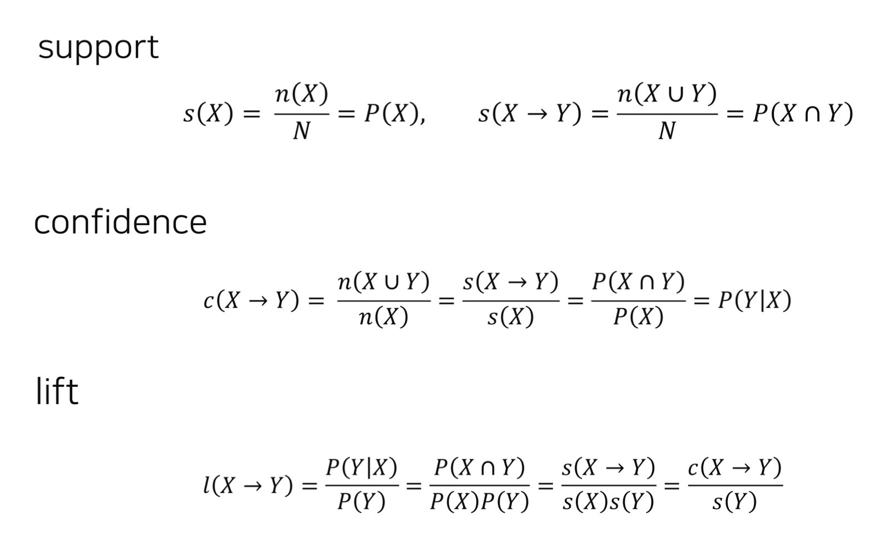
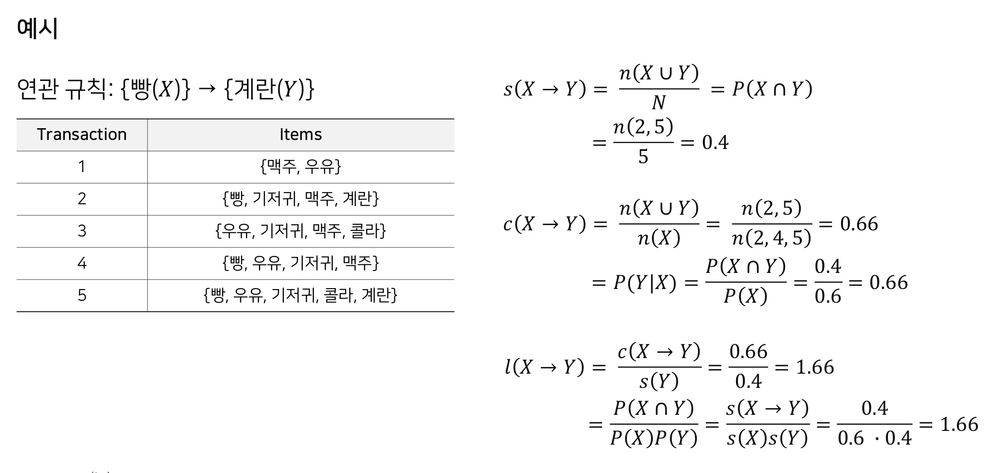

#### __연관 규칙의 척도 사용방법__  
  : item의 수가 많아질 수록, 가능한 itemset에 대한 rule의 수가 기하급수적으로 많아짐  
    -> 이 중 유의미한 rule만 사용해야 함  
  <br>
  유의미한 rule 사용을 위해 필터링 하는 방법은 아래와 같음  
  01. minimum support, minimum confidence로 의미 없는 rule을 screen out  
    : 전체 transaction 중에서 너무 적게 등장하거나, 조건부 확률이 아주 낮은 rule을 필터링하기 위함  
  02. lift 값으로 내림차순 정렬을 하여 의미 있는 rule을 평가함  
    : lift가 크다는 것은 rule을 구성하는 antecedent와 consequent가 연관성이 높고 유의미하다는 뜻  
> 최종 추천을 위한 척도로는 confidence 값이 아닌 lift 값을 사용함  
> ( lift 값을 사용했을 때, User 입장에서 질적으로 만족스러운 추천 결과를 얻을 수 있기 때문 )  
> <br>
> 왜??  
> <br>
> X : 와인, Y : 오프너, Z : 생수 라고 했을 때  
> P(Y|X) = 0.1  P(Y) = 0.01 일 때, lift로 정렬된 rule은 10  
> P(Z|X) = 0.2  P(Z) = 0.2  일 때, lift로 정렬된 rule은 1  
> 
> 그냥 오프너를 살 확률은 0.01 인데,  
> lift 값으로 내림차순 정렬하여 구한 와인을 샀을 때 오프너를 살 lift는 10으로 확 증가했음을 알 수 있음
<br>

__# 마지막으로 정리하자면 !__  
Support는  
관계 rule X->Y에 대한 순서에는 관심이 없고 아이템 셋 X와 Y가 모두 존재하는 transaction이 몇 개인지 관심이 있는 지표  
Confidence는  
X->Y에 대한 정확한 구매 순서를 가지고 있는 확률 지표이다  
```
item = {water, coke, coffee, milk, juice, alcohol} 
Transaction = { 
  {water, milk, alcohol}, 
  {coffee, juice}, 
  {water, milk, juice, alcohol}, 
  {coke, coffee, milk, juice}, 
  {coke, coffee, juice, alcohol}, 
  {water, milk},
}

해당 Transaction 로그를 통해 의미 있는 내용을 도출해보자 !  
(support, confidence를 이용하면 의미있는 내용을 찾을 수 있다.)  
```
> 만약 관리자가 minsup은 30%가 넘으면서 minconf가 70%를 넘는 로그를 찾는다고 했을 때,  
> water, milk -> alcohol 은 sup=2/6=33%, conf=2/3=66%  
> ( 이 경우 관리자가 설정한 minsup은 충족 시켰지만 minconf는 충족하지 못했기 때문에 관심 있는 로그가 아님 )  
> coffee -> juice 은 sup=3/6=50%, conf=3/3=100%  
> ( 이 경우 minsup, minconf 모두 충족 시키기 때문에 coffee->juice 라는 관계는 관리자가 관심있는 로그로 판단할 수 있다. )  
> <br>
> 위의 예시는 transaction 양이 굉장히 작기 때문에 직관적으로도 몇 가지 관계가 있는 룰을 뽑을 수 있었지만,  
>실생활에서는 수 많은 로그들이 발생되기 때문에 관리자가 설정한 조건을 만족하는 룰을 직관적으로 찾는다는 것은 매우 어려운 일임  
> 그렇기 때문에 이런 작업을 컴퓨터로 맡겨야 하는데 이를 해결하는 알고리즘이 Apriori 알고리즘임  
> <br>
> Apriori 알고리즘  
> : 데이터 집합 T가 주어지고 minsup, minconf가 주어졌을 때, 만족하는 rule을 찾는 알고리즘  
<br>

### __☑ 연관 규칙의 탐색__  
  연관 규칙의 탐색이 연관 분석에서 가장 중요하고 어려운 부분임  
  연관 규칙을 추천에 사용하기 위해서 주어진 연관규칙을 추출해야 함  
  * Association Rules Mining  
    : Brute-force approach를 활용하여  
      주어진 transaction 가운데, 아래 조건을 만족하는 가능한 모든 연관 규칙을 찾음  
    : (support) ≥ (minimum support)  
    : (confidence) ≥ (minimum confidence)  

  * Brute-force. Approach(가장 무식하고 간단한 방법)  
    가능한 모든 연관 규칙을 나열  
    모든 연관 규칙에 대해서 개별 support와 confidence를 계산  
    minimum support, minimum confidence를 만족하는 rule만 남겨놓고 모두 Pruning  
    => 근데 이렇게 모든 연관 규칙을 찾아서 계산하려면 엄청나게 많은 계산량이 요구되기 때문에 제한시간 안에 의미있는 연관 규칙을 탐색할 수 없게함

  * 효율적인 Association Rule Mining  
    효율적인 Association Rule Mining을 위해서는 두 가지 스탭을 거쳐야 함  
    ( 01번 Task의 computation cost가 가장 큼 )  
    01. Frequent Itemset Generation  
        : minimum support 이상의 모든 itemset을 생성  
        : 해당 알고리즘이 연관 규칙에서 가~장 중요한 부분임
    02. Rule Generation  
        : minimum confidence 이상의 association rule을 생성  
        : 이때 rule을 이루는 antecedent와 consequent는 서로소를 만족해야 함  
  
  * Frequent Itemset을 효율적으로 Generation하는 알고리즘  
    01. Apriori 알고리즘  
    02. DHP(Direct Hashing & Pruning) 알고리즘  
    03. FP-Growth 알고리즘  
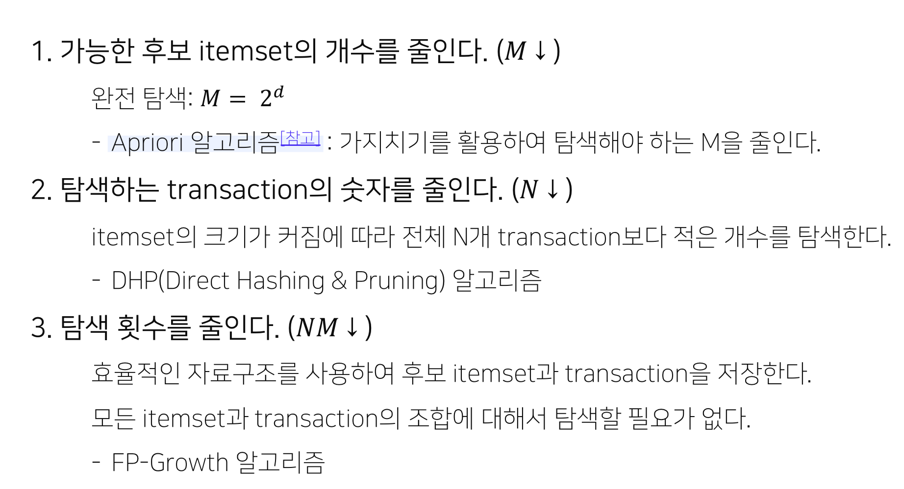
<br>


### __🦖 (4) TF-IDF를 활용한 컨텐츠 기반 추천__  

### __☑ 컨텐츠 기반 추천__  
* 기본 아이디어  
  : 유저 x가 과거에 선호한 아이템과 비슷한 아이템을 유저 x에게 추천  
* 장점  
  : 유저에게 추천을 할 때 다른 유저의 데이터가 필요하지 않음  
  : 새로운 아이템 혹은 인기도가 낮은 아이템을 추천할 수 있음  
  : 추천 아이템에 대한 설명이 가능함  
  ( 기존에 유저가 고른 정보를 통해 새로운 아이템을 추천하기 때문에 )  
* 단점  
  : 아이템의 적합한 피쳐를 찾는 것이 어려움  
  ( 아이템별로 사용할 수 있는 아이템 부가정보가 다르기 때문(이미지, 텍스트 등) )  
  : 한 분야/장르의 추천 결과만 계속 나올 수 있음  
  ( overspecialization, 빨간색을 좋아하면 빨간색 계열만 추천될 수도 있음 )  
  : 다른 유저의 데이터를 활용할 수 없음  
<br>

* __Item Profile__  
  추천 대상이 되는 아이템의 feature들로 구성된 Item Profile을 만들어야 함  
  * 영화: 작가, 제목, 배우, 장르, 감독  
  * 이미지, 동영상: 메타데이터, 태그, 업로드한 사람  
  * SNS: 친구, 팔로잉/팔로워  
아이템이 가진 다양한 속성(feature)를 어떻게 표현하면 가장 편할까? -> Vector 형태  
  : 하나의 feature가 1개 이상의 vector dimension에 표현됨  
  : vector는 이진값(0 또는 1) 혹은 실수값으로 구성됨  
<br>

* __Item Profile: TF-IDF for Text Feature__  
  문서의 경우, 중요한 단어들의 집합으로 표현할 수 있음  
  중요한 단어를 선정하기 위해서는 단어에 대한 중요도를 나타내는 스코어가 필요  
  -> 가장 많이 쓰는 기본적인 방법은 TF-IDF    
<br>

* __TF-IDF ( Term Frequency - Inverse Document Frequency )__  
  문서 d에 등장하는 단어 w에 대해서  
  단어 w가 문서 d에 많이 등장하면서(Trem Frequency, TF)  
  단어 w가 전체 문서(D)에서는 적게 등장하는 단어라면 (Inverse Document Frequency, IDF)  
  단어 w는 문서 d를 설명하는 중요한 feature로, TF-IDF 값이 높음 !  
<br>

* __TF-IDF Formula__  
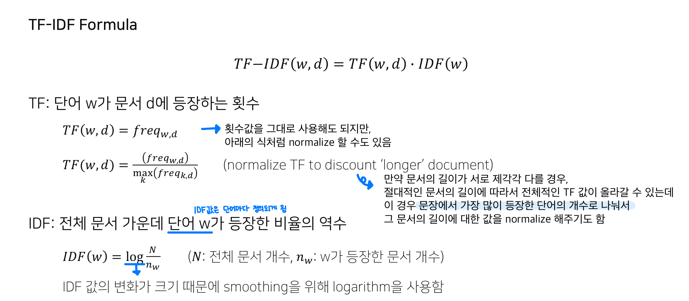

<br>


### __☑ User Profile 기반 추천__  

 * __Build User Profile__  
    item profile을 모두 구축했으나,  
    우리가 해야 할 일은 유저에게 아이템을 추천하는 것이기 때문에 User Profile 구축이 필요함  
<br>

* __User Profile__  
  : 유저가 과거에 선호했던 Item List가 있고 개별 Item은 TF-IDF를 통해 벡터로 표현됨  
  : 각 유저의 Item List 안에 있는 Item의 Vector들을 통합하면 User Profile이 됨  
  통합하는 방법은 대표적으로 아래 두 가지가 있음  
  * Simple: 유저가 선호한 Item Vector들의 평균값을 사용  
  * Variant: 유저가 아이템에 내린 선호도로 정규화(normalize)한 평균값을 사용  
  유저가 d1, d3을 선호했다면 해당 유저의 profile vector는 다음과 같음  
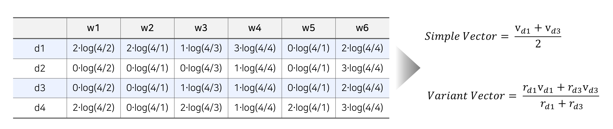
<br>

* __Cosine Similarity(추천 시스템에서 가장 많이 사용되는 유사도)__  
  주어진 두 벡터 X, Y에 대하여,   
  각각의 벡터의 크기 분에 두 벡터의 내적으로 나타냄   
  직관적으로는 두 벡터의 각도를 의미하며, 두 벡터가 가리키는 방향이 얼마나 유사한지를 의미함   
  * 두 벡터의 차원이 같아야 함  
  * 두 벡터의 방향이 비슷할 수록 1에 가까움  
  * 방향이 정반대인 경우 -1에 가까움  
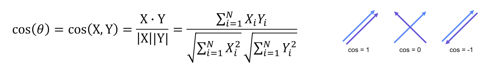
<br>

* __유저와 아이템 사이의 거리 계산하기__  
  유저 벡터 u와 아이템 벡터 i에 대해서 아래와 같이 거리를 계산함  
  둘의 유사도가 클수록 해당 아이템이 유저에게 관련성이 높음  
  해당 유저와 가장 유사한 아이템, 즉 score(u,i)가 가장 높은 아이템부터 유저에게 추천함  
  -> 만약 유저 u가 i에 대해 가질 선호도(평점)를 정확하게 예측하고 싶다면?  Rating 예측하기  
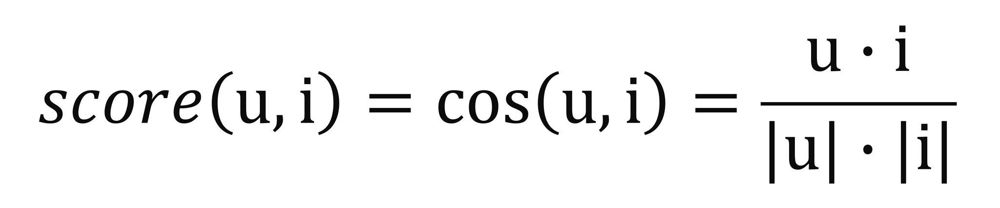
<br>

### __☑ Rating 예측하기__  
유저가 선호하는 아이템의 Vector를 활용하여 정확한 평점 예측하기  
(user profile을 따로 구축하지 않고, user가 평점을 매긴 item vector를 사용)  
새로운 아이템 i’ 에 대한 평점을 예측해보기 위해서는
유저 u가 선호하는 아이템 I={i1, …, iN}, item vector V={v1, …, vN}, 평점 ru,i을 사용
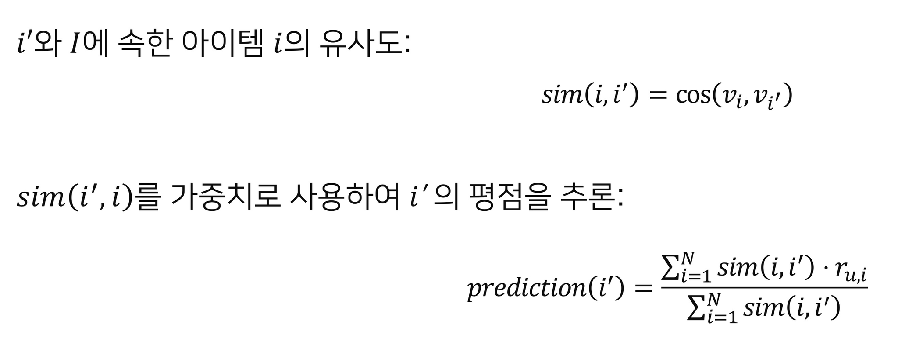
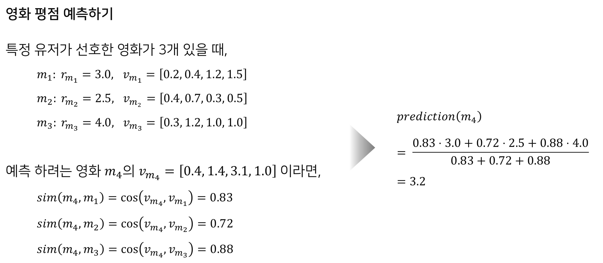

<br>
<br>
<br>

```toc

```