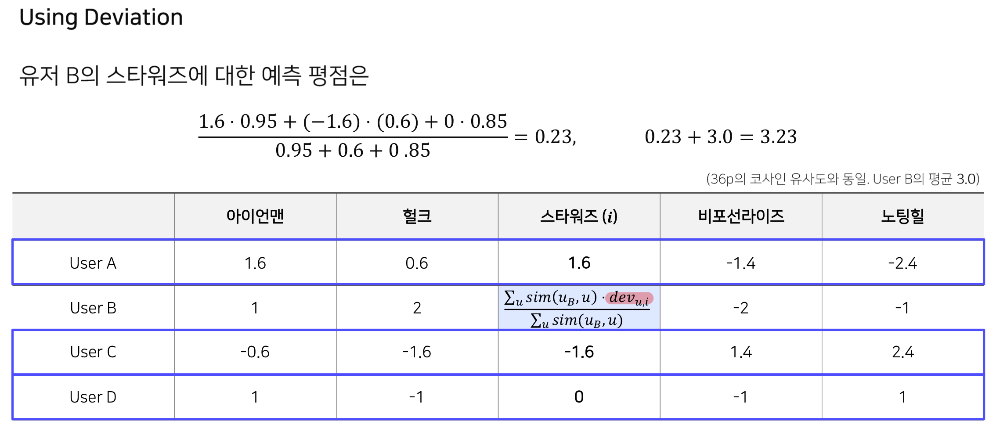

## __🚀 02. Collaborative Filtering__  
<br>

### __🦖 (1) Collaborative Filtering ( CF )__  

### __☑ Collaborative Filtering ( CF )__  
협업 필터링  
: '많은 유저들로부터 얻은 기호 정보'를 이용해 유저의 관심사를 자동으로 예측하는 방법  

#### __CF 기반 추천 시스템__  
* 원리  
  : 유저 A와 비슷한 취향을 가진 유저들이 선호하는 아이템을 추천  
    ( 아이템이 가진 속성을 사용하지 않으면서도 높은 추천 성능을 보임 )  
* 최종 목적  
  : 유저 u가 아이템 i에 부여할 평점을 예측하는 것  
* 방법  
    01. 주어진 데이터를 활용해 유저-아이템 행렬을 생성  
    02. 유사도 기준을 정하고, 유저 혹은 아이템 간의 유사도를 구함  
    03. 주어진 평점과 유사도를 활용하여 행렬의 비어 있는 값(평점)을 예측  
    > 행렬의 원소는 유저가 아이템에 기록한 선호도나 평점으로 예측하게 되는데,  
    > 문제는 이 행렬이 모두 채워져있지 않다는 것  
    > ( 모든 유저가 모든 아이템에 대해서 평가를 내리지 않기 때문에 반드시 빈칸이 존재하게 되고 이 빈칸을 채워나가야 함 )  
    > 이미 과거에 내려진 평점과 우리가 정한 유사도 기준을 가지고 비어있는 평점을 예측하게 됨  
<br>

#### __CF 분류__  
* __Neighborhood-based CF ( Memory-based CF )__
  - User based
  - Item-based
* __Model-based CF__
  - Non-parametric(KNN, SVD)
  - Matrix Factorization
  - Deep Learning
* __Hybrid CF__
  - Content-based Recommendation과의 결합
<br>


### __🦖 (2) Neighborhood-based CF ( NBCF )__  
 
### __☑ Neighborhood-based CF ( NBCF )__  
Neighborhood-based Collaborative Filtering, NBCF (이웃 기반 협업 필터링, Memory-based CF)  
유저 간의 유사도를 사용하는지, 아이템 간의 유사도를 사용하는지에 따라 나뉨   
#### __UBCF__  
User-based CF, UBCF (유저 기반 협업 필터링)  
두 유저가 얼마나 유사한 아이템을 선호하는가?  
유저 간 유사도를 구한 뒤, 타겟 유저와 유사도가 높은 유저들이 선호하는 아이템을 추천  

> 직관적으로 user B는 user A와 비슷한 취향을 가짐  
> 즉, user A와 user B의 유사도가 높음(mathematically highly correlated)  
> => 따라서, user B의 black에 대한 선호도는 user A와 비슷하게 높을 것으로 예측됨  
<br>

#### __IBCF__  
Item-based CF, IBCF (아이템 기반 협업 필터링)  
두 아이템이 유저들로부터 얼마나 유사한 평점을 받았는가?  
아이템간 유사도를 구한 뒤, 타겟 아이템과 유사도가 높은 아이템 중 선호도가 큰 아이템을 추천  

> 직관적으로 black은 red, blue와의 유사도가 높음  
> 반대로 white와의 유사도는 낮음  
> => 따라서, user B의 black에 대한 평점은 red, blue와 비슷하게 높을 것  
<br>

#### __NBCF__  
* __최종 목적__  
  : 유저 u가 아이템 i에 부여할 평점을 예측하는 것  
* __특징__  
  : 구현이 간단하고 이해가 쉬움  
  : 아이템이나 유저가 계속 늘어날 경우 확장성이 떨어짐 ( Scalability )  
  : 주어진 평점/선호도 데이터가 적을 경우, 성능이 저하됨 ( Sparsity )  
  > 참고로 Scalability와 Sparsity 두 가지 문제는 NBCF 뿐만 아니라  
  > 어떤 추천 시스템이든지 반드시 풀어야 할 문제임   
* __Sparsity__  
  : 주어진 데이터를 활용해 유저-아이템 행렬을 만듦  
    -> 실제로 행렬 대부분의 원소는 비어 있음(sparse matrix, 희소 행렬)  
    > 예를 들어,  
    > 넷플릭스 유저: 100M, 영화: 500K 라면 평균적으로 한 명의 유저가 몇 개의 영화를 봤을까?  
    > 많이 봐 봤자 몇 백개 정도 일거임  
    > 따라서 NBCF를 적용하려면 적어도 sparsity ratio가 99.5%를 넘지 않는 것이 좋음  
    > ( sparsity ratio: 행렬 전체 원소 중 비어 있는 원소의 비율 )  
    > 
    > 그렇지 않을 경우 모델 기반 CF를 사용해야 함 ( ex. Matrix Factorization )  
<br>


### __🦖 (3) KNN CF & Similarity Function__

### __☑ KNN CF & Similarity Function__  
#### __K-Nearest Neighbors (KNN) CF__  
* __NBCF의 한계__  
아이템 i에 대한 평점 예측을 하기 위해서는,  
아이템 i에 대해 평가 한 유저 집합에 속한 모든 유저와의 유사도를 구해야 함  
그런데 유저가 많아질 경우 계속해서 연산은 늘어나고 오히려 성능이 떨어지기도 함  

* __KNN CF 아이디어__
아이템 i에 대해 평가 한 유저 집합에 속한 유저 가운데 유저 u와 가장 유사한 K명의 유저(KNN)를 이용해 평점을 예측  
(유사하다는 것은 우리가 정의한 유사도 값이 크다는 것을 의미함. 보통 K=25~50을 많이 사용하지만 직접 튜닝해야 하는 하이퍼파라미터임)  


> 유저 B와 가장 유사한 1명인 유저 A의 평점 데이터를 이용해서 평점을 예측  
> -> 유저 B의 black에 대한 예측 평점은 5  

위 표를 통해 유저 B와 가장 유사한 유저는 A임을 대략적으로 알 수 있었지만,  
정확한 유사도를 측정하기 위해서는 수치적인 표현으로 나타내야 함 -> 유사도 측정법  
<br>

#### __Similarity Measure__  
  
  : 두 개체(집합, 분포, 데이터 등이 될 수 있음) 간의 유사성을 수량화하는 실수 값 함수 혹은 척도  
  : 유사성에 대한 여러 정의가 존재하지만, 일반적으로는 거리의 역수 개념을 사용  
  ( 거리가 길면 길수록 유사도는 작아지고, 거리가 가까울 수록 유사도는 커지게 됨 )  
  : 따라서 두 개체 간 거리를 어떻게 측정하냐에 따라 유사도 측정방법이 달라짐  

* __추천 시스템에서 자주 사용하는 4가지 유사도 측정 방법__  
  01. Mean Squared Difference Similarity  
  02. Cosine Similarity  
  03. Pearson Similarity (Pearson Correlation)  
  04. Jaccard Similarity  
<br>

* __Mean Squared Difference Similarity__
    Mean Squared Difference  
    - User based Collaborative Filter ( msd(u,v) )  
      : 동일한 item에 대해 점수를 매긴 user 사이의 유사도  
      : Iuv는 사용자 u와 사용자 v 모두에 의해 평가된 상품의 집합  
      : |Iuv|는 사용자 u와 사용자 v 모두에 의해 평가된 상품의 수   
    - Item based Collaborative Filter ( msd(i,j) )  
      : 동일한 user에 대해 점수가 매겨진 item 사이의 유사도  
      : Uij는 상품 i와 상품 j 모두를 평가한 사용자의 집합  
      : |Uij|는 상품 i와 상품 j 모두를 평가한 사용자의 수  

    Mean Squared Difference Similarity  
    : 거의 추천 시스템에서만 사용되는 유사도임  
    : MSD의 역수로 계산하기 때문에 차이가 클 수록 Similarity 값은 작아짐  
      ( 각 기준에 대한 점수 차이를 계산. 유사도는 유클리드 거리에 반비례 )  
    : Mean Squared Difference Similarity 식에서는 MSD가 0이 되는 경우를   대응하기 위해서 무조건 1을 더해줌 ( smoothing )  
  
> 평점이 비슷할 수록 차이가 작아지기 때문에 분모는 작아지게 되고,  
> 평점이 가장 일치할 때 msd 값은 0 이 되기 때문에 유사도 값은 1 이 됨  
<br>

* __Cosine Similarity(추천 시스템에서 가장 많이 사용되는 유사도)__  
  : 코사인 유사도 값의 범위는 -1 ~ 1
  : 내적 공식을 이용하여 도출

  __장점__  
  : 벡터의 규모(크기)가 중요하지 않음 -> 모수가 적을 때 장점을 가짐  
  : 다양한 차원이 존재할 때 유사도 구분이 뚜렸할 수 있음  
  -> 여러가지 지표들을 비교할 때 유사도를 비교적 뚜렸하게 구분할 수 있음  
  : 자카드와 마찬가지로 (0,0)match는 고려하지 않음  

  __단점__  
  : 상호 상관관계 feature(키, 몸무게 등)를 갖는 원소들간의 유사도를 계산할 때에 좋지 못함  
  : 위치(vector)의 기준을 무엇으로 잡는지에 따라 유사도(각도)가 달라질 수 있음  
  : Binary data에서는 사용할 수 없음  

  주어진 두 벡터 X, Y에 대하여,   
  각각의 벡터의 크기 분에 두 벡터의 내적으로 나타냄   
  직관적으로는 두 벡터의 각도를 의미하며, 두 벡터가 가리키는 방향이 얼마나 유사한지를 의미함   
  * 두 벡터의 차원이 같아야 함  
  * 두 벡터의 방향이 비슷할 수록 1에 가까움  
  * 방향이 정반대인 경우 -1에 가까움  
  * 사용자 u와 사용자 v간의 Cosine Similarity  
    : cos(u,v)  
    : 두 사용자가 모두 평가한 상품의 평점을 사용해서 계산  
    : 분모는 내적값을 구하는 것과 같음  
    : 분자는 벡터의 크기를 구하는 것과 같음  
  * 상품 i와 상품 j간의 Cosine Similarity  
    : cos(i,j)  
    : 두 상품의 평점을 사용해서 계산  
    : 분모는 내적값을 구하는 것과 같음  
    : 분자는 벡터의 크기를 구하는 것과 같음  

<br> 

* __Pearson Similarity (Pearson Correlation)__  
  : 코사인유사도와의 차이점은 표본평균으로 정규화를 한다는 점  
    ( 이를 통해 각각의 벡터의 rating의 크기 차이를 고려할 수 있음.  
      즉, 무난하게 추천 성능을 낼 수 있음 )  
  : 피어슨 유사도 값의 범위는 -1 ~ 1  
  : 특정 인물의 점수 기준이 극단적으로 너무 낮거나 높을 경우  
    유사도에 영향을 크게 주기 때문에, 이를 막기 위해 상관계수를 사용  
  : 각 벡터를 표본평균으로 정규화한 뒤에 코사인 유사도를 구한 값  
  : 직관적으로 해석하면 (X와 Y가 함께 변하는 정도) / (X와 Y가 따로 변하는 정도)  
  : 1에 가까우면 양의 상관관계, 0일 경우 서로 독립, -1에 가까우면 음의 상관관계를 나타냄  

  * 사용자 u와 사용자 v간의 Pearson Similarity  
    : pearson_sim(u,v)
  * 사용자 i와 상품 j간의 Pearson Similarity  
    : pearson_sim(i,j)  

<br> 

* __Jaccard Similarity__  
  : 집합의 개념을 사용한 유사도  
  : 두 집합의 교집합을 합집합으로 나눈 값.  달라도 이론적으로 유사도 계산 가능  
  : 두 집합이 같은 아이템을 얼마나 공유하고 있는지를 나타냄  
    * 두 집합이 가진 아이템이 모두 같으면 1  
    * 두 집합에 겹치는 아이템이 하나도 없으면 0  
  __장점__  
  : 0이 많은 데이터에서는 해당 부분을 고려해줌  
  : A와 B는 같은 사이즈일 필요가 없음 ( 자연어 분석인 기준에서 의미하는 것 같음 )  
  __단점__  
  : 0과 1이 교차되는 경우에 자카드는 상관관계를 구현하지 못함  
  : 음의 상관관계를 알지 못함 ( 산점도를 비롯한 그래프로 재확인 필요 )  
  : 얼마나 자주 발생하는지 (term frequency)를 고려하지 않음  
  : 정규화 작업이 필요할 떄가 있음  

<br>

__# 정리!__   
기능을 사용하는 유저가 많다면 -> 피어슨 유사도(피어슨 상관분석)  
기능을 사용하는 유저가 많지 않고 사용 유무로 분석하고 싶다면 -> 자카드 유사도  
빈도를 고려하고 싶다면 -> 코사인 유사도  
<br>


### __🦖 (4) Rating Prediction__  

### __☑ Rating Prediction__  

#### __UBCF – Absolute/Relative Rating__  
* __Absolute Rating 절대적 평점 ( Average, Weighted Average )__  
  * Average  
    : 다른 유저들의 스타워즈에 대한 rating 평균을 냄  
    -> 유저 B의 입장에서 볼 때, 유저 A C D의 rating을 동일하게 반영하는 것이 과연 적절할까? ㄴㄴ  
    유저 B의 입장에서는 자신과 비슷한 사용자의 평점이 많이 반영되고,  
    비슷하지 않은 사용자의 평점은 적게 반영되는 것이 더 정확한 예측을 하기에 좋음  
  * Weighted Average  
    : 유저 간의 유사도 값을 가중치(Weight)로 사용하여 rating의 평균을 냄  
  * Absolute Rating의 한계  
    : 유저가 평점을 주는 기준이 제각기 다름
      어떤 유저는 전체적으로 높게 평점을 줄 수도 있고 반대로 낮게 줄 수도 있음  
    * 긍정적 유저: 대부분 5점을 주고 부정적인 평가로 3점을 줌  
    * 부정적 유저: 대부분 1~2점을 주고 가끔 4점을 줌  
    => 이럴 경우 유저의 평점 절대값을 그대로 활용하게 되면  
    각각의 유저 별로 가지는 편차를 반영할 수 없게됨  
    따라서 상대적 평점의 개념이 등장함  
* __Relative Rating 상대적 평점__  
  : 개별 유저의 평균 평점에서 얼마나 높은지 혹은 낮은지, 그 편차(Deviation)를 사용함  
    ( 어떤 유저의 평균이 2.5점인데, 5점을 줬다면 아주 높게 평가한거라고 볼 수 있음.  
    반면 모든 아이템의 평점을 5점으로 준 유저는 아이템간의 비교가 어려움 )  
  : 옛날에는 rating을 가지고 그대로 예측 평점을 구했는데,  
    지금은 deviation 값을 구해서 예측 deviation을 구하는 방식으로 평점을 예측함  
---
__# Absolute Rating 예시__  
<br>


> B와 A의 유사도 : 0.95  
> B와 C의 유사도 : 0.6  
> B와 D의 유사도 : 0.85  

---  
__# Relative Rating 예시__  
<br>

  

---

__# Absolute/Relative Rating 최종 수식__
<br>


---
<br>


#### __IBCF – Absolute/Relative Rating__  
__# Absolute Rating 예시__  
<br>


> 아이어맨, 스타워즈 유사도 : 0.9  
> 헐크    , 스타워즈 유사도 : 0.95  

---  
__# Relative Rating 예시__  
<br>

  

---

__# Absolute/Relative Rating 최종 수식__
<br>


---
<br>


#### __Top-N Recommendation__  
__CF in Recommendation System__  
Collaborative FIltering의 최종 목적  
: 유저 u가 아이템 i에 부여할 평점을 예측하는 것  

Recommendation System의 최종 목적  
: 예측 평점이 높은 아이템을 유저에게 추천하는 것 -> Top-N Recommendation !!  
  (상위 N개 추천) -> 추천 완료 !
<br> 
<br>
<br>


```toc

```
