## __🚀 02-2. Collaborative Filtering_2__ 
<br>

### __🦖 (1) Model Based CF ( MBCF )__  

### __☑ NBCF의 한계__  
* __추천 시스템에서 반드시 해결해야 하는 두 가지 이슈__  
    01. __Sparsity(희소성) 문제__  
        : 데이터가 충분하지 않다면 추천 성능이 떨어짐  
        ( 유사도 계산이 부정확함 )  
        : 데이터가 부족하거나 혹은 아예 없는 유저, 아이템이 등장할 경우 추천이 불가능함  
        ( Cold start )  
    02. __Scalability(확장성) 문제__  
        : 유저와 아이템이 늘어날 수록 유사도 계산이 늘어남  
        : 유저, 아이템이 많아야 정확한 예측을 하지만 반대로 시간이 오래 걸림  
=> 그래서 모델 기반 협업 필터링이 등장하게 됨  
<br>

### __☑ Model based Collaborative Filtering__  
* __MBCF 모델 기반 협업 필터링__  
    : 항목 간 유사성을 단순 비교하는 것에서 벗어나 데이터에 내재한 패턴을 이용해 추천하는 CF 기법  
    : Parametric Machine Learning을 사용  
    : 주어진 데이터를 사용하여 모델을 학습  
    : 데이터 정보가 파라미터의 형태로 모델에 압축  
    : 모델의 파라미터는 데이터의 패턴을 나타내고, 최적화를 통해 업데이트  
<br>

* __MBCF의 특징__  
    : 데이터에 숨겨진 유저-아이템 관계의 잠재적 특성/패턴을 찾아서 이를 파라미터에 반영함  
    : 현업에서는 Matrix Factorization 기법이 가장 많이 사용됨  
    ( MF는 NBCF의 희소,확장 문제를 극복하기 위한 MBCF의 기법이며, 02. 에서 한번 언급했었음 )  
    : 특히, 최근에는 MF 원리를 Deep Learning 모델에 응용하는 기법이 높은 성능을 냄  
    * __vs NBCF 이웃 기반 협업 필터링__  
        : 이웃 기반 협업 필터링은 유저/아이템 벡터를 데이터를 통해 계산된 형태로 저장하지만  
        ( 즉, 파라미터를 따로 학습하지 않고 유저와 아이템의 rating을 그대로 유저/아이템 벡터로 사용하는 기법, Memory-based CF = Neighborhood-based CF )    
        MBCF의 경우 유저, 아이템 벡터는 모두 학습을 통해 변하는 파라미터임  
<br>

* __MBCF의 장점 ( vs. NBCF )__  
    * __모델 학습/서빙__  
        : 유저-아이템 데이터는 학습에만 사용되고 학습된 모델은 압축된 형태로 저장됨  
        : 이미 학습된 모델을 통해 추천하기 때문에 서빙 속도가 빠름  
    * __Sparsity / Scalability 문제 개선__  
        : NBCF에 비해 sparse한 데이터에서도 좋은 성능을 보임  
         ( NBCF와 달리 Sparsity Ratio가 99.5%가 넘을 경우에도 사용 )  
        : 사용자, 아이템 개수가 많이 늘어나도 좋은 추천 성능을 보임  
    * __Overfitting 방지__  
        : NBCF와 비교했을 때 전체 데이터의 패턴을 학습하기 때문에 특정 이웃에 오버피팅 되지 않고 좀 더 일반화된 성능을 지닌 모델이 작동함  
        : NBCF의 경우 특정 주변 이웃에 의해 크게 영향을 받을 수 있음  
    * __Limited Coverage 극복__  
        : NBCF의 경우  
          공통의 유저/아이템을 많이 공유해야만 유사도 값이 정확해지는데,  
          아무리 데이터가 많다고 하더라도 coverage(범위)가 워낙 sparse한 matrix이기 때문에 어느정도의 적당한 유사도를 가진 두 유저/아이템 벡터 쌍은 많지 않음  
        => coverage로 인해 아주 높은 추천 성능은 낼 수 없음  
        => 또한 NBCF의 유사도 값이 정확하지 않은 경우 이웃의 효과를 보기 어려움  
        : 그렇지만 MBCF의 경우  
          모델이 전체 데이터의 패턴을 학습하기 때문에 위와 같은 문제는 발생하지 않음  
<br>

### __☑ 또 다른 이슈 : Implicit Feedback__  
* __Implicit Feedback ( vs. Explicit Feedback )__  
    * Explicit Feedback  
        : 영화 평점, 맛집 별점 등 item에 대한 user의 선호도를 직접적으로 알 수 있는 데이터  
        : 위는 모두 Explicit Feedback 문제  
    * Implicit Feedback  
        : 클릭 여부, 시청 여부 등 item에 대한 user의 선호도를 간접적으로 알 수 있는 데이터  
        : 유저-아이템 간 상호작용이 있었다면 1 (positive)을 원소로 갖는 행렬로 표현 가능  
        ( 다만 여기서 상호작용이 없었을 때의 값을 0으로 놓지는 않음 )  
        : 현실에서는 implicit feedback 데이터의 크기가 훨씬 크고 많이 사용 됨  
        => implicit feedback 데이터를 학습하기에 적합한 모델링 방식도 중요한 문제임  
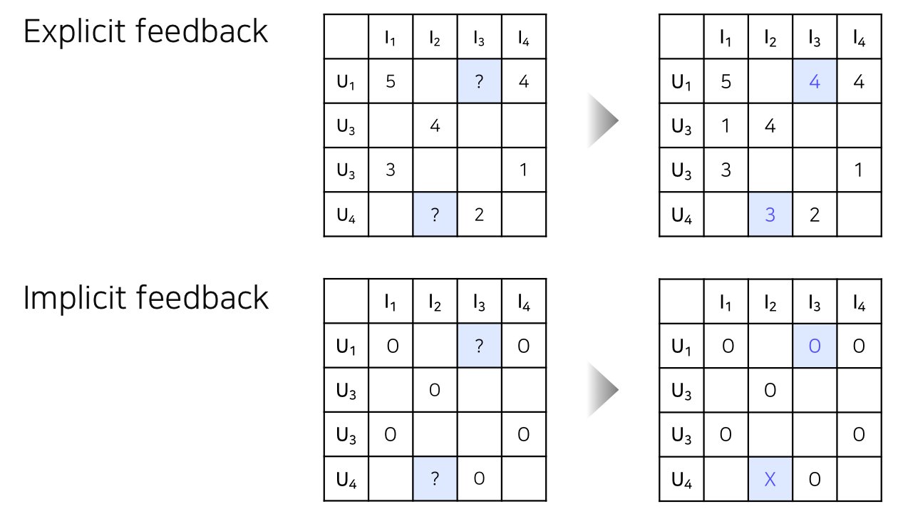
> Explicit feedback  
> : 위에서 했던 것처럼 유저/아이템에 대한 예측 평점을 채워 넣으면 됨  
> Implicit feedback  
> : 유저가 이 아이템을 선호할 것인지, 선호하지 않을 것인지에 해당하는  
>   선호도 값으로 예측해서 채워넣음 ( 정확한 예측값은 아님 )  
<br>

### __☑ Latent Factor Model__  
* __Latent Factor Model의 의미__  
    : 요즘은 Embedding 이라고 표현  
    : 유저와 아이템 관계를 잠재적 요인으로 표현할 수 있다고 보는 모델  
    다양하고 복잡한 유저와 아이템의 특성을 몇 개의 벡터로 compact하게 표현  
    : 유저-아이템 행렬을 저차원의 행렬로 분해하는 방식으로 작동  
    각 차원의 의미는 모델 학습을 통해 생성되며 표면적으로는 알 수 없음  
    : 같은 벡터 공간에서 유저와 아이템 벡터가 놓일 경우 유저와 아이템의 유사한 정도를 확인할 수 있음  
    : 유저 벡터와 아이템 벡터가 유사하게 놓인다면 해당 유저에게 해당 아이템이 추천될 확률이 높음  
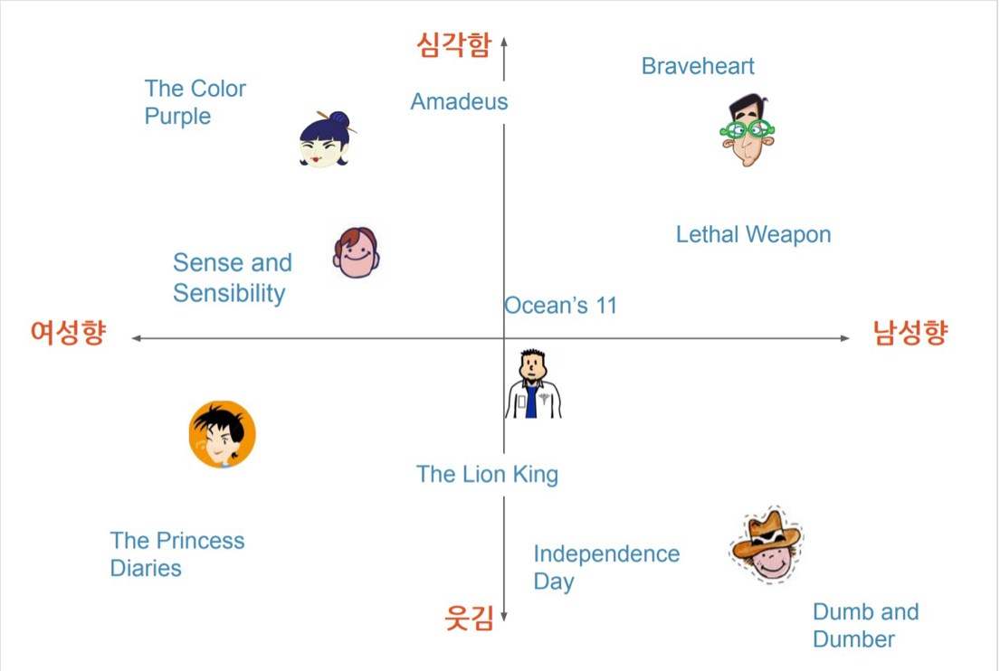
> 첫 번째 차원은 이 유저가 남성향인지 여성향인지  
> 두 번째 차원은 이 영화가 심각한 영화인지 웃긴 영화인지  
> => latent factor 모델을 사용해서 유저 벡터와 아이템 벡터를 임베딩 시켰을 때 각각 영화의 특징에 따라 임베딩이 이루어짐을 볼 수 있음  
> 
> 1사분면 유저의 경우 심각한 남성향의 영화(전쟁영화 같은 거)를 좋아함을 알 수 있고  
> 3사분면 유저의 경우 웃긴 여성향의 영화를 좋아하기 때문에 그런 영화들이 추천될 것임을 알 수 있음  
> 
> 여기서는 latent factor의 각 차원별 의미를 남성-여성, 심각함-웃김 으로 표현했지만  
> 실제 모델로 학습하게 되면 각 차원의 의미가 무엇인지는 알 수 없음  
<br>

#### __Collaborative Filtering 분류__   
* Neighborhood-based Collaborative Filtering  
    * User-based  
    * Item-based  
* Model-based Collaborative Filtering  
    * __Singular Value Decomposition ( SVD )__  
    * __Matrix Factorization ( SGD, ALS, BPR )__    
    * Deep Learning  
* Hybrid Collaborative Filtering  
    * Content-based Recommendation과의 결합  
<br>

###  __🦖 (2) Singular Value Decomposition ( SVD )__  
### __☑ SVD의 개념__  
: 추천 시스템에서 사용하는 데이터는 유저와 아이템으로 이루어진 2차원 Rating Matrix인데,  
 이러한 이차원 행렬을 분해하는 기법을 svd라고 함  
: Rating Matrix R에 대해 유저와 아이템의 잠재 요인(Latent factor)을 포함할 수 있는 행렬로 분해하는데, 행렬은 총 3가지의 행렬로 이루어짐  
 ( 유저 잠재 요인 행렬, 잠재 요인 대각 행렬, 아이템 잠재 요인 행렬 )  
: 사실 SVD는 추천시스템에 처음 사용됐다기 보다는 선형 대수학에서 차원을 축소하는 기법으로 분류하는 것이 더 정확함  
 ( + 주성분분석(PCA)도 차원 축소 기법 중 하나임 )  
<br>

### __☑ SVD 원리 이해__  
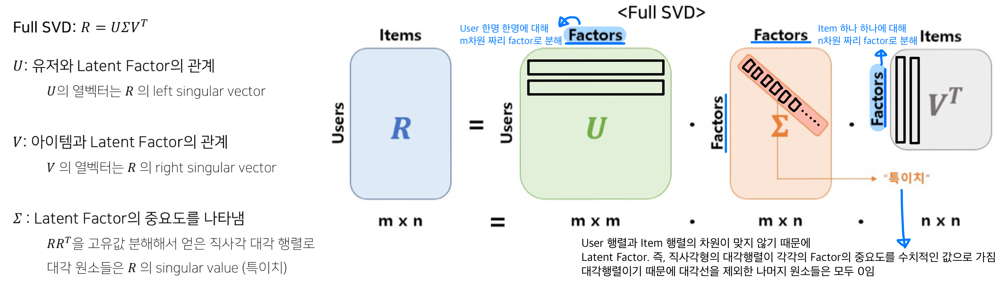
<br>

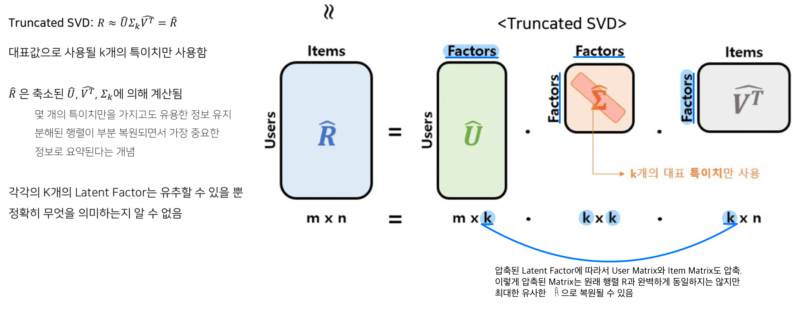
> 전체 Rating Matrix를 온전하게 3개의 Matrix로 분해하는 것 : Full SVD  
> -> 이를 압축하여 대표값으로 사용 될 K개의 특이치만 사용하는 것 : Truncated SVD  
<br>

### __☑ SVD의 한계__  
* 분해(Decomposition)하려는 행렬의 knowledge가 불완전할 때 SVD는 작동하지 않음  
    : Sparsity가 높은 데이터의 경우 결측치가 매우 많고, 실제 데이터는 대부분 Sparse Matrix임  
    이처럼 비어있는 상태로는 SVD를 수행할 수 없고 완전히 채워져 있는 경우에만 작동할 수 있기 때문에 결측된 entry(원소)를 모두 채우는 Imputation을 통해서 유저/아이템 Matrix를  Dense하게 만들어야(Dense Matrix) SVD를 수행할 수 있음  
    > ex. 결측된 entry를 0 또는 유저/아이템의 평균 평점으로 채움  
    >     
    >   하지만 이렇게 할 경우,  
    >   실제 유저가 그 아이템에 대해 평가한 것이 아니지만 결측되었다는 이유만으로  
    >   0 또는 유저/아이템의 평균 평점으로 채우는 것은 데이터의 양을 상당히 증가시킴.  
    >   그리고 computation 비용이 높아짐   
    <br>
* 정확하지 않은 Imputation은 데이터를 왜곡 시키고 예측 성능을 떨어뜨림  
    : 행렬의 entry가 매우 적을 때(sparsity ratio가 매우 높을 때) SVD를 적용하면 과적합 되기 쉬움  
    => 따라서 SVD의 원리를 차용하되, 다른 접근 방법이 필요함 -> MF의 등장  
<br>


###  __🦖 (3) Matrix Factorization ( SGD, ALS, BPR  )__  
Matrix Factorization : 행렬 인수분해  
Optimizer : SGD, ALS  
> ( User-Item Matrix를 User Latent Vector와 Item Latent Vector로 분해한 뒤 내적을 통해 결측치를 메꾸는 방법을 Matrix Factorization이라고 하며,  
> 
> 이 때 User-Item Matrix를 복원하는 과정에는 여러 가지 방법이 있는데 크게 SGD와 ALS 방법론이 존재함 )   
: MF는 [NCF](http://localhost:8000/1-4.Recsys_study(Recsys%20with%20DL_1)/)의 특별한 케이스라고 볼 수 있으며, GMF는 MF를 일반화한 모델임  
> 단순히 dot-product로 output을 예측했던 MF와 달리 GMF에서는 element-wise product를 수행하며, 가중치를 적용해준후 활성화함수를 통과한다.  
> 활성화함수로는 시그모이드를 사용하였다.  
> ( 이 내용은 04 에서 다룰 내용이기 때문에 그냥 그렇구나 정도로만 이해하고 넘어가기 )


### __☑ MF 문제정의__  
: SVD 개념과 유사하지만,  
채워져있지 않은(관측되지 않은) 선호도를 강제로 Imputation(덮어쓰기) 하지 않고 오로지 유저/아이템의 관측된 선호도(평점)만 모델링에 활용하여 관측되지 않은 선호도를 예측하는 일반적인 모델을 만드는 것이 목표임  
: Rating Matrix를 User Matrix(P) (= User Latent Factor)와 Item Matrix(Q) (= Item Latent Factor) 2가지로 분해하여 P와 Q의 곱이 R과 최대한 유사하게 R-hat을 추론(최적화)  
𝑅 ≈ 𝑃 × 𝑄^T = 𝑅-hat  
<br>  

---
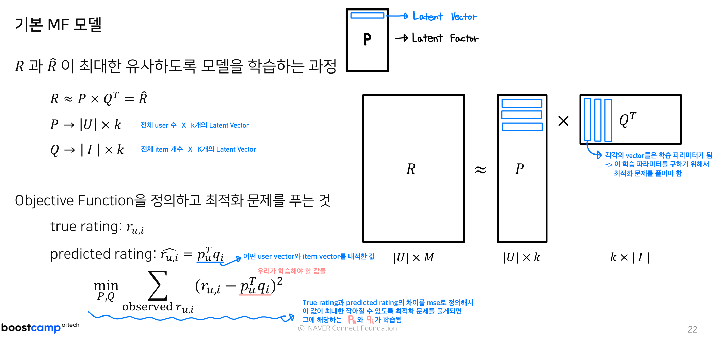

---
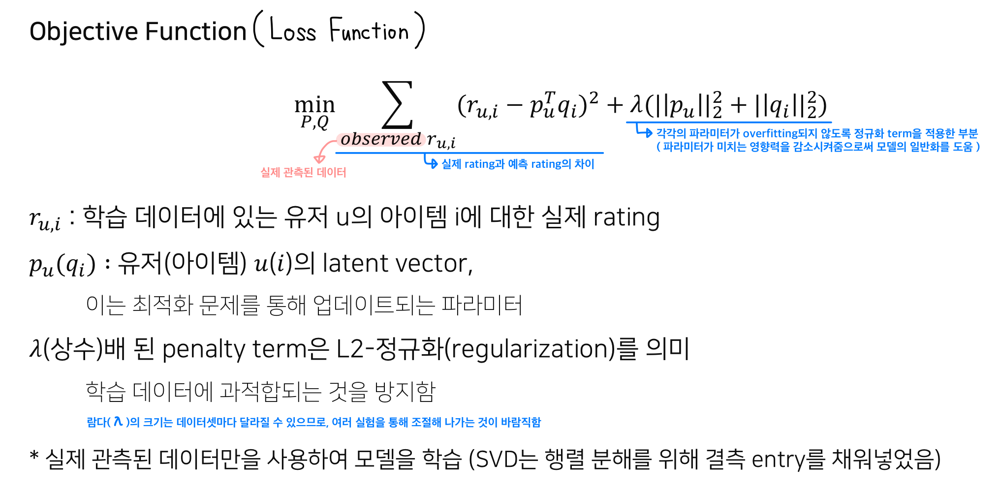 

---
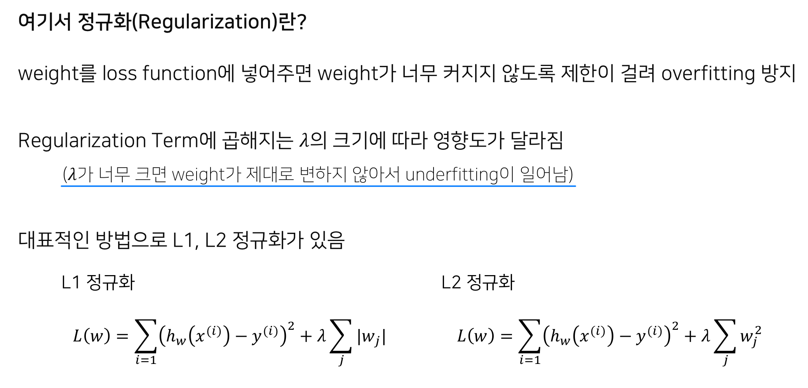
<br>


### __☑ MF 학습__  
#### __SGD__  
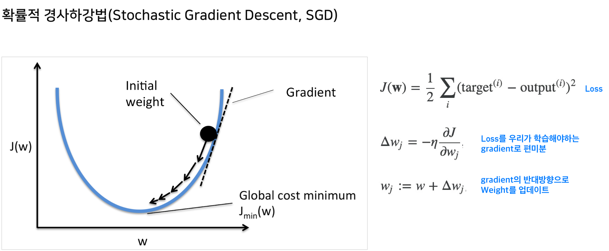  
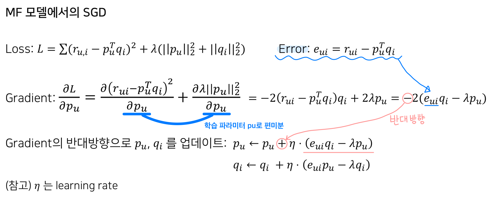
<br>


### __☑ MF + α__  
__Matrix Factorization Techniques for Recommender Systems__  
: MF 기반 추천으로 가장 널리 알려진 [논문](https://datajobs.com/data-science-repo/Recommender-Systems-%5bNetflix%5d.pdf)  
: 기본적인 MF에 다양한 테크닉을 추가하여 성능을 향상시킴
<br>  

---
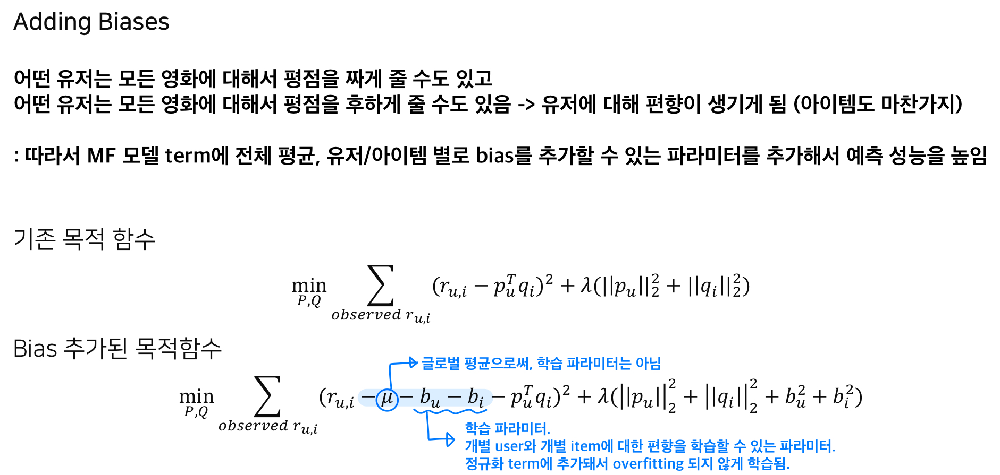  

---
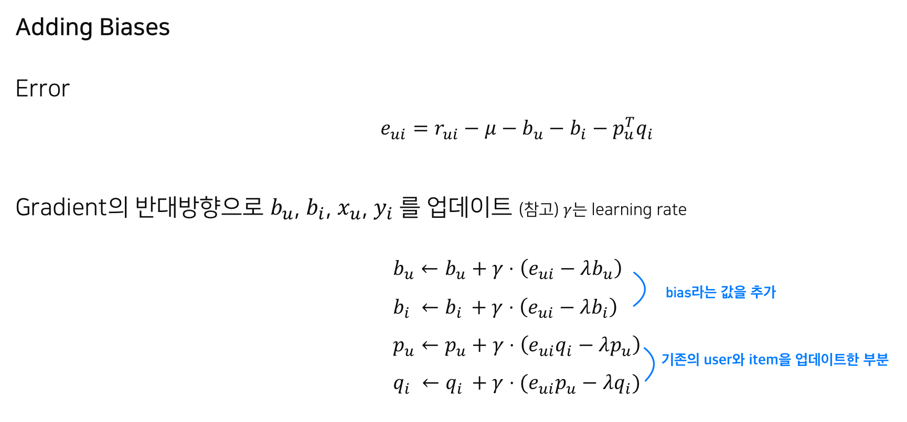  

---
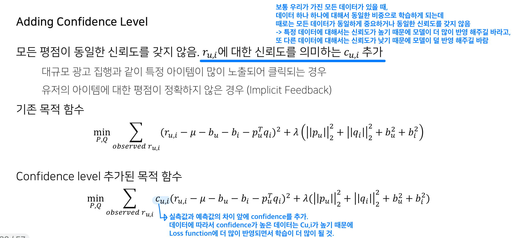

---
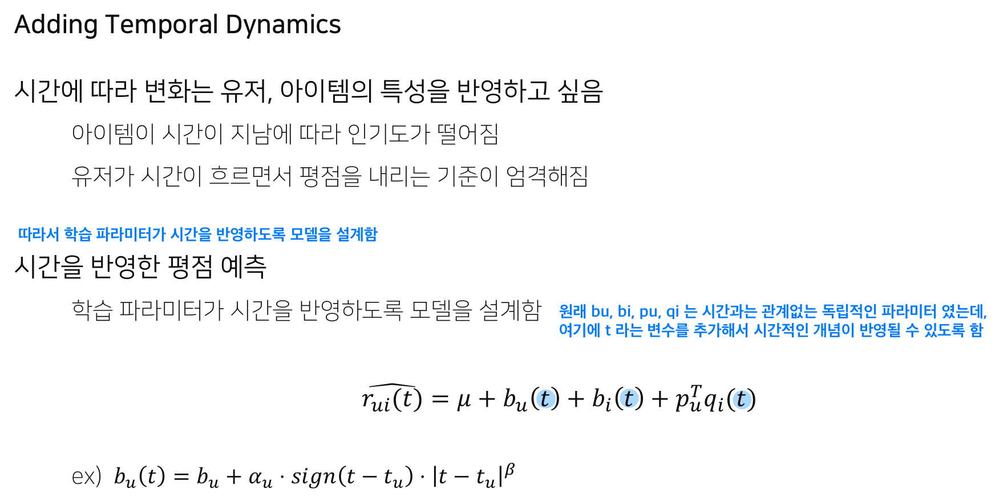  

---
<br>


###  __🦖 (4) MF for Implicit Feedback__  
Matrix Factorization : 행렬 인수분해  
Optimizer : SGD, ALS  
> ( User-Item Matrix를 User Latent Vector와 Item Latent Vector로 분해한 뒤 내적을 통해 결측치를 메꾸는 방법을 Matrix Factorization이라고 하며,  
> 
> 이 때 User-Item Matrix를 복원하는 과정에는 여러 가지 방법이 있는데 크게 SGD와 ALS 방법론이 존재함 )  

### __☑ Alternating Least Square ( ALS )__  
__Collaborative Filtering for Implicit Feedback Datasets__  
: Implicit Feedback 데이터에 적합하도록 MF 기반 모델을 설계하여 성능을 향상 시킨 [논문](http://yifanhu.net/PUB/cf.pdf)  

> Implicit Feedback(암시적 피드백)    
> : 클릭, 콘텐츠 소비, 구매와 같이 유저도 모르는 사이에 자연스럽게 유저의 선호를 유추할 수 있도록 하는 피드백  
> : 이러한 피드백의 경우, 유저가 이 콘텐츠에 대해 싫어하는지 알 수가 없음 ( Unary Rating )  
> 
>  즉, 유저가 해당 컨텐츠를 여러 번 소비한 경우에는 선호가 높다고 할 수 있지만,  
>  유저가 클릭하지 않은 아이템이 유저가 선호하지 않아서 소비하지 않은 것인지  
>  혹은 알고보니 취향인데 소비하지 않은 것인지는 알 수 없음  

=> Implicit Feedback의 이러한 특성을 잘 고려한 모델이 ALS 라고 불리는 모델임  

유저가 스스로 밝힌 취향 그 자체인 Explicit Feedback과 달리 Implicit Feedback은 유저가 해당 아이템을 소비하고 불만족하였을 수도 있고, 소비하지 않은 아이템을 꼭 싫어한다고 볼 수도 없기 때문에, 이러한 불확실성을 반영하기 위해 Confidence 개념을 도입함  

> Implicit Feedback이 존재하는 경우는 “선호가 있다”라고 해석하고,  
> 반대의 경우는 “선호가 없다”라고 해석함  
> 다만, 그러한 판단이 얼마나 확신할 수 있는지는 Implicit Feedback을 바탕으로 계산하게 됨  
> 아무래도 특정 아이템을 소비한 횟수가 많으면 많을수록, 실수로 소비했다거나, 소비 후 불만족했다고 보기 어렵고, 한 번도 소비하지 않은 경우는 불확실성이 매우 높을 것이기 때문.  
> 
> 이처럼 ALS 모델은 단순히 관찰된 피드백뿐만 아니라 관찰되지 않은 제로 피드백의 경우에도 학습 과정에 반영 가능함 !!  

이 과정에서 계산량이 많아지다 보니, alternating-least-squares optimization 방식을 사용하여 학습을 진행하기 때문에 위와 같은 이름이 붙게 됨  

__Alternating Least Squares(ALS)__  
: 교대 최소 제곱법. 목적함수를 최적화하는 기법으로, 사용자와 아이템의 Latent Factor를 한 번씩 번갈아가며 학습시킴. 아이템의 행렬(qi)을 상수로 놓고 사용자 행렬(pu)을 학습시키고, 사용자 행렬(pu)을 상수로 놓고 아이템 행렬(qi)을 학습시키는 과정을 반복함으로써 최적의 Latent Factor를 학습시키는 방법.  
: Sparse한데이터에대해 SGD 보다더 Robust(튼튼) 함  
: 대용량 데이터를 병렬 처리하여 빠른 학습 가능  

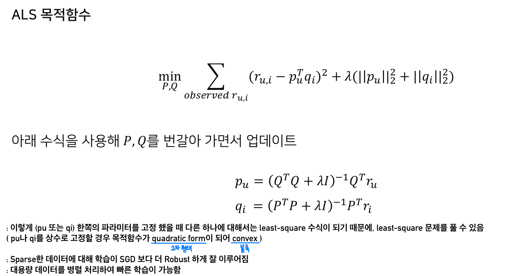 
<br>

### __☑ MF for Implicit Feedback__   
---
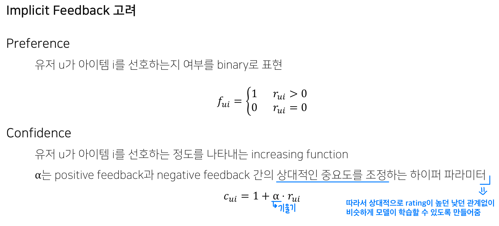  

---
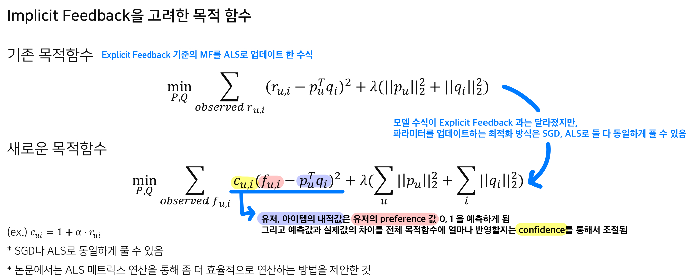

---
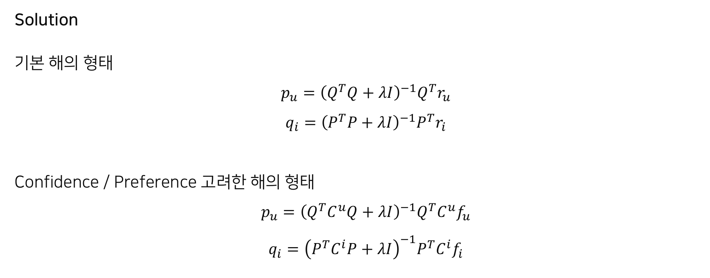  

---
<br>
<br>  


###  __🦖 (5) Bayesian Personalized Ranking ( BPR )__  
### __☑ Bayesian Personalized Ranking의 개념__  
#### ____  
<br>

### __☑ Bayesian Personalized Ranking 학습 및 추론__  
#### ____  
<br>
<br>
<br>


```toc

```
