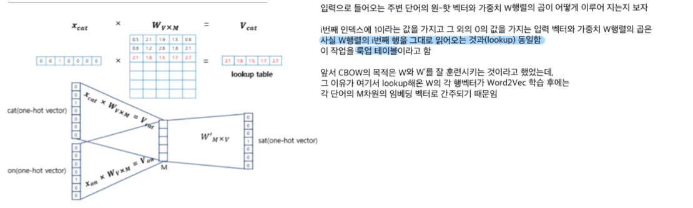

## 🚀 03. Item2Vec and ANN  

### __🦖 (1) Word2Vec__  
### __☑ Word Representation__  
 = Sparse Representation, Local Representation  

: 단어들을 벡터로 표현  
: 1 또는 0으로 표현하는 one-hot encoding을 사용  
 즉, 총 10,000개의 단어가 있다면 10,000개의 벡터 값 중 단어의 해당 값만 1 이고 나머지는 0  

* __특징__  
    Sparse Representation ( 희소 표현 )  
    : 벡터의 대부분이 이진값(0 또는 1)으로 표현된 희소 표현임  
    ( one-hot encoding 또는 multi-hot encoding )  
    : 아이템의 전체 가짓수와 차원의 수가 동일함  
    : 아이템 개수가 많아질 수록 벡터의 차원은 한없이 커지기 때문에 공간이 낭비됨  

* __약점__  
    : 각 단어를 하나의 개체로 여기고, 알고리즘이 교차 단어를 일반화시키지 못함  
        예를 들어 (오렌지, 사과)의 유사성(관계)는 (남성, 여성), (왕, 퀸)의 유사성(관계)처럼 가깝지 않음  
        즉, (오렌지, 사과)의 유사성(관계)을 표현해 줄 무언가가 없음  
    => 모든 단어들을 이용하여 유사성(관계)를 알아낼 수 있는 특징적인 표현을 학습하는 것이 필요함  = Word Embedding  
<br>

### __☑ Word Embedding__  
= Dense Representation, Distributed Representation  
* 텍스트 분석을 위해서 단어를 밀집 벡터(dense representation)의 형태로 표현하는 방법이고,  
    이 밀집 벡터는 워드 임베딩 과정을 통해서 나온 결과이기 때문에 임베딩 벡터라고 함  
    ( one-hot embedding(sparse representation) -> dense representation )  
* (오렌지, 사과)의 많은 특징들은 실제로 동일하거나 아주 비슷한 가치를 지니기 때문에  
    이 특징들을 알아내도록 학습하면 (오렌지, 사과)의 유사성(관계)를 알 수 있음  
    > 이들의 특징을 예를 들어 10개(특징 개수)의 목록으로 표현한다고 하면,  
    > (오렌지, 사과)는 Food(특징)에서 매우 높은 값이라는 것을 확인할 수 있음  
    > 이를 통해 오렌지 주스와 사과 주스가 어떤 것인지를 알아낼 수 있는 확률이 증가하는데,  
    > 이 어떤 것(새로운 차원)을 알아내는 것을 학습이라고 함  
    > 
    > 다른 단어들도 마찬가지로 학습하여 일반화(표현)가 가능함  
* 단어 간 의미적인 유사도를 구할 수 있음  
    ( 비슷한 의미를 가진 단어일 수록 embedding vector가 가까운 위치에 분포함 )  
    ex. 예쁘다, 귀엽다, 애교 등의 단어는 비슷한 vector 값을 가질 것으로 예상  
* 임베딩으로 표현하기 위해서는 학습 모델이 필요함
    Matrix Factorization도 유저/아이템의 임베딩으로 볼 수 있으며, 데이터로부터 학습한 매트릭스가 곧 임베딩임
* 워드 임베딩 방법론으로는 LSA, Word2Vec, FastText, Glove 등이 있으며, 
    단어를 랜덤한 값을 가지는 밀집 벡터로 변환한 뒤에 인공 신경망의 가중치를 학습하는 것과 같은 방식으로 단어 벡터를 학습하는 방법을 사용함
<br>

* 특징
    * __Dense Representation(밀집 표현)__  
        : 단순한 Word Representation은 Sparse Representation이였음  
        이것은 공간 낭비를 유발하며 유사성(관계)을 찾아내지 못한다는 단점이 있음  
        ( 0하고 곱해지는 경우가 많기 때문 )  
        하지만 Word Embedding은 어떤 것(새로운 차원)을 실수값으로 이루어진 벡터로 표현하는 Dense Representation임  
        : 이 실수값으로 인해, 계산하면서 유사성(관계)을 찾아낼 수 있고 곱해도 0이 되지 않음  
        : 이 어떤 것(새로운 차원)으로 이루어진 벡터는 빽빽하게 밀집되어 있는 벡터이며, 저차원으로 이루어져있음  
        (아이템의 가짓수보다 훨씬 작은 차원으로 표현. 10,000개 -> 300개)  
    * __Distributed Representation__  
        : Word Embedding은 빽빽하게 밀집되어 있는 벡터이며, 저차원으로 이루어져있기 때문에 어떤 것(새로운 차원)의 유사성(관계)을 계산할 수 있는 단어의미를 내장하게 됨  
        : 이처럼 여러 곳에 단어의미를 분포한다 하여 distributed representation이라고 함  

|   |       원-핫 벡터      |임베딩 벡터|
|---|----------------------|-----------|
|차원|고차원(단어 집합의 크기)|저차원|
|다른 표현|희소 벡터의 일종|밀집 벡터의 일종|
|표현 방법|수동|훈련 데이터로부터 학습함|
|값의 타입|1과 0|실수|

<br>

### __☑ Word2Vec__  
* __특징__  
    * 뉴럴 네트워크 기반 ( 기존의 NNLM 모델 )  
    * 대량의 문서 데이터셋을 벡터 공간에 투영  
    * 압축된 형태의 많은 의미를 갖는 dense vector로 표현  
    * 효율적이고 빠르게 Word의 벡터 값을 추정하는 기계 학습 모델
* __학습 방법__  
    CBOW, Skip-Gram, Skip-Gram with Negative Sampling (SGNS)  
  
.png)  
<br>

### __☑ Word2Vec 학습 방법__  
( CBOW, Skip-Gram, SGNS )  
#### __CBOW__  
* __CBOW ( Contimuous Bag of Words )__  
    : 주변에 있는 단어들을 가지고 센터에 있는 단어를 예측하는 방법  
    : 중심 단어를 예측하기 위해서 앞, 뒤로 몇 개의 단어를 사용할 것인지 결정해야 하는데,  
    이 범위를 윈도우(window)라고 함  
    : 윈도우의 크기가 n이라면 실제 중심 단어를 예측하기 위해서 참고하는 단어의 개수는 2n개  
    : 윈도우 크기가 정해지면 윈도우를 옆으로 움직여서 주변 단어와 중심 단어의 선택을 변경해가며 학습을 위한 데이터 셋을 만드는데, 이 방법을 슬라이딩 윈도우(sliding window)라고 함  
    
👉 [NNLM_네트워크_그림_URL](https://drive.google.com/file/d/1yT5wgGaBMl8NyOy9KxRFYzjQEj_bwGKN/view?usp=sharing)  

👉 [CBOW_네트워크_그림_URL](https://drive.google.com/file/d/1FmHi6-Xn8dLOOMcfrkNISRvtMjyDJQJD/view?usp=sharing)  
<br>


  
  
  
<br>

#### __Skip-Gram__  
* __Skip-Gram__  
    : CBOW에서는 주변 단어를 통해 중심 단어를 예측했다면,  
    Skip-Gram은 중심 단어에서 주변 단어를 예측함  
    즉, CBOW의 입력층과 출력증이 반대로 구성된 모델 ( 벡터의 평균을 구하는 과정이 없음 )  
    : 여러 논문에서 성능 비교를 했을 때, 일반적으로 CBOW 보다 Skip-Gram이 성능이 좋다고 알려져 있음  
<br>

#### __Negative Sampling__  
> __네거티브 샘플링 ( Negative Sampling )__  
> 
> Word2Vec의 출력층에서는 소프트맥스 함수를 지난 단어 집합 크기의 벡터와 실제값인 원-핫 벡터와의 오차를 구하고 이로부터 임베딩 테이블에 있는 모든 단어에 대한 임베딩 벡터 값을 업데이트 함  
> 
> 만약 단어 집합의 크기가 수만 이상에 달한다면 이 작업은 굉장히 무거운 작업이므로,  
> Word2Vec은 학습하기에 꽤나 무거운 모델이 됨  
> 네커티브 샘플링은 Word2Vec이 학습 과정에서 전체 단어 집합이 아니라 일부 단어 집합에만 집중할 수 있도록 하는 방법임  
> 
> 만약, 현재 집중하고 있는 주변 단어가 ‘고양이’, ‘귀여운’이라고 한다면  
> 여기에 ‘돈가스’, ‘컴퓨터’, ‘회의실’ 과 같은 단어 집합에서 무작위로 선택된 주변 단어가 아닌 단어들을 일부 가져옴  
> 이렇게 하나의 중심 단어에 대해서 전체 단어 집합보다 훨씬 작은 단어 집합을 만들어놓고 마지막 단계를 이진 분류 문제로 변환함  
> 
> 주변 단어들을 긍정(positive), 랜덤으로 샘플링 된 단어들을 부정(negative)으로 레이블링한다면, 이진 분류 문제를 위한 데이터셋이 됨  
> 
> 이는 기존의 단어 집합의 크기만큼의 선택지를 두고 다중 클래스 분류 문제를 풀던 Word2Vec 보다 훨씬 연산량에서 효율적임  
<br>

#### __SGNS__  
* __SGNS ( Skip-Gram with Negative Sampling )__  
    Skip-Gram의 경우,  
    입력은 중심 단어, 모델의 예측은 주변 단어 (multi class classification)  

    하지만 SGNS의 경우,  
    입력은 중심 단어와 주변 단어 모두, 모델의 예측은 이 두 단어가 실제로 윈도우 크기 내에 존재하는 이웃 관계인지에 대한 확률  
<br>

👉 [Skip-Gram_네트워크_그림_URL](https://drive.google.com/file/d/1ualYyKXRZA_K1wVeO7QlC_mdg3k8yDM3/view?usp=sharing)  

👉 [CBPW_vs_Skip-Gram_네트워크_그림_URL](https://drive.google.com/file/d/14X4IcJzxXHahLzdjHP86G0QFV5J1YmI4/view?usp=sharing)  

👉 [SGNS_네트워크_그림_URL](https://drive.google.com/file/d/1rD-4r76rtfh1qjZNh5Fomsz4Y3ZjTJgh/view?usp=sharing)  

---


---


---
  

---
 
 
---
<br>

### __🦖 (2) Item2Vec__  
: Word2Vec(SGNS)의 아이디어를 추천 시스템에 적용  

__Item2Vec: Neural Embedding for Collaborative Filtering__  
SGNS에서 영감을 받아, 아이템 기반 CF(IBCF)에 Word2Vec을 적용한 [논문](https://arxiv.org/pdf/1603.04259.pdf)  
논문의 명칭 그대로 자연어 처리에 있는 word가 아니라 추천 시스템에서 사용하는 item을 임베딩하는 데에 Word2Vec 모델을 그대로 사용한 논문임  
> -- 간단히 논문 요약 --  
> 많은 협업 필터링(CF) 알고리즘은 아이템 유사도를 생성하기 위해 아이템-아이템 간의 관계를 분석한다는 점에서 아이템 기반이라고 할 수 있음  
> 최근 NLP 분야에서의 연구들 중 일부는 Neural Embedding 알고리즘을 사용하여 단어의 잠재 표현을 학습하는 것을 제시했는데, 이 방법들 중 Word2Vec으로 알려진 Negative Sampling을 이용한 Skip-Gram (SGNS)은 다양한 언어학적 작업에서 좋은 결과를 가져왔음  
> 
> 본 논문에서, 아이템 기반 CF(IBCF)가 동일한 프레임워크의 뉴럴 워드 임베딩으로도 만들 수 있다는 것을 보여줌  
> => SGNS에서 영감을 받아서, 우리는 Item2Vec 이라고 이름을 붙인, 잠재 공간에서 아이템에 대한 임베딩을 만드는 아이템 기반 CF(IBCF) 방법을 설명함  
> ( 조금 수정한 SGNS가 CF 데이터셋에서 서로 다른 아이템 사이의 관계를 포착할 수도 있다는 것을 제안 )  
> 이 방법은 유저 정보를 이용할 수 없을 때조차도 아이템-아이템 관계를 추론할 수 있음  

* __Item2Vec__  
    : 단어가 아닌 추천 아이템을 Word2Vec을 사용하여 임베딩  
    ( 기존 MF도 유저와 아이템을 임베딩하는 방법이기 때문에  
    본 논문에서는 Item2Vec과 MF의 임베딩 성능을 비교하는 부분이 제시되어 있음 )  
    
    : Word2Vec을 학습시키기 위해서는 문장과 단어가 필요한데,  
    추천 시스템에서는 이 문장과 단어를 다르게 구성함  
    > 유저가 소비한 아이템 리스트를 문장으로, 아이템 리스트에 있는 아이템 하나 하나를 단어로 가정하여 Word2Vec 사용  
    > Item2Vec은 유저-아이템 관계를 사용하지 않고 개별 유저가 소비한 아이템들만 학습데이터로 사용하기 때문에 때로는 유저 식별 없이 세션 단위로도 데이터 생성이 가능
    : 앞서 배운 SGNS 기반의 Word2Vec을 사용하여 아이템 하나하나를 벡터화하는 것이 최종 목표이고 그 임베딩 값을 추천에 활용했을 때 기존의 SVD기반의 MF를 사용한 IBCF보다 Word2Vec이 더 높은 성능과 양질의 추천 결과를 제공함  

* __Item2Vec 활용 사례__  
    아프리카 TV의 Live2Vec  
        [문장] 유저의 시청 이력     [단어] 라이브 방송  

    Spotify의 Song2Vec  
        [문장] 유저의 플레이리스트  [단어] 노래  

    Criteo의 Meta-Prod2Vec  
        [문장] 유저의 쇼핑 세션     [단어] 상품

* __Item2Vec 상세__  
    : NLP에서는 문장과 단어를 사용했지만,  
    추천 시스템에서는 유저 혹은 세션 별로 소비한 아이템 집합과 그 아이템 집합을 구성하는 아이템을 사용함  
    이때 시퀀스를 집합으로 바꾸면서 공간적/시간적 정보는 사라짐  
    대신 집합 안에 존재하는 아이템은 서로 유사하다고 가정함  
    : 공간적/시간적 정보를 무시하기 때문에 동일한 아이템 집합 내 아이템 쌍들은 모두 SGNS의 Positive Sample이 됨  
    : 기존의 Skip-Gram이 주어진 단어의 앞뒤로 n개의 단어를 사용한 것과는 달리 모든 단어 쌍을 사용함  

---


---


---
<br>

### __🦖 (3) Approximate Nearest Neighbor ( ANN )__  
### __☑ ANN의 필요성__  
#### __Brute Force KNN__  

### __☑ ANNOY__  

### __☑ 기타 ANN 기법 ( HNSW, IVF, PQ )__  
#### __HWSW__  
#### __IVF__  
#### __PQ__  


```toc

```


