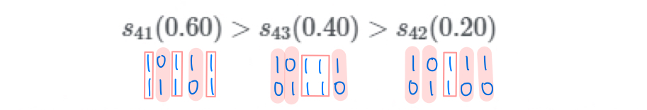

## 🚀 04. RecSys with DL_1
### __🦖 (1) RecSys with DL/MLP__
### __☑ Recsys with DL__  
#### 추천 시스템과 딥러닝  
추천시스템에서 딥러닝을 활용하는 이유  
1. __Nonlinear Transformation__  
    Deep Neural Network(DNN)은 data의 non-linearity를 효과적으로 나타낼 수 있음  
    -> 복잡한 user-item interaction pattern을 효과적으로 모델링하여 user의 선호도를 예측할 수 있음  
2. __Representation Learning__  
    DNN은 raw data로부터 feature representation을 학습해 사람이 직접 feature design하지 않아도 됨  
    -> 텍스트, 이미지, 오디오 등 다양한 종류의 정보를 추천 시스템에 활용할 수 있음  
3. __Sequence Modeling__  
    DNN은 자연어처리, 음성 신호 처리 등 sequential modeling task에서 성공적으로 적용됨  
    -> 추천 시스템에서 next-item prediction, session-based recommendation에 사용됨  
4. __Flexibility__  
    Tensorflow, PyTorch 등 다양한 DL 프레임워크 오픈  
    -> 추천시스템 모델링 flexibility가 높으며 더 효율적으로 서빙할 수 있음


<br>

### __☑ Recsys with MLP__  
#### __MLP__  
다층 퍼셉트론(Multi-layer Perceptron, MLP)  
    : 퍼셉트론으로 이루어진 layer 여러 개를 순차적으로 이어 놓은 feed-forward neural network  
    : 선형 분류만으로 풀기 어려웠던 문제를 비선형적으로 풀 수 있음  
        ex. XOR 분류기  
  
<br>

#### __NCF__  
Neural Collaborative Filtering  
: MF의 한계를 지적하여 신경망 기반의 구조를 사용해 더욱 일반화된 모델을 제시한 [논문](https://dl.acm.org/doi/pdf/10.1145/3038912.3052569?casa_token=vTVZLCKNe5wAAAAA:9am227a6HNfs7T9D0f4jLqj4lVaa3Ht5iejdyokMol6THszHfo6A4Wfz9l4TMgRtFjDtWVUxLypV-aA)  
: GMF와 MLP를 ensemble한 것을 최종 모델로 제시함  

__# 아래는 해당 논문을 바탕으로 정리한 글__  
__https://leehyejin91.github.io/post-ncf/ 을 참고하여 작성함__

* MF의 한계  
    : user와 item embedding의 선형 조합(linear combination)을 구함
    -> user와 item 사이의 복잡한 관계를 표현하는 것에 한계를 가짐

    > Matrix Factorization(MF)은 추천시스템에서 널리 사용되는 방법이다.  
    > 이는 user와 item의 상호작용을 학습하는 한 방법으로, user-item 공간의 latent feature들의 inner product를 통해 두 관계를 표현하게 된다.  
    > 일반적으로 MF는 linear 한 방식이므로 user와 item간의 복잡한 관계를 표현하는데 한계가 있다.  
    > 
    > 반면 Deep Neural Network(DNN)의 multi-layer 구조는 non-linear 하기 때문에 보다 복잡한 구조를 표현하는데 용이하다.  
    > 따라서 Neural Net 기반의 architecture인 Neural Collaborative Filtering(NCF)를 제시함으로써, 보다 유연한 방식으로 두 관계를 표현할 수 있는 일반화된 MF 모델을 제안한다.  
<br>

* Implicit Data  
    
    M과 N이 각각 user와 item 개수라고 할 때 user-item 행렬 Y는 아래와 같다.  
    여기서 y u,i = 1 은 user 와 item 간의 상호작용이 있음을 나타낸다. 상호작용이란 user가 item을 열람했거나, 구매했거나 등의 암시적인(implicit) 정보를 의미하며, 주의할 점은 이것이 명시적인(explicit) 선호를 뜻하진 않는다는 것이다. 
    따라서 은 상호작용이 없는 것이지, 해당 item을 비선호 한다는 의미는 아니다.  

    위처럼 user와 item간의 implicit한 정보를 담고있는 데이터의 문제는 user의 선호를 분명하게
    정의할 수 없다는 것에 있다.  예를 들어 user가 특정 item을 좋아할 수 있지만 해당 item을 모를
    경우에도 y u,i = 0이 되기 때문이다.  
    따라서 이런 경우, 추천은 y u,i가 이 될 확률( user 와 item 의 관련 정도)을 예측하는 문제로 귀결되며 이는 다음과 같이 표현될 수 있다.
    

    이런 문제를 풀때 흔히 사용하는 loss function은 크게 두 가지가 있다.  
      

    먼저 L1은 point wise loss function으로, regression 문제에 많이 사용되며 실제값과 예측값의 차이를 최소화 한다.  
    이와 달리 L2는 pairwise loss function으로, 관측값(y obs)이 관측되지 않은 값(y unobs)보다는 큰 값을 갖도록 하여 두 값의 마진을 최대화한다.  
    논문에 따르면, NCF는 Interaction function 에 Deep Neural Network를 사용하는 것으로, 이 경우 자연스럽게 L1과 L2 모두를 이용할 수 있다고 한다.  
> https://junklee.tistory.com/126  
> 1. __Point-wise approaches__  
>    Point-wise는 Loss function에서 한번에 하나의 아이템만 고려합니다.  
>    하나의 Query(=User)가 들어왔을 때, 이에 대응하는 하나의 Item만 가져와서,  
>    Score(User, Item) 를 계산하고, 이를 Label score와 비교해서 최적화시키는거지요.  
>    이렇게 각각의 (User, Item) 별 점수를 모두 업데이트시켜주고,  
>    이런 점수들을 내림차순으로 정렬한 뒤, 그 인덱스를 그대로 Rank의 개념으로 표현합니다.  
>    이런 학습 방식은, Item과 Item 사이의 순서 관계를 무시하고, 그냥 독립적인 개체로써 학습시키고, 결과만 정렬한다는 것에서 단점이 보이는 듯 합니다.  
>    다만, 굉장히 직관적인, 그리고 일반적인 Loss이기 때문에  
>    기존에 존재하는 다양한 분류, 회귀 모델을 그대로 사용할 수 있다는 장점이 있습니다.  
>    이러한 Loss function으로는 LSE 등이 있습니다.  
> 
> 2. __Pair-wise approaches__  
>    Pair-wise는 Loss function에서 한번에 2개의 아이템을 고려합니다.  
>    더 구체적으로는, 1개의 Positive item, 1개의 negative item을 고려합니다.  
>    이런 Pos, Neg item pair 가 들어오면, Pos item > Neg item 이라는 Rank가 자연스럽게 형성되고, 이를 이용해 학습과정에서부터 Rank를 고려할 수 있게됩니다.  
>    Point-wise와 달리 Item을 2개로 사용하고 있으니,  
>    Score를 계산할 때도 (User, Item)이 아닌 (User, Pos Item, Neg Item)이 들어가게 될 테고,  
>    때문에 데이터셋을 Triplet으로 미리 바꿔두는 과정이 필요하겠지요.  
>    추가로, 저희는 Dataset 안에서 Pos item보다 Neg item이 훨씬 많은 비율을 차지하고 있다는 것을 압니다.  
>    그럼 Triplet을 구성할 때, 모든 조합을 활용하게되면 같은 Pos item이 과도하게 많이, 중복해서 활용될 것이라는 점을 알 수 있는데,  
>    이를 해결하기 위해 여러 Sampling 기법이 활용됩니다. 만 여기서 구체적인 기법은 다루지 않도록 하겠습니다.  
>    이렇게 Rank를 미리 고려해서 학습을 하고, Rank로 평가를 하니 일반적으로는 Point-wise 보다 성능이 좋은 편입니다.  
>    이러한 Loss function으로는 BPR, WARP, CLiMF 등이 있습니다.  
> 
> 3. __List-wise approaches__  
>    List-wise는 Loss function에서 한번에 전체의 아이템을 고려합니다.  
>    Pair-wise는 두 개 아이템간의 상대적인 Rank만 학습한다면,  
>    이 친구는 전체 아이템간의 Rank를 학습하려 듭니다.  
>    그게 쉽고, 잘되면 당연히 List-wise가 가장 좋은 Loss function이라고 생각이 드는데,  
>    다른 방법에 비해 꽤나 복잡합니다.  
>    이런 방법론의 예시로는 아래와 같은 2가지가 존재합니다.  
> 
>       * NDCG 등의 IR measure을 직접적으로 최적화 하는 방법론.   
>           SoftRank, AdaRank  
>       * 자신이 필요한 Rank의 특성을 이해하고, 새롭게 정의한 Loss를 최적화하는 방법론.  
>           ListNet, ListMLE  
<br>

* Matrix Factorization  
    행렬 Y의 y u,i를 예측하는 한 가지 방법은 MF을 이용하는 것이다.  
    MF란 아래와 같이 Y를 보다 저차원(K < N)의 행렬 2개(P,Q)로 분해하여 표현하는 방법이다.  
      

    이때, MF는 y u,i를 아래와 같이 p u와 q i의 내적으로 추정하게 된다.  
      
<br>

* MF의 한계  
    저자는 내적과 같은 linear 모델은 user와 item 간의 복잡한 관계를 표현하는데 한계가 있음을 지적한다.  
      

    예를 들어 위의 왼쪽 그림(a)과 같은 user-item 행렬이 있다고 할때, s ij는 user i 와 j의 유사도를 나타낸다고 하자. 그럼 다음과 같은 관계가 성립한다고 볼 수 있다.  
      

    즉 user 2와 3이 가장 비슷하고, user 1과 3이 가장 덜 비슷하다는 뜻이다.  
    위의 오른쪽 그림(b)은 이런 관계를 기하학적으로 보여주고 있다. b를 보면 user 2와 user 3이 가장 가까이 위치하며 1과 3은 가장 멀리 위치하고 있다.  
    linear space의 한계는 새로운 user 4가 등장했을 때 발생한다.  
    그림 a에 따르면, user 4는 나머지 유저와 아래와 같은 관계를 갖고 있다.  
      

    하지만 그림 b가 보여주듯, user 1,2,3 이 만든 공간에 새로운 user 4를 나타낼 때,  
    절대 위의 식같은 관계를 표현할 수 없다.  
    즉, 4와 1을 가장 가깝게 하는 동시에 4와 2를 가장 멀게하는 p4벡터를 찾을 수 없는 것이다.

    이런 한계는 user와 item간의 복잡한 관계를 저차원의 단순한 공간에 표현 하는데서 기인한다.  
    (또한 linear space 는 고정된(fixed) 특징이 있기 때문에 새로운 관계를 표현하는데 유연하지 못함)  따라서 저자는 DNN을 이용해 이런 문제를 해결하고 있다.  
<br>

* NCF의 general framework  
  

---
 
<br>

* NCF 학습  
    위와 같은 모델을 학습하기 위해서는 loss function을 정의해야 한다.  
    NCF는 0과 1사이의 예측값을 갖고, 데이터는 y u,i=1 or 0 과 같은 이진 데이터로 이뤄져 있다.  
    일반적으로 이런 분포를 모델링 할 때는 bernoulli distribution을 이용한다. 
    즉, Y가 y u,i=1인 관측치 집단, Y−가 y u,i=0 인 관측치 집단을 나타낼 때, likelihood function은 다음과 같다.  
      

    이어 loss function은 아래와 같다. (이는 binary cross entropy loss와 동일) 모델은 이 L을 최소화 하는 파라미터를 찾게 된다.  
      
    <br>

    > 참고!  
    > y u,i=1인데, pred_y u,i=1 이라면 L1=0 이 될 것이고  
    > y u,i=1인데, pred_y u,i=0 이라면 L1=undefine 이 되지싶다.  
    > ( log(0)은 -∞ 가 되는 줄 알았는데 undefine 으로 정의한다고 함 )  
    >   
    > 이처럼 L1=undefine 이 되는 경우에는 pred_y에 작은 숫자( 1e-15와 같은 것 )를 추가하는데,  
    > 이 숫자는 예측을 크게 빗나가게 하지 않으며 해당 문제를 해결한다고 함  

* GMF  
    Generalized Matrix Factorization  
    > MF는 NCF의 특별한 케이스라고 볼 수 있으며, GMF는 MF를 일반화한 모델임  
    > 단순히 dot-product(내적)로 output을 예측했던 MF와 달리 GMF에서는 element-wise product(성분곱. 같은 크기의 두 행렬의 각 성분을 곱하는 연산)를 수행하며, 
    > 가중치를 적용해준후 활성화함수를 통과함 ( 활성화함수로는 시그모이드를 사용 )  
      
<br>  

* MLP  
    저자에 따르면 GMF는 linear하고 fixed한 특징으로 인해 user 와 item간의 복잡한 관계를 표현하지 못하는 반면  
    MLP는 non-linear하고 flexible 하기 때문에 보다 복잡한 관계를 표현할 수 있다고 함   
    이에 따르면 MLP는 다음과 같이 파라미터라이징 됨  
    
      

    이때 ϕ1은 user와 item의 latent vector를 concatenation하는 함수이며,  
    ϕl (l≥2)은 Neural Net 함수로 W와 b 는 각각 가중치 행렬과 편향 벡터를 나타냄  
    마지막 식은 GMF의 구조와 동일함  
    이때 차이점은 GMF는 ϕ1(.) 가 linear구조인 반면, MLP는 ϕL(.) 가 non-linear 구조임  

* 최종 모델 Neural MF ( GMF와 MLP를 ensemble )  
    Neural Matrix Factorization  
    저자는 아래 그림과 같이 GMF와 MLP를 통합한 모델을 제시함  
    이는 각자가 가진 장점을 살릴 수 있는 반면 단점은 서로 보완할 수 있다고 함  
      


    통합 프레임워크의 가장 큰 특징은 각 모델별로 서로 다른 embedding layer를 사용한다는 것임  
    아래 식은 이 모델이 어떻게 파라미터라이징 되는지 보여줌  
       

    이 모델은 user-item간의 상호 관계를 표현하기 위해 MF의 linearity 와 MLP의 non-linearity를 결합한 것이 특징이며 저자는 이 모델을 일컬어 neural matrix factorization 라고 함  

    결과  
    : MovieLens, Pinterest 데이터셋에 대하여 NCF의 추천 성능이 기존 MF(BPR)나 MLP 모델보다 높음  

    > 저자에 따르면, NeuMF은 collaborative filtering의 핵심 가치(user와 item의 상호작용 모델링)를 놓치 않으면서 성능은 높인, 그런 방법이다.  
    > 이것이 가능한 이유는 linear space에 기반한 기존 모델들이 갖는 한계를 DNN을 도입해 해결할 수 있었기 때문이다.  
    > 나아가 DNN에만 의존한 것이 아닌 두 모델을 통합함으로써 더 큰 성능 향상을 보일 수 있었다.  

<br>

#### __Youtuve Recommendation__  


### __🦖 (2) RecSys with AE__  
__AutoRec: Autoencoders Meet Collaborative Filtering__  
AE를 CF에적용하여 기본 CF 모델에 비해 Representation과 Complexity 측면에서 뛰어남을 보인 [논문](https://users.cecs.anu.edu.au/~akmenon/papers/autorec/autorec-paper.pdf)  

#### __Autoencoder__  
* __오토인코더 ( Autoencoder, AE )__  
    : 단순히 입력을 출력으로 복사하는 신경망에 여러가지 방법으로 제약을 줌으로써 어려운 신경망으로 만듦  
    : 즉, 입력 데이터를 출력으로 복원(reconstruct)하는 비지도(unsupervised) 학습 모델  
    : ( 또는 동일한 입, 출력 구조를 사용해 압축된 latent representation을 학습할 수 있는 비지도 학습 모델 )    
    : 따라서 Autoencoder는 Encoder와 Decoder로 구성되어 서로 대칭을 이루는 구조를 가지고 있음
    
    : 제약은 다양하게 있는데 이러한 제약들은 Autoencoder가 단순히 입력을 바로 출력으로 복사하지  못하도록 방지하며, 데이터를 효율적으로 표현(representation)하는 방법을 학습하도록 제어함  
    : hidden layer의 뉴런 수를 input layer(입력층) 보다 작게해서 데이터를 압축(차원을 축소)한다거나, 입력 데이터에 노이즈(noise)를 추가한 후 원본 입력을 복원할 수 있도록 네트워크를 학습시키는 등 다양한 오토인코더가 있음  
  
    
    : 학습은 일반적으로 모델 Output과 Input 사이의 RMSE를 최소화하는 방향으로 진행됨  
    : 학습이 완료된 Auto Encoder는 분리를 통해 다양한 쓰임새로 사용될 수 있음  
    : Encoder는 저차원 latent space로의 임베딩을 위해 사용될 수 있으며,  
    Decoder는 generative model로서 사용이 가능함  
    
    : 간단하지만 강력한 성능을 가지고 있기 때문에, Auto encoder의 다양한 Variation 구조들이 Vision, Speech 등 다양한 분야에서 사용되고 있음  
    : 노이즈에 일반화된 성능을 보여주는 Denoising Auto Encoder,  
    이미지를 학습하는 Convolutional Auto Encoder,  
    시퀀스를 학습하는  RNN Auto Encoder,  
    정규분포를 사용하여 latent feature를 가정하는 Variational Auto Encoder는 대표적인 Auto Encoder 구조의 예시임
    
   
> 출처: https://excelsior-cjh.tistory.com/187 [EXCELSIOR]  
> 출처: https://supkoon.tistory.com/36  

<br>

#### _AutoRec_  
AutoRec은 Auto Encoder를 협업 필터링에 적용한 모델로서,  
Auto Encoder의 장점에 힘입어 기존의 협업필터링 모델에 비해 Representation과 Complexity 측면에서 뛰어난 모습을 보여줌  

* __AutoRec 모델 구조__  
    유저, 아이템 등의 특성을 Latent space로 매핑하는 것은 협업필터링에서 특성간의 Interaction을 모델링하기 위해 대중적으로 사용되는 방법 중 하나임  
    추천시스템 모델인 MF, NCF, FM, DeepFM, Wide&deep도 서로 다른 방법론 속에서도 부분적으로는 Latent Factor를 사용하고 있음  
    > __vs MF__  
    > 
    > MF는 SVD와 유사한 방법으로 각기 다른 차원의 User, Item Matrix를 동시에 Latent space로 매핑하지만, AutoRec은 I-AutoRec, U-AutoRec 각각의 형태에서 유저와 아이템 중 하나만을 매핑함  
    >   
    > MF는 linear한 저차원의 Latent representation과 interaction을 학습하는 반면,  
    > AutoRec은 non-linear한 Activation FUnction을 사용하여 복잡한 non-linear latent representation을 학습할 수 있음  
    > ( 즉, AutoRec은 non-linear activation function을 사용하므로  더 복잡한 interaction 표현이 가능함 )   

    AutoRec 또한 Auto Encoder를 사용하여 유저 또는 아이템 벡터를 저차원의 Latent feature로 표현하는 방법으로, partially observed User-Item rating matric ∈ R x R^mxn에 대한  
    Matrix Completion(비어있는 matrix를 완성시키는 문제)을 수행함  
    ( 즉, Autoencoder의 representation learning을 유저와 아이템에 적용한 것 )  

    그렇지만 일반적인 Latent Factor 모델과 달리,  
    AutoRec은 아이템, 유저 중 하나에 대한 임베딩만을 진행함

    해당 논문의 저자들은 아이템을 임베딩하는 Item-based 구조를 I-AutoRec,  
    유저를 임베딩하는 user-based 구조를 U-AutoRec으로 명명하였음  
    ( 두 가지 모델에 대한 방법은 동일함 )  

    아이템 i ∈ I = {1 . . . n} 이 존재할 때,
    각각의 아이템 i에 대한 평점 r(i)는 모든 유저 u ∈ U = {1 . . . m} 와의 조합으로 r(i) = (R_1i, . . . R_mi) ∈ R^m 과 같이 표현될 수 있고  

    이와 동일하게  
    유저 u ∈ U = {1 . . . m} 가 존재할 때,  
    각각의 유저 u에 대한 평점 r(u)는 모든 아이템 i ∈ I = {1 . . . n} 와의 조합으로 r(u) = (R_u1, . . . R_un) ∈ R^n 과 같이 표현될 수 있음  
    r(u).png)    
    > 이때, 실제 데이터 r(i)에는 관측되지 않은 조합과 관측된 조합들이 섞여있을 것임

    I-AutoRec은 각각의 아이템 i에 대한 rating vector r(i)를 Auto Encoder의 input으로 넣고,  
    U-AutoRec은 각각의 유저   u에 대한 rating vector r(i)를 Auto Encoder의 input으로 넣음  

    일반적인 Auto Encoder와 동일하게 AutoRec은 다음과 같은 Encoder & Decoder reconstruction 과정을 수행함  
    h(·), f(·), g(·)는 element-wise mapping function임  
      

    ---
      
    > 모든 개별적인 아이템에 대한 AutoRec은 파라미터를 공유하는 하나의 모델임      

* __AutoRec 학습__  
    AutoRec은 일반적인 Auto Encoder와 동일하게 RMSE를 최소화 하는 방향으로 학습을 진행함  
         
    
    이 때 중요한점은,  
    관측되지 않은 데이터에 대해서는 역전파를 진행하지 않고,  
    관측된 데이터의 파라미터에 대해서만 역전파를 통해 업데이트가 된다는 것임.
      
    > 회색은 관측된 데이터, 흰색은 관측되지 않은 데이터를 의미함  
    > 관측된 데이터에 해당하는 회색의 Connection은 실선의 형태로 업데이트를 진행하고,  
    > 관측되지 않은 데이터인 흰색의 Connection은 점선으로 표시하여 업데이트 하지 않는다는 것을 알 수 있음  
    > 또한 Overfitting을 방지하기 위해서 정규화 항을 최적화식에 추가할 수 있음  

    AutoRec의 목적함수  
      
    I-AutoRec을 기준으로 했을 때,  
    학습이 진행되는 파라미터는 2mk + m + k개임.
    Encoder, Decoder가 각각 mk개의 임베딩 파라미터를 갖고, bias를 위해 m, k개의 파라미터가 사용됨  

    U-AutoRec을 기준으로 했을 때도 동일함.  
    학습이 진행되는 파라미터는 2nk + n + k개임.  
    Encoder, Decoder가 각각 nk개의 임베딩 파라미터를 갖고, bias를 위해 n, k개의 파라미터가 사용됨  

    기존의 CF에 비하면 굉장히 적은 파라미터가 필요함을 알 수 있음  

    최종적으로 학습된 파라미터를 통해 I-AutoRec과 U-AutoRec이 예측하는 평점은 아래와 같음
     

    > 참고  
    > : AutoRec은 Vanila Auto Encoder 구조만 사용하며,  
    >  모델의 목적 함수는 Auto Encoder의 loss function과 유사함  
    > : 탄력적인 전파(더 빠르게 수렴하고 비슷한 결과를 생성) 또는 L-BFGS(제한된 메모리 Broyden Fletcher Goldfarb Shanno 알고리즘)를 통해 최적화할 수 있음  
    >  

__AutoRec 실험 결과 및 가지 중요한 사항__  
* I-AutoRec은 일반적으로 U-AutoRec보다 성능이 좋음  
    ( 이는 각 iten에 대한 평균 평점 수가 각 user가 부여한 평균 평점 수보다 훨씬 많기 때문임 )   
* hidden layer에 비 선형성을 추가시켜주는 sigmoid g(·) 활성화 기능의 사용은 AutoRec의 성능에 상당한 영향을 미침    
    ( 실험에서 I-AutoRec이 가장 낮은 RMSE를 달성함 )
* hidden unit의 수를 늘리면 모델 성능이 향상됨  
    ( hidden unit의 수에 따른 성능 비교 실험을 했을 때, 깊어질 수록 RMSE가 줄어드는 것을 볼 수 있었음 )  
* hidden layer의 수를 늘리면 모델 성능이 향상됨  
    ( hidden layer의 차원을 확장하면 AutoRec이 입력 기능을 시뮬레이션 할 수있는 더 많은 용량을 갖게되므로 성능 향상에 도움을 줌 )  
* 심층 네트워크를 구성하기 위해 더 많은 계층을 추가하면 약간의 개선이 이루어질 수 있음  
      
본 논문 이후 고급 AE 기법을 CF에 활용한 후속 연구들이 나옴  
DAE -> Collaborative Denoising Auto-Encoders for Top-N Recommender Systems,  
VAE -> Collaborative Variational Autoencoder for Recommender Systems, …  
<br>
<br>

#### __CDAE__  
__Collaborative Denoising Auto-Encoders for Top-N Recommender Systems__   
Denoising Autoencoder를 CF에 적용하여 top-N 추천에 활용한 [논문](https://alicezheng.org/papers/wsdm16-cdae.pdf)  

* __디노이징 오토인코더 ( Denoising Autoencoder, DAE )__  
    > DAE의 탄생 배경 
    >  
    > Auto Encoder는 위에서 말했듯 입력 데이터를 출력으로 복원하는 비지도 학습 모델이며,  
    > 주요 활용 분야는 이상치 탐지(Anomaly Detection), 표현학습(Representation Learning), 이미지 노이즈 제거(Image Denoisint Task)임  
    > 특히 이미지 노이즈 제거의 경우 처음 Auto Encoder는 이미지를 그대로 복원하는 것이 주요 Task 였으나, 실제 적용 문헌에서는 오히려 Noise가 낀 데이터에서 노이즈를 제거하는데 사용되었음  
    > 이를 더 잘 수행하기 위해 나온 것이 DAE임   
    : 입력 데이터에 노이즈한 input을 만들기 위해 일부러 random noise나 dropout을 추가하여 학습함  
    : noisy input을 더 잘 복원할 수 있는 robust한 모델이 학습되어 전체적인 성능 향상   
    : 학습 데이터에 있는 깨끗한 Input data에만 Overfitting 되는 AE의 한계를 극복함  
  

* __CDAE 모델 구조__  
    : input layer, hidden layer, output layer로 총 3개의 layer로 구성되어 있음  
    : input layer와 output layer는 총 i + 1 개의 노드가 있음    
    : i노드는 item에 해당함  
    마지막 i + 1번째의 노드는 user에 해당하며(그림의 빨간색 노드), 관련 가중치(빨간색 선)는 데이터의 각 사용자 u ∈ U에 대해서 unique함  
    : 한 명의 유저 u를 기준으로 모든 item에 대한 평점을 나타내는 벡터 y u를 구한 뒤, 이 y u 를 그대로 사용하지 않고 y u tilde(~) 값을 사용함  
    : y u tilde값들은 q라는 확률에 의해 0으로 drop-out 된 벡터를 의미함  
    ( q의 확률로 어떤 원소(평점 값)는 0 이 되고, 1-q의 확률로 어떤 원소는 기존 원소에 δ 가 곱해지게 됨. 즉, 노이즈 씌운거라고 생각하면 됨 )    
    : 개별 유저에 대해서 V u 라는 파라미터가 존재함  
    ( 각각의 유저에 따라 unique한 특징이 해당 파라미터를 통해서 학습되고, 이는 유저별 Top-N 추천에 활용되어 추천 성능을 높임 )  
    : 각각의 유저별로 다른 특징이 각각의 파라미터를 통해서 학습되기 때문에 이 모델에 Collaborative라는 이름이 붙게 되었음  
    : h(·), f(·)는 element-wise mapping function임  
    : CDAE는 문제 단순화를 위해 유저-아이템 상호작용 정보를 binary(0 또는 1) 정보로 바꿔서 학습 데이터로 사용함  
    ( 개별 유저에 대해서 아이템의 rating이 아닌 preference를 학습하게 된다는 말 )  
    : DAE를 사용하여 입력에 Noise 정보를 추가함  
  
  
 


* AutoRec vs CDAE  
    |       AutoRec      |      CDAE      |
    |--------------------|----------------|
    |Rating prediction을 위한 모델|Ranking을 통해 유저에게 Top-N 추천을 제공하는 모델|
    |입력 데이터 그대로 input|입력 데이터에 DAE로 noisy적용해서 input|
    |개별 유저 학습 X|개별 유저 학습 O|

* result  
    대체적으로 N에 관계 없이 다른 top-N 추천 모델에 비해 더 높은 MAP와 recall을 보임  

```toc

```
