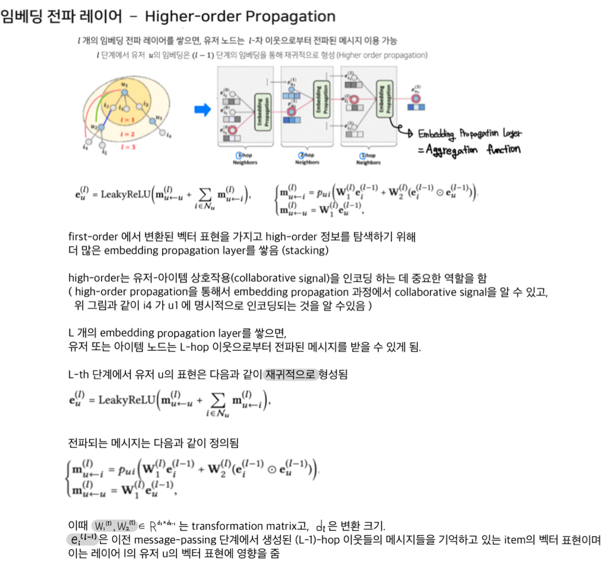

## 🚀 05. RecSys with DL_2
### __🦖 (1) RecSys with GNN__
### __☑ Graph Neural Network__
* __정점 표현 학습 ( Node Representation Learning 또는 Node Embedding )__  
    : 그래프의 정점들을 벡터의 형태로 표현하는 것. 정점 임베딩이라고도 불림  
    : 그래프에서의 정점 간 유사도를 임베딩 공간에서도 보존하는 것을 목표로 함  
    : 정점 임베딩 방법은 변환식 방법과 귀납식 방법이 있음  

    우선, 변환식 임베딩 방법은 학습의 결과(출력)로 정점의 임베딩 자체를 얻기 때문에 여러 한계를 가짐  
    > 학습이 진행된 이후에 추가된 정점에 대해서는 임베딩을 얻을 수 없음  
    > 모든 정점에 대한 임베딩을 미리 계산하여 저장해두어야 함  
    > 정점이 속성(Attribute) 정보를 가진 경우에 이를 활용할 수 없음  
    반면, 귀납식 임베딩 방법은 학습의 결과(출력)으로 인코더를 얻기 때문에 여러 장점을 가짐  
    > 학습이 진행된 이후에 추가된 정점에 대해서도 임베딩을 얻을 수 있음  
    > 모든 정점에 대한 임베딩을 미리 계산하여 저장해둘 필요가 없음  
    > 정점이 속성(Attribute) 정보를 가진 경우에 이를 활용할 수 있음  

    이런 귀납식 임베딩 방법의 대표적인 모델이 GNN ( Graph Neural Network ) 임
<br>

* __Graph__
    : 꼭짓점(Node)들과 그 노드들을 잇는 변(Edge)들을 모아 구성한 자료구조  
    : 일반적으로 그래프는 G = (V, E)로 정의함  
    ex. G = ({A,B,C,D}, {{A,B}, {A,C}, {A,D}, {C,D}}  


* __Graph를 사용하는 이유__  
    01. __관계, 상호작용과 같은 추상적인 개념을 다루기에 적합__  
        : 복잡한 문제를 더 간단한 표현으로 단순화 하기도 하고 다른 관점으로도 표현이 가능  
        : 소셜 네트워크, 바이러스 확산, 유저-아이템 소비 관계 등을 모델링 가능  
    02. __Non-Euclidean Space의 표현 및 학습이 가능__  
        : 우리가 흔히 다루는 이미지, 텍스트, 정형 데이터는 격자 형태로 표현이 가능 (Euclide Space)  
        : 그러나 SNS 데이터, 분자(molecule) 데이터 등은 non-Euclidean space  
    > 참고  
    > Euclide Space: 우리가 살아가고 있는 3차원 공간을 포함해서 평면, 수직선은 물론 그 이상의 다차원 공간까지 표현하는 공간  
    > Non-Euclide Space: 유클리드 기하학과 달리 평면이 아닌 곡면의 세계에서 점, 선, 면을 설명하는 것. 쌍곡 기하학, 타원 기하학 등이 존재함)  
  

* __Graph Neural Network, GNN ( 그래프 신경망 )__  
    : Node, edge 등으로 표현되는 graph 형태의 데이터를 모델링하기 위한 네트워크  
    : graph와 정점의 속성 정보(graph 형태의 데이터)를 Input으로 받음
    > 기존 머신러닝에서 다루는 정형, 비정형(이미지, 텍스트, 오디오)데이터들은 모두 n차원 유클리드 공간에 벡터와 행렬로 표현 가능  
    > 그러나 그래프 데이터는 유클리드 공간에 존재하지도, 직접적으로 벡터화 할 수도 없음  
    > 따라서 이를 기존 ML 알고리즘에 넣기 위해 추가적인 네트워크(연산 틀)를 만들고,
    > 이를 통해 유클리드 공간에 벡터와 행렬로 표현    
    > -> 네트워크(연산 틀) = Aggregation function  
    > 
    > 즉, 그래프 데이터를 유클리드 공간에 존재할 수 있도록 하기 위한 네트워크(연산 틀)가 Embedding Propagation Layers인 것  

    : 이웃 정점들의 정보를 집계하는 과정을 반복하여 임베딩을 얻음  
     ( 대상 정점의 임베딩을 얻기 위해 이웃들 그리고 이웃의 이웃들의 정보를 집계 )  
    : 각 집계 단계를 층(layer)이라 부르고, 각 층마다 임베딩을 얻음  
     ( 각 layer에서는 이전 층의 임베딩을 집계하여 새롭게 얻고, 가장 밑의 층(0번층)은 ‘정점의 속성 벡터’를 사용함 )  
    : 대상 정점마다 집계되는 정보가 상이함  
     ( 대상 정점 별 집계되는 구조를 ‘계산 그래프(computation graph)’라고 부름 )  
    : 마지막 층에서의 정점 별 임베딩이 해당 정점의 출력 임베딩이 됨  
    : 그래프 데이터에 적용 가능한 신경망  

     * __목적__  
        : 이웃 노드들 간의 정보를 이용해서 특정 노드를 잘 표현할 수 있는 특징(벡터)을 잘 찾아내는 것   
         ( 즉, 그래프 형태의 데이터를 학습이 가능하도록 embedding 해주는 것 )  
     * __방법__  
        : 인접 행렬(노드 간 연결 관계를 담고 있는 행렬)과 feature 들을 결합,  
         concat 한 뒤에 이를 뉴럴 네트워크에 넣는 방식 ( A Naive Approach )  
        > __A Naive Approach 방식의 한계__  
        > 
        > : 파라미터가 N개, 데이터의 개수만큼 필요함  
        > : 노드가 많아질 수록 연산량이 기하급수적으로 많아지며, 노드의 순서가 바뀌면 의미가 달라질 수 있음  
        > 
        > => local connectivity, shared weights, multi-layer를 이용하여 convolution 효과를 만들면 연산량을 줄이면서 깊은 네트워크로 간접적인 관계 특징까지 추출이 가능함  


### __☑ Neural Graph Collaborative Filtering__
> * Matrix Factorization, MF  
>     : 유저-아이템 상호작용에는 유저의 행동, 아이템 평점에 영향을 주는 잠재 요인(latent factoy)이 존재함  
>     : 잠재 요인을 고려하여 유저에게 적합한 아이템을 추천하는 방법  
>     : MF는 유저-아이템 상호작용을 latent factor 간의 곱셈을 선형으로 결합하는 내적(저차원 공간)을 통해 나타내기 때문에 복잡한 구조를 알아내기 어려움  
>     : 새로운 유저가 나타나면 저차원 공간에 이를 표현하기 어려움  
>     : MF는 NCF의 특별한 케이스라고 볼 수 있으며, GMF는 MF를 일반화한 모델임  
>     ===> Neural Collaborative Filtering, NCF  
> * Neural Collaborative Filtering, NCF  
>     : Deep Neural Network를 사용하여 유저-아이템 상호작용을 학습  
>     : Non-Linear 한 요소를 표현할 수 있음 ( Matrix Factorization과의 차별성 )  
>     : 그러나 유저-아이템 상호작용을 나타내기에 아직 부족  
>     ===> Neural Graph Collaborative Filtering, NGCF   

* __Neural Graph Collaborative Filtering, NGCF__  
    : 유저-아이템 상호작용(collaborative signal)을 GNN으로 임베딩하는 과정에서 인코딩하는 접근법을 제시한 [논문](https://arxiv.org/pdf/1905.08108.pdf)  
    > NGCF의 등장 이유  
    > 
    > 일반적으로 Collaborative Filtering Model은 다음과 같은 두 개의 주요 요소로 구성되어있음  
    >  Embedding : 유저/아이템을 벡터로 변환하는 과정   
    >  Interection Modeling : Embedding을 기반으로 historical interaction (구매 혹은 클릭)을 재구성(예측)     
    > 
    > : 기존의 Collaborative Filtering 모델들은 유저-아이템 상호작용을 명시적으로 사용하지 않았음  
    > : ( 기존의 CF 모델들.  Matrix Factorization, Neural Collaborative Filtering 등 )  
    > : latent factor 추출을 interaction function에만 의존하므로 sub-optimal한 임베딩을 사용함  
    >   -> 부정확한 추천의 원인이 될 수 있음  
    > : 모든 Embedding에 유저-아이템 상호작용을 반영하지 않고,  
    >   유저, 아이템 각각의 descriptive feature 만을 Embedding에 사용함  
    > 
    > => 이러한 기존 CF 모델의 한계점을 극복하기 위해 NGCF 모델에서는 High-order Connectivity 라는 새로운 특성을 모델에 반영하고자 함  
  
  
이처럼 High-order Connectivity 에서 유저-아이템 상호작용을 표현하기 위해 GNN의 아이디어를 embedding propagation layer에서 실현함  

즉, 유저-아이템 상호작용을 더 잘 표현하기 위해서 GNN의 아이디어를 차용하여(Embedding Propagation Layer) 유저-아이템간의 Sequential한 관계(High-order)를 그래프적으로 표현한 High-order Connectivity라는 특성을 기존 NCF모델에 반영한게 NGCF라는 모델임  

* __NGCF 모델 구조__  
기존 CF 모델과는 다르게 NGCF는 Embedding Propagation Layer를 가짐  
  
<br>

---


---


> N u와 N i는 각각 유저와 아이템 노드에 연결된 첫 번째 hop의 차수를 의미함.  
> self-connection (W1e(k)u, W1e(k)i)을 통해 이전에 갖고 있었던 임베딩의 정보는 유지하고, 
> feature transformation (W1,W2)과  nonlinear activation(σ)를 사용해 임베딩 값을 업데이트시키는 것을 알 수 있음  

### -> Staking



---
  

---

* __NGCF 결과 및 요약__  
    : 임베딩 전파 레이어가 많아질 수록 모델의 추천 성능이 향상됨  
    다만, 레이어가 너무 많이 쌓이면 Overfitting 발생 가능  
    ( 실험 결과, 대략 L = 3~4 일 때 가장 좋은 성능을 보임 )  
    : MF 보다 더 빠르게 수렴하고 recall 도 높음  
    Model Capacity가 크고 임베딩 전파를 통해 representation power가 좋아졌기 때문  
    : MF와 비교하여 유저-아이템이 임베딩 공간에서 더 명확하게 구분됨  
    ( 레이어가 많아질 수록 명확해짐 )  
<br>

### __☑ Light GCN__  
__Light GCN: Simplifying and Powering Graph Convolution Network for Recommendation__  
: GCN의 가장 핵심적인 부분만 사용하여, 더 정확하고 가벼운 추천 모델을 제시한 논문  

> ablation study  
> 제안한 요소가 모델에 어떠한 영향을 미치는지 확인하고 싶을 때, 
> 이 요소를 포함한 모델과 포함하지 않은 모델을 비교하는 것을 말한다. 
> 이는 딥러닝 연구에서 매우 중요한 의미를 지니는데, 시스템의 인과관계(causality)를 간단히 알아볼 수 있기 때문이다.  
> [출처](https://blog.naver.com/ballade8/222082617131) 

저자들은 NGCF를 실험한 같은 조건과 데이터셋에서 다음과 같은 3가지 측면에서 ablation study를 진행하였음.  
1) NGCF-f : feature transformation matirx 제거 (W1,W2)  
2) NGCF-n : non-linear activation function 제거 (σ)  
3) NGCF-fn : feature transformation matirx와 non-linear activation function 둘 다 제거

먼저, feature transformation matrix를 제거하였을 때 평가지표 recall@20에 대하여 기존 NGCF 모델보다 우수한 성능이 나타남  
반면 non-linear activation function을 제거한 경우에는 기존 NGCF 모델보다 성능이 떨어졌지만,  
feature transformation matrix와 non-linear activation function을 동시에 제거하였을 때 기존의 NGCF 성능보다 훨씬 좋아짐  
이에 따라 저자는 추천시스템 모델을 구성할 때 각 요소가 어떠한 영향력을 갖는지 알 수 있게 ablation study를 하는 것이 중요하다고 강조함  
해당 연구를 통해 CF에 사용하기 위한 GCN의 필수 요소(neighborhood aggregation)만 포함한 LightGCN 모델을 제안함

* __Light GCN 아이디어__    
    : Light Graph Convolution  
    이웃 노드 임베딩을 가중합 하는 것이 convolution의 전부. 학습 파라미터와 연산량이 감소  
    : Layer Combination
    레이더가 깊어질수록 강도가 약해질 것이라는 아이디어를 적용해 모델을 단순화 함
<br>

* __Light GCN 모델 구조( vs NGCF)__  
      
    위 NGCF와 LigtGCN의 아키텍처를 보면 
    처음에는 두 모델이 공통으로 임베딩 벡터 e(0)u, e(0)i 가 입력으로 들어옴  
    이후 각각 서로 다른 Embedding Propagation Layers를 통과해 유저와 아이템의 연결성을 만듦  
    이후 NGCF는 통과된 레이어의 임베딩 값들을 concat을 통해 유저와 아이템의 점수를 계산하고,  
    LightGCN은 Layer Combination(weighted sum)을 통해 유저와 아이템의 점수를 계산함  
    최종적으로 계산된 점수를 통해 유저가 구매하지 않은 아이템 중 상위의 점수에 있는 k개의 아이템을 유저에게 추천함  
    > 마지막 embedding을 표현하기 위해서 layer 결합을 진행한 이유는 다음과 같음  
    > 
    > (1) layer가 많이 쌓일수록 embeddings들은 점차 과부화되기 때문에 단순히 마지막 layer를 사용하는것은 문제가 있음   
    > (2) 각각의 층의 embedding은 다른 점을 포착하기 때문  
    > 예를들어, 첫번째 layer는 상호작용하는 user와 item의 smooth를 도와줌. 두번째 layer는 중복되는 item을 가지고 있는 user를 smooth하게 해주고 세번째 층은 더 높은 고차원의 특징을 파악함. 이처럼 이들을 결합하는것은 더 포괄적인 표현이 가능하다는 것.  
    > (3) 서로 다른 계층의 임베딩을 가중 합과 결합하면 그래프 컨볼루션과 자체 연결의 효과를 포착할 수 있음

* __Propagation Rule ( vs NGCF )__  
    본 논문의 저자는 Embedding propagation layer에서 feature transformations과, nonlinear activation, self-connection을 제거하고 아래와 같은 새로운 Embedding propagation rule을 제안함  
    이때 symmetric normalization term 1√|Nu|√|Ni| 에서 N u와 N i는 각각 유저와 아이템 노드에 연결된 첫 번째 hop의 차수를 의미하는데, 컨볼루션 연산을 수행하면서 임베딩 값이 커지지 않도록 정규화 역할을 함  
  

* __예측 ( vs NGCF )__  
    최종 예측을 위해 각 레이어의 임베딩을 결합하는 방법도 NGCF와 다름  

    최종적으로 유저와 아이템의 스코어를 계산하기 위한 최종 embedding 벡터의 경우  
    Layer의 수를 의미하는 k번째 임베딩 레이어에 α k를 각각 곱한 Layer combination을 통해 유저와 아이템의 최종 embedding 벡터를 구함 Layer combination을 수행함으로써 다음과 같은 3가지 역할을 함  
    1. 레이어의 수가 증가할수록 임베딩 값이 서로 유사해지는 over-smoothing 문제를 해결  
    2. 각각의 레이어를 통과한 임베딩의 값마다 서로 다른 의미로 쓰이게 됨  
        예를 들어 첫 번째 레이어에서는 유저와 아이템의 smoothness를 전달하고,  
        두 번째 레이어에서는 유저와 다른 유저가 연결된 겹치는 아이템(overlap items, overlap users)의 smoothness를 전달하고,  
        세 번째 레이어에서는 고차 연결성 구조에 대한 정보를 내포함  
    3. 가중치 α를 통해 이전에 제거했던 self-connection 효과를 가질 수 있음
  

* 행렬부분 정리하기

* __모델 훈련__
    LightGCN의 trainable parameters는 유저와 아이템 각각의 초기 임베딩 값이 사용됨(E(0)).  
    이후 모든 유저에 대해서 실제 구매한 아이템과 구매하지 않은 아이템의 차이를 계산하여 실제 구매한 아이템에는 높은 가중치를 부여하고 구매하지 않은 아이템에는 낮은 가중치를 부여해 loss를 계산하는 Bayesian Personalization Rank(BPR) loss를 사용하여 모델을 최적화함
  

* __결과 및 요약__
    학습을 통한 손실 함수와 추천 성능 모두 NGCF 보다 뛰어남  
    training loss가 낮으면서 추천 성능이 좋다는 것은 모델의 Generalization Power가 크다는 것.

### __🦖 (2) RecSys with RNN__
### __☑ RNN Families__

### __☑ GRU4Rec__  
__Session-Based Recommendation with Recurrent Neural Networks__  
: '지금' 고객이 원하는 상품을 추천하는 것을 목표로, 추천 시스템에 RNN을 적용한 [논문](https://arxiv.org/pdf/1511.06939.pdf)  

> [출처](https://ehdgns.tistory.com/87)를 참고하여 작성함  
고객에게 그 고객과 유사한 다른 고객이 좋아하는 상품을 추천해주는 전략은 고객의 선호가 고정된 것이라고 보는 것이기 때문에 항상 유효하지 않음  
Session-Based Recommendation은 말 그대로 세션 데이터를 기반으로 유저가 다음에 클릭 또는 구매할 아이템을 예측하는 추천을 말함   
Session이란 유저가 서비스를 이용하면서 발생하는 중요한 정보를 담은 데이터를 말하며, 서버 쪽에 저장됨   
유저의 행동 데이터들은 유저측 브라우저를 통해 쿠키의 형태로 저장되는데 쿠키는 세션과 상호작용하면서 정보를 주고 받음  
이번 자료에서는 세션을 브라우저가 종료되기 전까지 유저의 행동을 담은 시퀀스 데이터와 같은 의미로 사용하겠음  

마저 정리하기

####   


```toc

```
