## 🚀 06. Context-aware Recommendation  
### __🦖 (1) Context-aware Recommendation이란__  
### __☑ 문제 정의__  
* 행렬 분해(MF) 기법을 활용한 협업 필터링(CF)의 한계  
    : 개별 유저와 개별 아이템 간 상호 작용을 2차원 행렬로 표현하기 때문에  
     유저의 데모그래픽(인구 통계)이나 아이템의 카테고리 및 태그 등 여러 특성  (feature)들을 추천 시스템에 반영할 수 없음  
     상호작용 정보가 아직 부족할 경우, 즉 “cold start”에 대한 대처가 어려움  

* Context-aware Recommender System ( 맥락 기반 추천 시스템 )  
    : 유저와 아이템 간 상호작용 정보 뿐만 아니라,  
    맥락(context)적 정보도 함께 반영하는 추천 시스템  
    : X를 통해 Y의 값을 추론하는 일반적인 예측 문제에 두루 사용 가능  
    -> general predictor  

### __☑ 활용 예시__  
__Click-Through Rate Prediction__

* __CTR 예측__  
    : 유저가 주어진 아이템을 클릭할 확률(probability)을 예측하는 문제  
    : 예측해야 하는 y값은 클릭 여부  
     즉, 0 또는 1 임의로 이진 분류(binary classification) 문제에 해당  
    : 모델에서 출력한 실수 값을 시그모이드(sigmoid) 함수에 통과시키면 (0,1) 사이의 예측 CTR 값이 됨  
    : CTR 예측은 광고에서 주로 사용됨  
    : 광고 추천을 잘하면 곧 돈이 됨. 그래서 매우 중요  
    : 광고가 노출된 상황의 다양한 유저, 광고, 컨텍스트 피쳐를 모델의 입력 변수로 사용  
    : 유저 ID가 존재하지 않는 데이터도 다른 유저 피쳐나 컨텍스트 피쳐를 사용하여 예측할 수 있음  
    ( 실제로 현업에서는 유저 ID를 피쳐로 사용하지 않는 경우가 많음 ) 

* __이진 분류 문제 - 로지스틱 회귀__  
    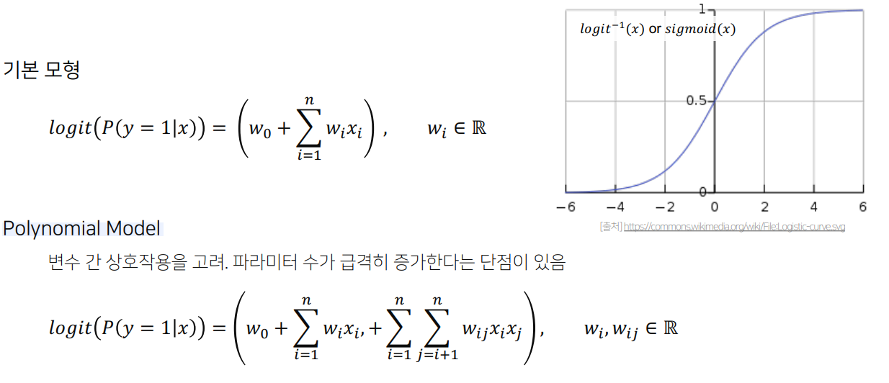  


### __☑ 사용 데이터__  
* __Dense Feature  vs  Sparse Feature__  
    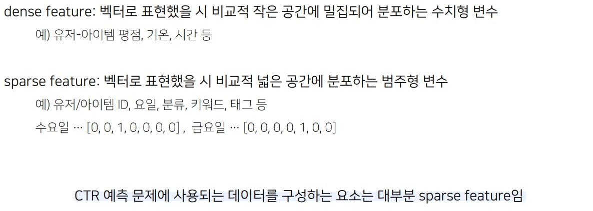

* __피쳐 임베딩 ( Feature Embedding )__  
    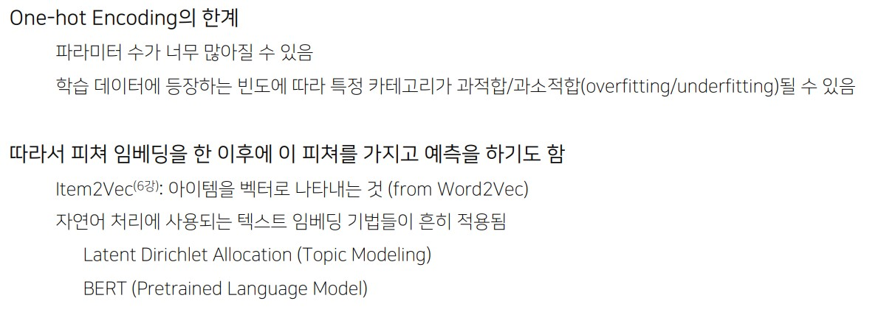  


### __☑ 발전 과정__  
(~90s) 로지스틱 회귀 / 서포트 벡터 머신  
(1999) Matrix Factorization의 출현  
(2008) Netflix Prize 데이터셋에 활용되면서 인지도 상승  
(2008) "Context-aware Recommendation"이라는 개념 출현  
(2010) Factorization Machine의 출현  
(2016) Field-aware Factorization Machine의 출현  
<br>

### __🦖 (2) Factorization Machine (FM)__  
__Factorization Machines__  
: SVM과 Factorization Model의 장점을 결합한 FM을 처음 소개한 [논문](https://sdcast.ksdaemon.ru/wp-content/uploads/2020/02/Rendle2010FM.pdf)  

* 딥러닝이 등장하기 이전에는 서포트 벡터 머신(SVM)이 가장 많이 사용되는 모델이었음  
    > SVM은 General Predictor로서 데이터의 형태에 크게 규제받지 않고 분류, 회귀 등 다양한 작업을 수행할 수 있으며, 커널 공간을 활용하여 비선형 데이터셋에 대해서 높은 성능을 보인다는 장점이 있음  

* 하지만 SVM은 CF 환경에서는 좋은 선택이 되지 못함 (MF계열의 모델이 더 높은 성능을 내왔음)  
    > 추천시스템은 대부분의 경우 User x Item으로 구성된 평점 행렬(rating matrix)을 채워나가는 Matrix Completion과 같기 때문에 모든 유저가 모든 아이템을 평가하지 않는 이상 Sparse한 환경이 자주 발생하게 됨  
    > 이처럼 매우 Sparse한 환경에서는 복잡한 커널트릭이 잘 작동하지 않음  

* 하지만 MF 모델은 일반적인 예측 데이터에 대해서 그리 유용하지 않다는 단점이 존재함  
    ( 특별한 환경 혹은 데이터에만 적용할 수 있음 )  
    > Matrix Factorization은 SVM과 반대로 일반적인 데이터에 바로 적용할 수 없으며,  
    > 대부분의 경우 Task specific한 Model이라는 단점이 존재함  
    > ( X: (유저, 아이템) → Y: (rating)으로 이루어진 데이터에 대해서만 적용이 가능 )  
    > 

===> 이 둘의(SVM, MF) 장점을 결합할 수 없을까?  

본 논문에서는 새로운 예측기인 FM을 소개하는데,  
FM은 범용적인 예측 모델이지만 또한 매우 희소한 데이터 환경 속에서도 reliable parameter를 추정할 수 있음  
FM은 모든 nested된 변수 간 상호작용을 모델화하지만 SVM이 Dense Parametrization을 사용하는 것과 달리 factorized parametrization을 사용함  
FM의 모형식은 선형 시간으로 학습될 수 있으므로 파라미터들의 숫자에 따라 학습시간이 결정됨  
이는 SVM처럼 학습 데이터를 저장할 필요 없이 직접적인 최적화화 모델 파라미터의 저장을 가능하게 함


요약하자면  
FM은 SVM과 Matrix Factorization의 장점을 함께 가지고 있는 모델임  
FM(Factorization Machines)은 다음과 같은 장점이 있음  
1) Sparse data : SVM으로 학습하기 어려운 Sparse 환경에서도 파라미터 추정이 가능함  
2) Linear Complexity : 선형복잡도를 가지고 있음. SVM과 같은 쌍대문제를 풀지 않아도됨  
3) General Predictor : General Predictor로서 어떠한 실수 벡터를 사용하더라도 잘 작동함
 
>  ( 참고 )  
> MF와 FM 두 모델은 모두 기본적으로 평점과 같은 상호관계를 예측한다는 공통점이 존재하지만,   
> 엄밀하게 따지면 MF와 FM은 서로 다르며, 오히려 FM은 Polynomial Regression에 가깝다고 할 수 있음   
<br>

* __FM input representation__  
    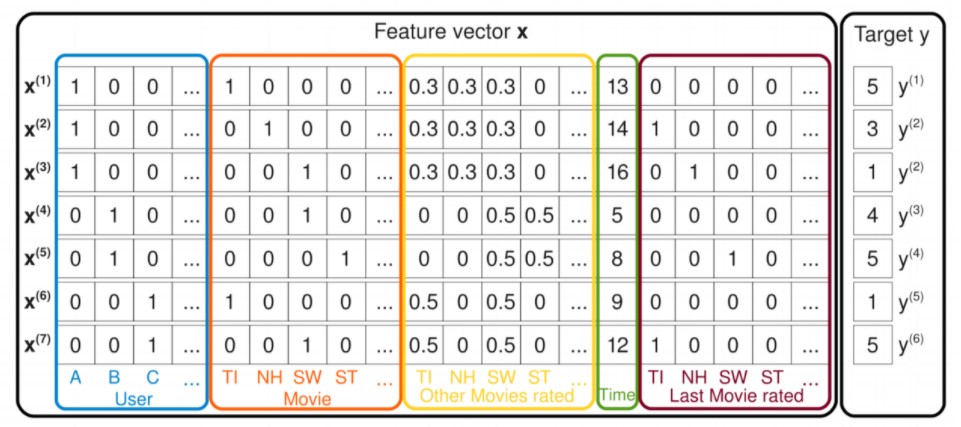
    우선 FM은 매우 Sparse한 feature vector X를 다룸  
    Matrix Factorization이 user, item, rating 만을 사용하는 것과는 다르게,  
    FM은 위의 그림과 같이 다양한 Feature를 concatenate하여 하나의 feature vector로 사용함  
    따라서 어떠한 implicit 특성이라도 실수 형태로 하나의 특성벡터 안에 추가할 수 있음  
    각각의 user, item과 같은 Categorical feature는 One-hot 형태로 표현하여 x에 추가되기 때문에 일반적인 경우 x는 매우 Sparse한 벡터가 됨  
    이는 user, item을 Latent factor를 사용하여 f 차원 벡터로 나타내는 Matrix Factorization(관측된것만)과 대조적이며       
    유저, 아이템을 포함한 다양한 특성이 하나의 벡터안에 공존하고 있다는 점이 SVM(잠재요인 포함)과 같은 일반적인 머신러닝 알고리즘과 유사함  
    그림의 예시에서는 '유저가 평가한 다른 영화 정보', '시간', '최근에 평가한 영화'와 같은 특성을 추가한 것을 확인할 수 있음  

    FM model 은 SVM의 다항식 커널(polynomial kernel)과 비슷하게  
    모든 변수들이 상호작용을 하지만,  
    ( polynomial kernel(다항식 커널)을 사용하면 2차원에서 x, y좌표로 이루어진 점들을 3차원으로 표현할 수 있음 )  
    SVM처럼 dense parametrization을 사용하는 것이 아니라 factorized parametrization (  인수분해된 파라미터화: 특성마다 latent  space로의 mapping을 진행하고, latent space에서의 내적을 계산 )를 사용함  
    각각의 변수를 f 차원의 latent Factor로 매핑하여, 변수간의 상관관계를 Matrix Factorization과 같이 Latent Factor의 내적으로 모델링하는 것  

* __FM 수식__  
    __# Linear Model__  
    FM에 대한 수식을 선형 회귀식에서부터 바라보자면 다음과 같음 [출처](https://hyunlee103.tistory.com/69)  
    위 데이터를 일반적인 선형 회귀문제라고 생각하고 모든 변수를 X, 예측하고자 하는 값을 y로 두면, Linear Model 수식은 다음과 같음
      

    하지만 높은 차원의 데이터, 높은 sparsity, 무시된 변수 간 interaction 등 Linear Model은 여러 한계가 있음  
    이를 보완하기 위해서 polynomial regression을 고려하거나, 비선형 모델인 SVM, NN 등을 사용할 수 있음  
    각 변수 간 interaction을 고려한 polynomial model의 수식은 다음과 같음  
    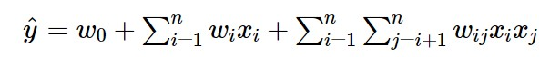  

    이렇게 모델링을 하면, Linear Model의 여러가지 한계를 극복할 수 있지만  
    parameter 수의 증가로 연산 복잡도가 증가하게 됨  

    Factorization Machine은 feature interaction vectoy를 저차원으로 fatorize해서 이를 해결함  
    <br>

    __# FM__  
    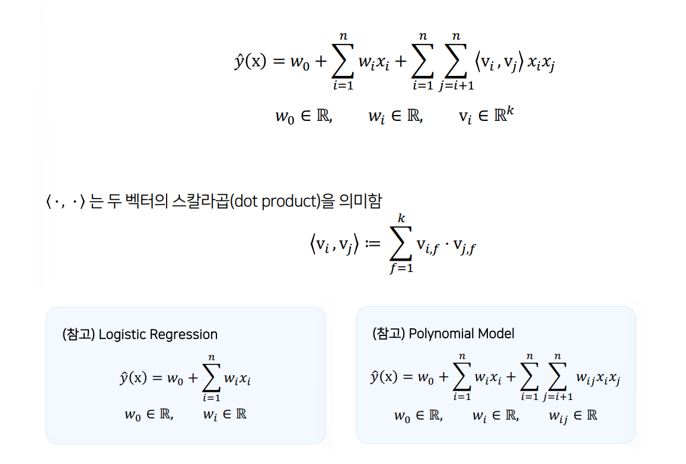  

    FM 수식은 위와 같음  
    앞서 살펴 본 polynomial model에서 interaction weight인 wij 가 두 벡터(Vi,Vj)의 내적으로 분해(factorize)되었음  
    즉, 두 변수의 interaction을 하나의 값인 wij으로 표현하지 않고 k차원으로 factorizing 된 두 벡터(Vi,Vj)의 내적으로 표현함   
    이 두 벡터는 변수 간 interaction의 latent vector이며 기존 변수의 정보를 k 차원으로 확장시켜 표현함  
    Sparse 환경에서 변수들은 서로 독립성이 강해 interaction을 포착하기 어려운데,  
    각 변수 정보를 latent vector로 표현함으로써 latent space 내에서 독립성을 깨고 interaction을 보다 더 잘 잡아낼 수 있음  
<br>

### __☑ FM의 활용__  
* __Sparse한 데이터셋에서 예측하기__  
    : 유저의 영화에 대한 평점 데이터는 대표적인 High Sparsity 데이터   
    ( 유저 - 아이템 매트릭스에서 다루던 Sparse Matrix와는 다른 의미 )  
    : 평점 데이터 = { (유저1, 영화2, 5), (유저3, 영화1, 4), (유저2, 영화3, 1), … }  
    ( 일반적인 CF 문제의 입력 데이터와 같음 )
    : 위의 평점 데이터를 일반적인 입력 데이터로 바꾸면, 입력 값의 차원이 전체 유저와 아이템 수만큼 증가  
    > 예시. 유저 수가 U명, 영화의 수가 M개일 때  
    > (유저1, 영화2, 5) → [ 1, 0, 0, …, 0, 0, 1, 0, 0, …, 0, 5 ]  
    > (유저3, 영화1, 4) → [ 0, 0, 1, …, 0, 1, 0, 0, 0, …, 0, 4 ]  

    Sparse 데이터 상황에서 wij를 각 케이스별로 독립적으로 학습하는 것은 어려운데,  
    w를 v로 분해함으로써 각 feature의 잠재벡터를 학습하므로 독립성을 깨고 특정한 상호관계를 나타내는 데이터로부터 실제 데이터가 존재하지 않는 것에 대한 상호관계를 예측할 수 있음  
    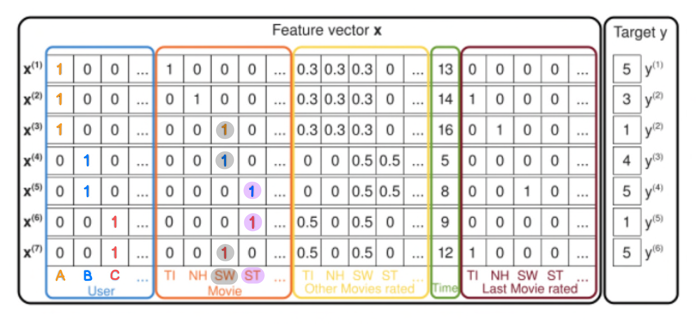

    예를들면,  
    (유저A, 영화 ST) 상호관계를 예측한다고 했을 때 이러한 경우를 나타내는 데이터가 존재하지 않기 때문에 w A,ST = 0이 됨. (w를 예측할 경우 상호관계가 존재하지 않게 나온다는 말)  
    하지만 fatorization(분해)을 통해 vA, vST로 표현한다면 상호관계를 예측할 수 있음  

    먼저 유저 B,C 둘 다 영화 ST를 보았기 때문에(평가했기 때문에) 영화 ST에 대해 비슷한 예측값을 나타내므로 < vB, vST >, < vC, vST > 값이 비슷할 것임  
    또한 유저 B,C 둘 다 영화 SW를 보았기 때문에(평가했기 때문에) 영화 SW에 대해서도 비슷한 예측값을 나타내므로 < vB, vSW >, < vC, vSW > 값이 비슷할 것임  
    그렇기 때문에 ST라는 영화가 SW에 비해 상대적으로 어떤 특징을 가졌는지 vST라는 fatorization parameter에 학습될 수 있고,  
    ( 마찬가지로 SW라는 영화가 ST에 비해 상대적으로 어떤 특징을 가졌는지 vSW라는 fatorization parameter에 의해 학습될 수 있음 ) 

    영화 SW는 유저 A, B, C가 모두 보았기 때문에(평가했기 때문에) 이를 학습하게 되면 유저 B, C와는 다른 유저 A의 특징이 vA라는 factorization parameter에 의해 학습될 수 있음  
<br>

* __FM의 장점__
    * vs SVM  
        : 매우 sparse한 데이터에 대해서 높은 예측 성능을 보임  
        : 선형 복잡도 ( O(kn) )을 가지므로 수십 억 개의 학습 데이터에 대해서도 빠르게 학습함 ( 모델의 학습에 필요한 파라미터의 개수도 선형적으로 비례함 )  
    * vs MF  
        : 여러 예측 문제(회귀/분류/랭킹)에 모두 활용 가능한 범용적인 지도 학습 모델    
        : 일반적인 실수 변수(real-value feature)를 모델의 입력(input)으로 사용함  
        ( MF와 비교했을 때 유저,아이템 ID 외에 다른 부가 정보들을 모델의 피쳐로 사용할 수 있음 )  
<br>

### __🦖 (3) Field-aware Factorization Machine (FFM)__  
__Field-aware Factorization Machines for CTR Prediction__  
: FM의 변형된 모델인 FFM을 제안하여 더 높은 성능을 보인 [논문](https://www.csie.ntu.edu.tw/~cjlin/papers/ffm.pdf)  

* __FFM 등장 배경__  
    : FM은 예측 문제에 두루 적용 가능한 Generalize predictor 모델로,  
        특히 sparse 데이터로 구성된 CTR 예측에서 좋은 성능을 보임  

    : FM을 발전시킨 모델로서 PITF 모델에서 아이디어를 얻음  
    > PITF : Pairwise Interaction Tensor Factorization [논문](http://www.wsdm-conference.org/2010/proceedings/docs/p81.pdf)  
    > PITF는 MF를 발전시킨 모델임  
    > MF는 2차원 matrix로 user와 item로 구성되어 있지만,  
    > PITF는 Tensor Factorization. 즉 3차원으로 MF를 확장시킨 모델임  
    > 따라서 user 임베딩, item 임베딩, tag 임베딩 -> 총 3개의 임베딩을 학습하게 됨  
    > MF에서는 user와 item에 대해서만 interaction이 가능했지만,  
    > PITF에서는 user와 item, user와 tag, item과 tag 각각의 interaction이 가능함  
    > 
    > 이때 핵심적인 아이디어는  
    > PITF에서는 (user, item, tag) 3개의 필드에 대한 클릭률을 예측하기 위해  
    > (user, item), (user, tag), (item, tag) 각각에 대해서 서로 다른 latent factor를 정의하여 구한다는 것임(즉, 서로 다른 임베딩을 정의)  
    > 
    > => PITF를 일반화하여 여러 개의 필드에 대해서 latent factor를 정의한 것이 FFM  
    > 즉, PITF는 field가 3개지만 FFM은 여러 개의 필드에 대해서(사용자가 정의한 갯수만큼 늘려서) 임베딩에 interaction을 시킬 수 있음  

* __FFM의 특징__  
    : 입력 변수를 field로 나누어 field별로 서로 다른 latent factor를 가지도록 fatorize함  
    : 기존의 FM은 하나의 변수에 대해서 k개로 fatorize 했으나, FFM은 f개의 필드에 대해 각각 k개로 fatorize함  
    : field는 모델을 설계할 때 함께 정의되며,  
    같은 의미를 갖는 변수들의 집합으로 설정함 ( 어떤 변수를 같은 field로 묶을 지 )   
    > 유저: 성별field(여, 남) , 디바이스field(아이폰, 갤럭시) , 운영체제field  
    > 아이템: 광고field , 카테고리field  
     > 컨텍스트: 어플리케이션field , 배너field   
    > 
    > 카테고리가 10개가 있다면 이는 10개의 변수로 표현되고, 10개가 하나의 카테고리 field에 포함되는 것임  
    : CTR 예측에 사용되는 피쳐는 이보다 훨씬 다양한데, 피쳐의 개수만큼 필드를 정의하여 사용할 수 있음  

### __☑ FFM 수식__   
2개의 변수가 interaction할 때,  
FM은 각각에 해당하는 k차원의 파라미터를 내적이 되는 형태로 표현했다면  
FFM은 반대편의 field에 해당하는 fatorization 파라미터를 사용함  
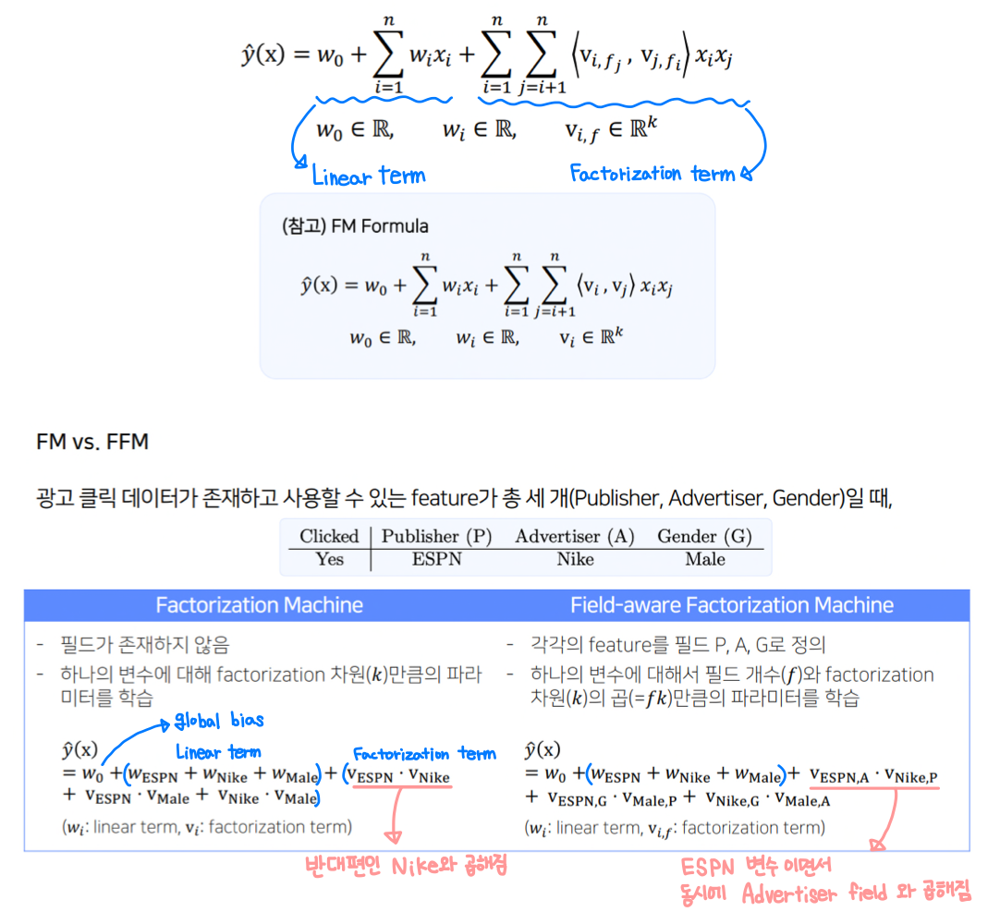  
> FFM은 interaction이 일어나는 반대편 변수의 field를 고려해서 fatorization을 수행하기 때문에 field-aware라는 이름이 붙음  
      
### __☑ FFM의 활용__  
FFM은 주로 CTR 예측 문제에 많이 사용되고, 이 문제의 데이터의 대부분은 categorical feature임  

categorical feature는 보통 같은 feature 그룹을 같은 field로 묶어서 정의함  
FM은 field가 필요 없지만, FFM은 각각의 변수가 속한 feature 그룹을 field로 정의함  

문제는 numerical feature.  
FFM은 모든 변수가 반드시 어떤 필드에 속해야하는데 실수 feature같은 경우  
원-핫 인코딩 되는게 아니라 실수값을 가지기 때문에 필드에 할당하기에는 부족함.  
두 가지 해결 방법이 있음 
( 각 feature가 가진 특징을 고려하여 적합하게 선택하면 됨 )  
01. __dummy field__   
: 실수 값 한 개당 하나의 필드에 할당하기 때문에 실제로 필드는 큰 의미를 가지지 않음  
02. __discretize__  
: 실수 값이 n개의 구간으로 나누어지기 때문에 n차원의 원-핫인코딩으로 표현될 것이고  
그 n차원의 원-핫인코딩은 총 n개의 입력 변수가 됨 -> n개의 변수를 하나의 필드에 할당  
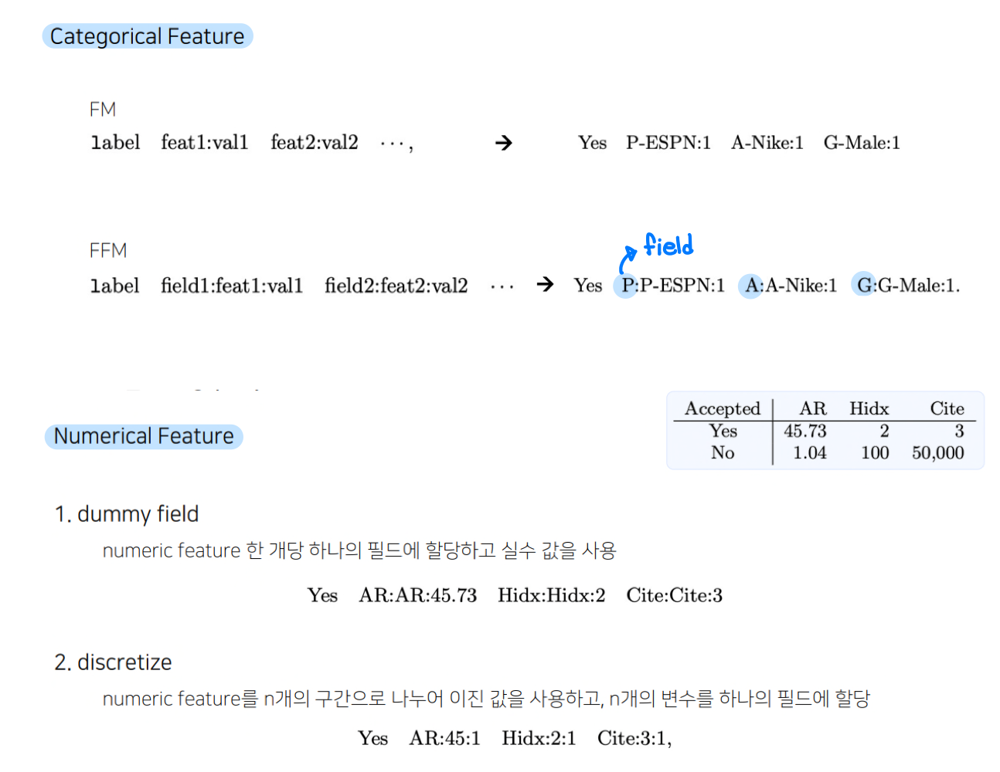

---
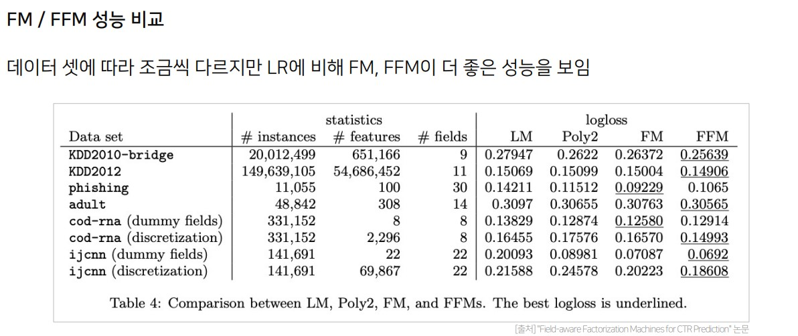
> CTR 예측 데이터셋같은 sparse한 데이터셋에서 fatorization machine 계열의 모델이 효율적이면서 성능이 좋음을 알 수 있음
>
> LM과 Poly2보다는 당연히 FM과 FFM이 더 좋은 성능을 보이는데,  
> FM과 FFM은 데이터셋의 종류에 따라서 FM이 좋을 때도, FFM이 좋을 때도 있음  
> 이는 어떤 데이터셋은 필드를 사용하여 명시적으로 피쳐를 구분하는게 별로 도움이 되지 않았을 수 있다는 말임  
> FFM은 필드 갯수만큼 factorization 파라미터가 늘어나기 때문에,  
>  필드를 사용하는게 적절하지 않는데 사용했을 경우에는 오히려 오버피팅 또는 언더피팅이 발생할 수 있음   
<br>

### __🦖 (4) Gradient Boosting Machine (GBM)__  
Greedy Function Approximation: A Gradient Boosting Machine  
: gradient descent을 사용하여 loss function이 줄어드는 방향(negative gradient)으로 week learner들을 반복적으로 결합함으로써 성능을 향상시키는 Boosting 알고리즘 [논문](https://jerryfriedman.su.domains/ftp/trebst.pdf)  

### __☑ GBM__  
* __Gradient Boosting Machine(GBM)을 통한 CTR 예측__    
    CTR 예측을 통해 개인화된(personalized) 추천 시스템을 만들 수 있는 또 다른 대표적인 모델  
    8개의 오픈 CTR 데이터셋에 대해 다른 추천 모델(FM 계열 포함)보다 높은 성능을 보임  
    * ex. 하쿠나 라이브 @ 하이퍼커넥트  
        * 서비스 데이터가 축적됨에 따라 초기의 인기도 기반 혹은 휴리스틱 기반 추천 시스템에서 탈피  
        * 실시간 서비스 데이터의 경우 다양한 환경에 의해 데이터의 특징이 자주 변하기 때문에 데이터의 특섣에 관계없이. 즉 하이퍼파라미터에 비교적 민감하지 않은(robust) 모델을 사용하고자 했음  
        * ( FM, FFM, DeepFM 모델 ) < ( 기존에 사용하던 휴리스틱 모델 ) < ( GBM 계열 모델 )  

* __Boosting__
    * 앙상블(ensemble) 기법의 일종  
        앙상블: 모델의 편향에 따른 예측 오차를 줄이기 위해 여러 모델을 결합하여 사용하는 기법  
    * 의사결정 나무(decision tree)로 된 weak learner들을 연속적으로 학습하여 결합하는 방식  
        연속적: 이전 단계의 weak learner가 취약했던 부분을 위주로 데이터를 샘플링하거나 가중치를 부여해 다음 단계의 learner를 학습한다는 의미  
    * Boosting 기반 모델  
        AdaBoost (Adaptive Boosting), Gradient Boosting Machine (GBM), XGBoost, LightGBM, CatBoost, …  

* __Gradient Boosting as Residual Fitting__
통계학적 관점에서, Gradient Boosting은 잔차(residual)를 적합(fitting)하는 것으로 이해할 수 있음  
이전 단계의 weak learner까지의 residual을 계산하여, 이를 예측하는 다음 weak learner를 학습함  
회귀 문제에서는 예측값으로 residual(실측값-예측값)을 그대로 사용하고, 분류 문제에서는 log(odds) 값을 사용함  
> 분류 task: 0과 1 사이로 예측하는 것을 실수로 표현하기 어렵기 때문에 log(odds) 값을 사용해서 residual을 계산함  

[출처](https://hyunlee103.tistory.com/25)  
Sequential 한 weak learner들을 residual을 줄이는 방향으로 결합하여 object function과의 loss를 줄여나가는 아이디어.  
여기서 정의되는 residual이 negative gradient와 같은 의미를 지니게 되므로 gradient 부스팅이라는 이름이 붙었음  

둘 사이의 관계를 살펴보자.  
loss function을 다음과 같이 정의하면,  

이 함수의 gradient는 다음과 같고,  

앞에 - 를 붙혀주면,  

위와 같고 residual(잔차)은 실제값과 예측값의 차이므로,  
이는 residual을 나타내는 식과 같음  
따라서 loss function을 MSE로 정의했을 때, negative gradient = residual 이 성립하게 됨  

위에서 언급한 대로,  
GBM은 residual을 줄이는 방향으로 weak learner들을 결합해 나감  
아래 그림을 보면 tree1, 2, 3이 각각 weak learner가 되고 각 모델에서 실제값(점)과 예측값(파란선)의 차이(residual)를 다음 모델에서 fitting 시키고 있음을 알 수 있음   

수식으로 써보면,  
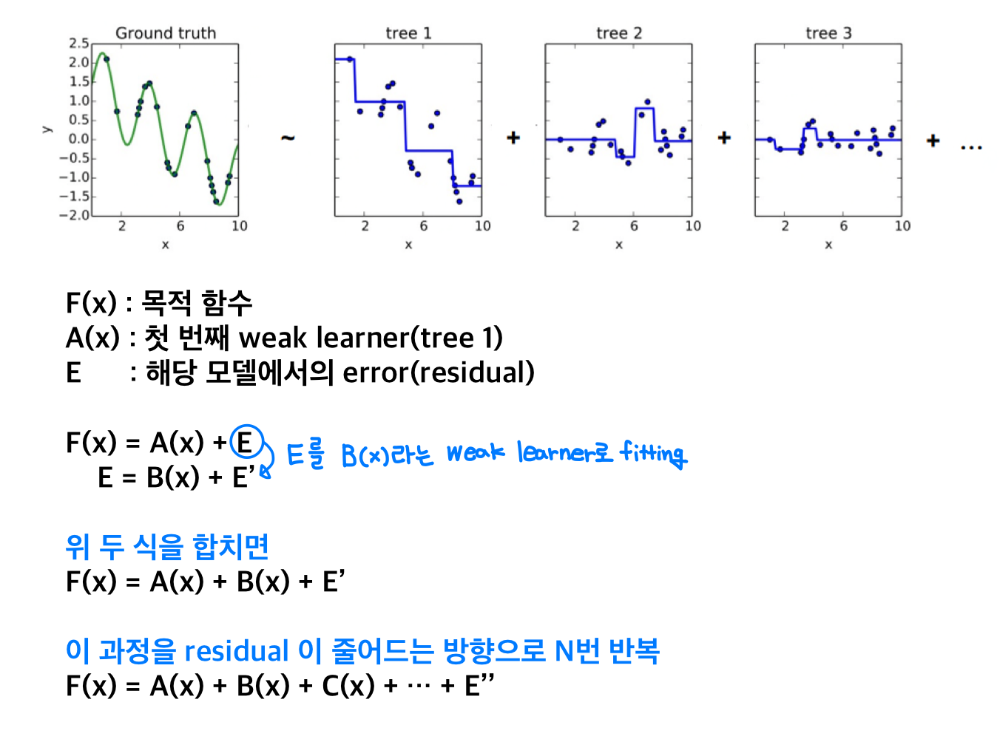

GBM 논문에 나온 수식으로 다시 정리하자면,   
* input: data set 과 미분 가능한 loss function 정의  
* Step1: 초기 예측값 설정  
* Step2: 1~M번 학습 진행  
    01. loss를 미분해서 negative gradient = residual을 구함  
    02. 1에서 구한 residual을 target으로 하는 tree model(weak learner)을 만들고 fitting 시킴  
    03. loss를 최소로 하는 tree 결괏값을 출력. (이 과정은 생략되기도 함)  
    04. tree로 fitting 시켜서 구한 residual로 기존 예측값(F0(x))을 update.   이때 gradient descent 알고리즘과 비슷하게 learning rate를 줌  
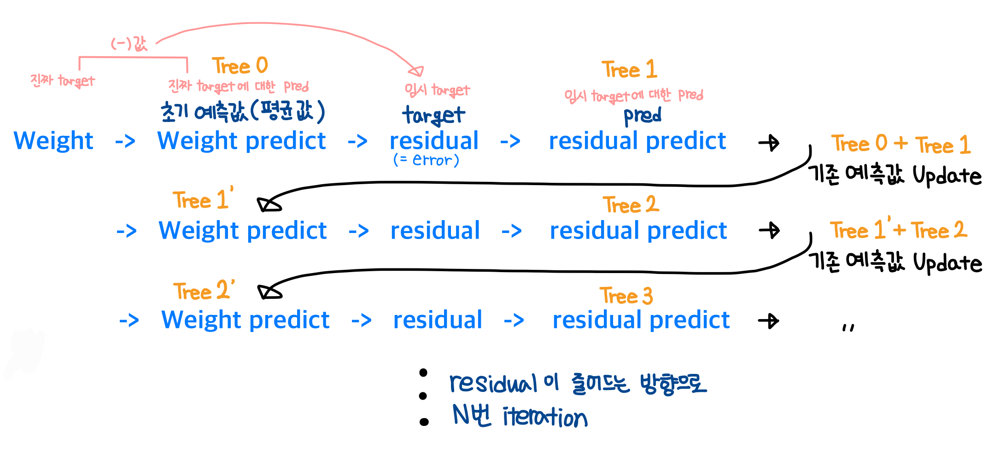  

---
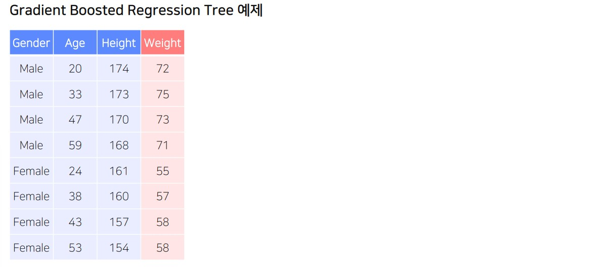  
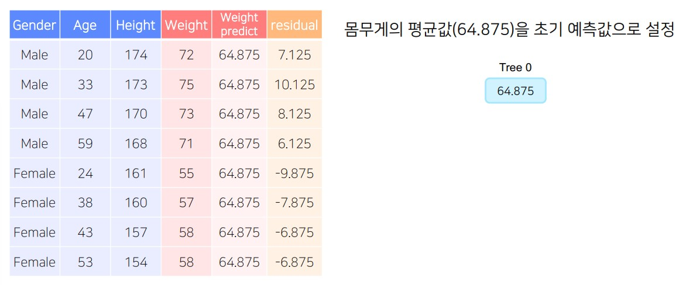  
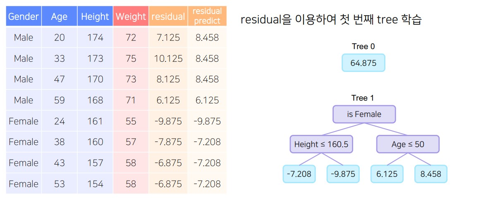  
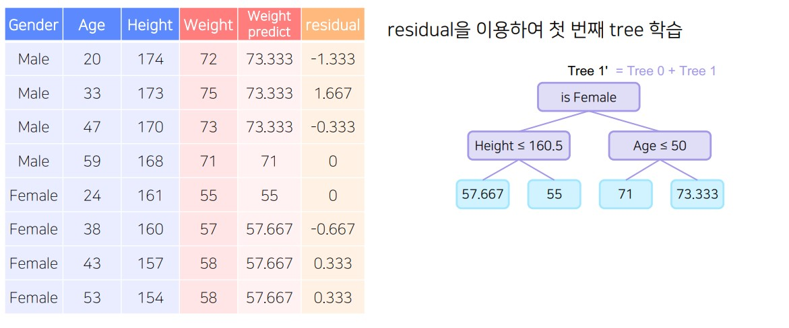  
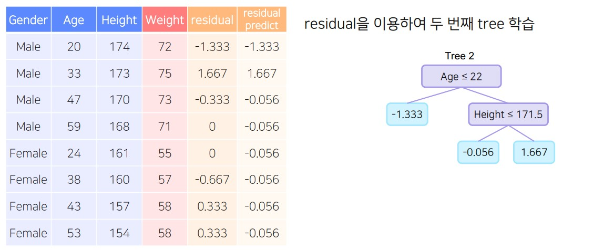  
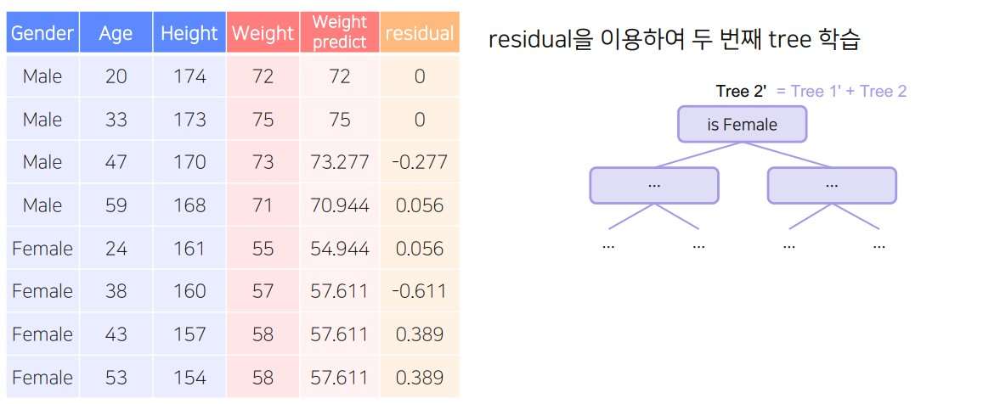  
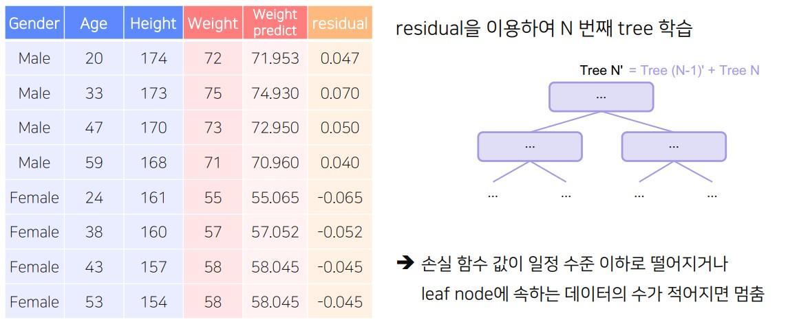  

> 참고  
> GBM에서도 weak learner로는 tree model을 사용함  
> Adaboost 보다는 복잡한 tree를 사용하는데, 최종 tree node가 8~32개 정도로 짜는 게 일반적임 (파이썬에서 hyperparameter로 튜닝이 가능함)
> 

 * __Gradient Boosting 알고리즘의 장단점__  
    장점  
    : 대체로 random forest 보다 더 나은 성능을 보임  
    단점  
    : 이러한 방식은 bias는 상당히 줄일 수 있어도, 과적합이 일어날 수도 있음(prediction shift)  
    : 느린 학습 속도  
    > 따라서 실제로 GBM을 사용할 때는 sampling, penalizing 등의 regularization 테크닉을 이용하여 더 advanced 된 모델을 이용하는 것이 보편적임  
<br>

### __☑ 대표적인 모델__  
__Gradient Boosting의 문제점을 해결하기 위한 대표적인 모델/라이브러리__  
XGBoost  
: Extreme gradient boosting의 약자로, 병렬처리 및 근사 알고리즘을 통해 학습 속도를 개선한 라이브러리  

LightGBM  
: Microsoft에서 제안한, 병렬 처리 없이도 빠르게 Gradient Boosting을 학습할 수 있도록 하는 라이브러리  

CatBoost  
: 범주형 변수에 효과적인 알고리즘 등을 구현하여 학습 속도를 개선하고 과적합을 방지하고자 한 라이브러리  
<br>

* __XGBoost__  
    [논문](https://dl.acm.org/doi/pdf/10.1145/2939672.2939785)  
작성

* __LightGBM__  
    [논문](https://proceedings.neurips.cc/paper/2017/file/6449f44a102fde848669bdd9eb6b76fa-Paper.pdf)  
작성

* __CatBoost__  
    [논문_1](http://learningsys.org/nips17/assets/papers/paper_11.pdf)  
    [논문_2](https://arxiv.org/pdf/1706.09516.pdf)    
작성

```toc

```
