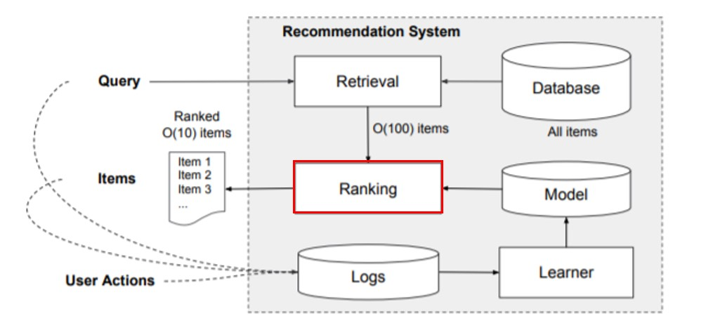

## 🚀 07. DeepCTR  
### __🦖 (1) CTR Prediction with DL__  
Review – CTR 예측 (Click-Through Rate Prediction)

* CTR 예측: 유저가 주어진 아이템을 클릭할 확률(probability)을 예측하는 문제  
    CTR 예측은 주로 광고에 사용되며 광고주 및 서비스 제공자들의 이익 창출에 사용됨  
    CTR 예측이 정확해지는 것은 곧바로 매출 향상에 직결됨  

* CTR 예측에 딥러닝이 필요한 이유  
    현실의 CTR 데이터(ex. 광고 데이터)를 기존의 선형 모델로 예측하는 데에는 한계가 있음  
    01. Highly sparse & super high-dimensional features  
    02. highly non-linear association between the features  
    -> 이러한 데이터에 효과적인 딥러닝 기법들이 CTR 예측 문제에 적용되기 시작  
<br>

### __🦖 (2) Wide & Deep__  
__Wide & Deep Learning for Recommender Systems__  
: 선형적인 모델(Wide)과 비선형적인 모델(Deep)을 결합하여 기존 모델들의 장점을 모두 취하고자 한 [논문](https://dl.acm.org/doi/pdf/10.1145/2988450.2988454)  

#### __Wide & Deep의 등장 배경__
* :   
    추천 시스템에서 해결해야 할 두 가지 과제  
    : Memorization & Generalization  

    __Memorization__  
    : 함께 빈번히 등장하는 아이템 혹은 특성(feature) 관계를 과거 데이터로부터 학습(=암기)    
    : Logistic Regression(LR)과 같은 선형 모델  
    : 대규모 추천 시스템 및 검색 엔진에서 사용해 옴  
    : 단순하고 확장 및 해석이 용이하나, 학습 데이터에 없는 feature 조합에 취약  
    > 일반적인 regression은 종종 One-hot vector를 사용하여 학습합니다.   
    > 예를 들어 One-hot 상황에서 (User == 정구섭)를 표현하는 Binary feature는 User가 "정구섭" 일때 1의 값을 갖게됩니다.  
    > 즉, 모델은 "정구섭"이라는 User 특성의 출현(occurence)를 학습하게 되는 것 입니다.  
    > 
    > Memorization은 기존의 특성들을 사용하여 새로운 특성을 만들어 학습하는 것을 의미합니다.  
    > 일반적으로 간단하게 Memorization은 동시출현(co-occurrence)빈도를 표현하는 Cross-product로 생성이 가능합니다.  
    > Cross-product Tranformation은 One-hot vector 사이의 AND 연산(cross product)을 통해 동시출현 여부를 의미하는 새로운 Binary feature를 생성할 수 있습니다.  
    > 예를 들어, AND(User = 정구섭, Item = 맥북) 이라는 새로운 Memorization 특성은 One-hot 특성간의 Cross-product transformation을 통해 생성이 가능합니다.  
    > 생성된 특성은 User가 "정구섭"인 동시에 Item 특성이 "맥북" 일 때 비로소 1의 값을 갖게 될 것입니다.  
    > 즉, Memorization은 각각의 특성들의 동시 출현을 바탕으로 새로운 특성을 생성하여 상호작용을 '암기'하는 것 입니다.  
    > [출처](https://supkoon.tistory.com/32)  
   
    __Generalization__  
    : 드물게 발생하거나 전혀 발생한 적 없는 아이템/특성 조합을 기존 관계로부터 발견(=일반화)  
    : FM, DNN과 같은 임베딩 기반 모델  
    : FM: Factorization Machine, DNN: Deep Neural Network
    : 일반화가 가능하지만, 고차원의 희소(sparse)한 데이터로부터 저차원의 임베딩을 만들기 어려움  
    > Generalization은 Memorization과 반대로, 새로운 특성 조합에 대한 일반화된 예측을 가능하게 하는 방법입니다.  
    >   
    > Matrix Factorization, Factorization Machines 같은 임베딩 기반 모델들은 각각의 특성들을 동일한 차원의 Latent space로 매핑하여 Dense한 벡터로 표현합니다.  
    >   
    > 새로 표현된 Dense한 특성벡터는 서로 내적이 가능하며,   
    > 따라서 별도의 Cross-product transformation을 필요로 하지 않습니다.  
    >   
    > 무엇보다도 Generalization은 과거에 관측되지 않은 특성의 조합에 대한 일반화된 예측을 제공해 줍니다.  
    > 따라서 추천시스템에서 Generalization은 추천의 다양성을 증가시키며, 비주류 아이템을 거의 추천하지 않는 Long-tail problem을 극복하도록 도와줄 수 있습니다.  
    > 
    > 또한 Generalization은 Memorization에 비해 상대적으로 적은 feature engineering을 필요로 합니다.  
    > 
    > 하지만 실제로 존재할수 없는 관계에 대해서도 과도한 일반화 결과를 내놓을 가능성이 존재합니다.    
    > Cross-product가 같은 경우를 존재하지 않는 조합으로 '암기'하는 것과는 대조적입니다.  
    > 
    > 단적으로 한화와 토트넘의 우승가능성에 대해서도 Generalization 모델은 Memorization 모델보다 높은 가능성을 점칠 것 입니다.  
    > [출처](https://supkoon.tistory.com/32)   

이처럼 추천시스템에서는 logistic regression과 같은 Memorization에 특화된 선형 모델과 MF, FM, NCF와 같이 Generalization에 특화된 임베딩 기반 모델이 모두 사용되고 있음  
Wide & deep의 가장 큰 Contribution은 Memorization과 Generalization을 동시에 수행할 수 있다는 점  
따라서 Wide & deep은 과거의 기록으로부터 어느정도 보장되었으며, 다양한 추천 결과를 동시에 제공할 수 있는 추천시스템 모델  

추천시스템에서 Memorization은 과거의 동시출현이 평가(Rating)에 끼친 영향에 대한 설명력을 제공하며, 매우 Topical하고 상품에 직접적으로 관련된 정보들을 추천하도록 도와줍니다.
<br>
<br>

#### __Wide & Deep의 구조__  
* :    
    앱 추천시스템 오버뷰  
        
    : user의 검색 query가 들어오면, database로부터 해당 query에 적합한 후보 앱들을 검색  
    : ranking 알고리즘을 통해 후보 앱들의 점수를 매겨 정렬  
    (여기서 점수란 user 정보 x가 주어졌을 때, user가 y앱에 action할 확률인 p(y|x)를 구하는 것)   
    Wide & Deep은 ranking 알고리즘으로, 여기서는 이런 후보 앱들의 점수를 메기는데 사용됨  

    * __The Wide Component ( Memorization을 담당 )__  
              
        
        

        wide 모델은 가장 기본적인 선형 모델과 비슷함  
        입력 변수(x) n개와 n개에 해당하는 파라미터(w), 각각의 변수는 모두 선형결합으로 이루어져있으며 global 변수(b)도 학습 파라미터로 존재함    
        그러나 서로 다른 2개의 변수 (예를들면 x1, x2)의 관계를 학습할 수 없기 때문에 wide 파트에서는 변수사이의 interaction을 표현하기 위해 cross-product transformation을 사용함  
        > 즉, cross-product한 결과를 input으로 사용함  
        예를 들어  
        사용자가 설치한 앱 feature와 사용자가 열람한 앱 feature간의 interaction을 input으로 사용한다고 가정.  
        이때 앱은 A, B, C 총 3개만 존재하며, 사용자가 설치한 앱과 클릭한 앱은 다음과 같음  
        * user_install_app = [A,B]  
        * user_impression_app = [A,C]  
        ( "사용자가 설치한 앱 = A" = 1 ) and ( "사용자가 열람한 앱 = C" = 1 ) 의 관계를 학습할 수 없기 때문에 두 변수 사이의 interaction을 표현하기 위해서 cross-product transformation을 사용함  
        > A 앱을 설치했고 동시에 C 앱을 봤다면 (A,C) = (1,1)로 표현가능하고, 두 값을 곱하면 1이 됨  
        > 이런식으로 모든 앱의 combination을 표현하면 총 9가지가 존재하고, 이때 1이 되는 경우는 단 4가지 뿐임  
        => "AND(사용자가 설치한 앱 = A, 사용자가 열람한 앱 = C)" = 1 라는 변수를 모델에 하나 더 추가함   
        이러한 cross-product term을 일반화하여 φk(x)라고 표현할 수 있으며  
        이 φk(x)에 해당하는 weight도 모델에 추가되어 학습에 반영됨  

        해당 방식은 1이되는 모든 경우를 학습하기 때문에 memorization에 강하고, user의 특이 취향이 반영된 niche combination을 학습하기에 탁월한 반면, 0이 되는 pair는 학습이 불가능하고, 또한 가능한 모든 변수들 사이의 cross-product를 표현하게 되면 학습해야 하는 weight가 기하급수적으로 증가한다는 단점이 있음.  
        따라서 본 논문에서는 주요 피쳐 2개(user installed App, impression App)에 대한 second order cross-product 만을 사용함  
        cross-product 변형의 수식(모델링)은 로지스틱회귀에 2차 polynomial항을 추가한 것과 거의 동일함.  
    * __The Deep Component ( Generalization을 담당 )__  
              
            

        > 반면 deep모델은 A, B, C 앱을 동일한 임베딩 공간(여기서는 2차원 가정)에 표현함  
        > 따라서 (C,B)처럼 pair가 없는 관계도 결국 같은 임베딩 공간 내에서 표현이 되기 때문에 학습이 가능함  
        > 하지만 niche combination의 경우 다른 user들에게서는 거의 등장하지 않기 때문에, 앱을 표현할 충분한 정보가 부족함  
        > 따라서 이런 앱들은 다른 앱과의 관계를 제대로 표현하지 못한 임베딩 벡터를 가질 가능성이 큼  
        > deep모델에서 두 feature간 interaction은 아래 오른쪽 그림처럼 multi-layer가 만든 non-linear 공간에서 표현됨  
        > 따라서 generalization에 강한 반면, 희소한 앱들은 학습이 잘 안되기 때문에 전혀 관계없는 아이템들이 추천이 될 수도 있음  
        Deep 모델은 continuous feature와 임베딩 된 categorical feature를 concat한 결과 a를 input으로 사용함  
        이때 L번째 layer는 다음과 같은 계산을 수행함  
        
        여기서 f는 activation function, W는 weight matrix, b는 bias를 의미함  
        위 그림에 따르면 총 3개의 layer를 쌓았으며, f로 ReLU를 사용했음  
        Feed-Forward Neural Network를 사용한 것 말고는 큰 특징이 없음.  
<br>
<br>

#### __전체 구조 및 손실 함수__  
* :  
    __Wide 모델과 Deep 모델을 joint training__  
    > joint training이란?
    > 
    > 여러개의 모델을 결합하는 앙상블과 달리,  
    > output의 gradient를 wide와 deep 모델에 동시에 backpropagation하여 학습함  
    > 논문에 따르면 wide 모델에서는 optimizer로 online learning 방식인 Follow-the-regularized-leader(FTRL) 알고리즘을 사용,  
    > deep 모델에서는 Adagrad를 사용했다고 함  

     
    x는 주어진 n개의 변수, φ(x)는 n개의 변수 사이의 cross-product transformation wide and deep 모델의 prediction임  
    (2개의 피쳐: user installed App, Impression App만을 cross-product transformation만을 이 변수에 추가함)  
    여기서 p(Y=1)은 특정 앱을 acquisition할 확률로 이해하면 됨  
    wide component와 deep component의 최종 출력값을 더한 뒤 global bias를 추가하여 sigmoid 함수 σ(.)를 통과 시킨 결과가 최종 output이 됨  
<br>
<br>

#### __모델 성능__  
* :  
    Baseline인 Wide 모델과 Deep 모델은 각각 Offline, Online에서 서로 다른 양상을 보이지만  
    두 개의 모델을 결합하여 만든 Wide & Deep 모델은 모두 좋은 성능을 보임  
<br>
<br>

### __🦖 (3) DeepFM__  
__DeepFM: A Factorization-Machine based Neural Network for CTR Prediction__  
: Wide & Deep 모델과 달리 두 요소(wide, deep)가 입력값을 공유하도록 한 end-to-end 방식의 모델  

#### __DeepFM의 등장 배경__
* :  
    CTR을 정확하게 예측하기 위해서는 user의 click log로부터 implicit feature interaction을 학습하는 것이 중요함  
    > ex)  
    > 식사 시간에 배달 앱 다운로드 수 증가는 'app category'와 'time' 간의 interaction이 존재함 ( order-2 interaction )  
    > 10대 남성은 슈팅/RPG 게임을 선호함에 대해서는 'app category'와 'gender'와 'age' 간의 interaction이 존재함 ( order-3 interaction )  
    > 사람들은 맥주와 기저귀를 함께 구매하는 경향이 있음에 대해서는 'beer'와 'diaper' 간의 숨겨진 interaction이 존재함 ( order-2 interaction )  

    위의 첫 번째와 두 번째 예시는 발견하기 쉽고 이해하기도 쉬운 반면,  
    마지막 예시는 모델이 자동으로 찾아주지 않으면 포착하기 어려운 interaction 일 수 있음  

    따라서 CTR 예측 모델을 고려할 때는, 명시적인 interaction과 숨겨진 interaction을 둘 다 잡아낼 수 있는 모델을 고려하는 것이 중요함 ( DeepFM이 두 파트로 구성된 이유 )  

* :  
    Wide & Deep 모델은 linear 모델(wide component)과 Neural Net 모델(Deep component)을 통합한 모델임  
    low-order와 high-order interaction을 모두 포착할 수 있지만, wide component에 feature engineering(=cross product transformation)이 필요하다는 단점이 있음  
    -> FM을 wide component로 대체 사용하여 입력값을 공유하도록 한것이 DeepFM임

* :  
    DeepFM은 low-order와 high-order feature interaction을 모두 포착할 수 있고,  
    비슷한 구조인 Wide & Deep 모델과 다르게 end-to-end 방식으로 학습되며 별도의 feature engineering이 필요 없음  
      
    DeepFM은 FM component와 DL component 파트가 input과 embedding 벡터를 공유하기 때문에 효율적인 학습이 가능함    
<br>

#### __DeepFM의 구조__  
* :  
    __DeepFM의 데이터 구조__  
        총 n개의 데이터가 있다고 할 때, 각 row는 user와 item 정보를 담고 있는 x와 특정 아이템 클릭여부를 나타내는 y 로 이루어져 있음  
        먼저 x는 m개의 필드로 이뤄져 있으며 각 필드는 다양한 정보를 담고있다. 예를들어 user 필드에는 user의 id, 성별, 나이 등의 정보가, item 필드에는 특정 item의 구매 정보 등이 포함된다. 각 필드에는 카테고리 피처일 경우 one-hot 벡터로, 연속적인 피처일 경우 해당 값을 그대로 사용할 수 있다. 일반적으로 x는 굉장히 sparse 하며 고차원이다.
        이어 y 는 user의 특정 item에 대한 클릭여부를 나타낸다. 만약 user가 특정 item을 클릭 했을 경우 y=1, 클릭하지 않았을 경우 y=0이 된다.
        위와 같은 데이터 구조를 고려할 때, DeepFM의 목표는 x 가 주어졌을 때, user가 특정 item을 클릭할 확률을 예측하는 것이 되겠다.

* :  
    __input__  
        먼저 Input의 경우 주목할 만한 특징은 FM layer와 Hidden layer가 같은 embedding 벡터를 공유한다는 점이다. 이는 앞서 Wide & Deep 모델과의 차별점이라고도 설명했다.  
        여기서 embedding 벡터란, 아래와 같은 별도의 embedding layer를 훈련시켜 얻은 dense 벡터를 의미한다. 여기서 mi, i=1,2…,m 는 xfieldi의 차원으로, ∑mi=1mi=d를 만족한다. ( d는 x의 차원)
        각 Neural Network은 hidden 벡터의 차원이 k로 모두 동일하며, 이는 sparse한 xfieldi를 k 차원으로 압축시켜 표현하겠단 의미다. 이 과정에서 얻게 되는 가중치 행렬 Wi의 각 행이 바로 xfieldi의 각 성분에 해당하는 embedding 벡터가 된다. (xfieldi는 one-hot 벡터이기 때문에 만약 j번째 성분이 1이라면, Wi의 j번째 행이 해당 성분의 벡터가 됨)
        정리하자면 위 그림의 Sparse Features 부분에서, 각 필드의 노란색 부분에 해당하는 embedding 벡터를 FM과 DNN 이 모두 사용하는 것이 특징이다.

    __output__  
        output 같은 경우는 아래 처럼 두 모델이 각각 내놓은 예측치를 더한 값을 최종 결과로 사용한다.

* :  
    __FM Component__  
    FM for low-order feature interaction  
      

    기존의 FM 모델과 완전히 동일한 구조임  
    > FM 모델은 order-1 interaction을 포착하는 term(x1~xn의 feature)과, order-2 interaction을 포착하는 term(2개의 feature interaction을 표현하는 factorization parameter)으로 나눠짐  
    > order-2 interaction term의 가중치는 embedding 벡터들의 내적으로 사용함
    > order-2 feature interaction을 효과적으로 잡음  
    우선 각각의 field가 하나하나의 feature를 의미하며  
    DeepFM에서는 모두 sparse한 feature로 구성하고 있음  
    > Addition 선  
    > : order-1 interaction term을 의미함. 각각의 feature에 대응되는 weight가 학습됨   
    > 
    > Inner Product 선  
    > : order-2 interaction term을 의미함. 각각의 feature는 동일한 차원으로(그림에서는 5차원) 임베딩(factorization)된 다음 내적으로 인해 서로 feature 간의 interaction을 학습함

    > -> 모두를 합하면 FM Formula  
<br>

* :  
    __Deep Component__  
    DNN for high-order feature interaction  
      

    모든 feature들은 동일한 차원(k)의 임베딩으로 치환됨  
    이때, 임베딩에 사용되는 가중치는 FM component의 가중치(V ij)와 동일함  
    그렇기 때문에 FM layer의 임베딩과 Deep layer의 임베딩이 따로따로 학습되지 않고  
    한꺼번에 학습됨  

    각각의 임베딩은 모두 concatenate되서 가로로 붙게 됨  
    concat 된 전체 임베딩 벡터가 input으로 들어가고, 이후에 L개의 Feed Forward neural network를 쌓게 되면 마지막 Layer에서 최종적으로 클릭 여부를 예측할 수 있게 됨  
<br> 

#### __전체 구조__  
* :  
      
    Dense Embedding -> FM Layer 사이의 Weight-1 Connection  
    : 각각의 field(feature)가 임베딩 된 이후에 FM component 쪽으로 fatorization (order-2 interaction) 이 이루어지는 부분  

    Dense Embedding 전체가 concatenate 돼서 Deep component의 input으로 사용됨  

    FM 모델에서는 embedding 벡터가 interaction 텀의 가중치의 역할을 했다면, DNN 모델에서는 input으로 사용됨  
    즉 ei(=v), i=1,..,m가 field i의 노란색 부분에 해당하는 embedding 벡터라 할때, 이런 벡터들을 모두 합친 a(0) 가 모델의 input이 되는 것임  
    나머지는 익히 알고있는 DNN의 구조와 동일하며, H 개의 층을 모두 통과해 나온 aH 에 output의 차원을 맞춰준 후 sigmoid 함수를 통과한 값이 최종 결과가 됨   

* :  
    __타 모델과의 비교__  
      

    * Factorization Machine supported Neural Network (FNN)  
        : FM 모델을 사용하지만 end-to-end로 학습하지 않고 FM 모델을 학습한 이후에 그 임베딩을 가지고 와서 다시 딥러닝 모델을 사용함  
        그래서 pretraining이 반드시 필요함  
        : NN 기반이므로 high-order interaction은 모델링 가능하지만,  
        low-order를 제대로 포착하기 어렵고 pre-train FM 을 사용하기 때문에 이것의 성능이 모델 전체의 성능을 좌우하게 되는 단점이 있음  

    * PNN  
        DeepFM과 굉장히 비슷한 부분이 있지만  
        low-order interaction(memorization)부분에 학습 파라미터가 빠져있음  

    * Wide & Deep  
        : linear 모델 (wide part) 과 Neural Net 모델(deep part) 을 통합한 모델로써   
        low-order와 high-order interaction을 모두 포착할 수 있지만,  
        wide 파트의 경우 고도의 feature engineering이 필요하다는 단점이 있음  
    
    > DeepFM는 low-order, high-order interaction이 모두 표현 가능하며, Wide & Deep 모델과 달리 별도의 feature engineering 이 필요없다. 또한 FNN는 FM을 미리 훈련시킨후 이를 DNN 가중치 초기화시 사용했다면, DeepFM은 FM을 DNN과 함께 훈련시키는 방식이므로 FM의 성능에 좌우되지 않는 장점이 있다.
<br>

#### __모델 성능__  
* :
      
<br>
<br>

### __🦖 (4) Deep Interest Network(DIN)__  
Deep Interest Network for Click-Through Rate Prediction  
: User behavior feature를 처음 사용한 [논문](https://arxiv.org/pdf/1706.06978.pdf)  

#### __DIN의 등장 배경__
* :  
    더 많은 유저 정보, 더 많은 유저의 과거 행동 정보 등 다양한 feature를 모델에 사용하고 싶다는 needs에서 출발함  

    : 기존의 딥러닝 기반 모델들은 모두 유사한 Embedding & MLP 패러다임을 따름  
    > sparse feature들을 저차원 임베딩으로 변환 후 fully connected layer(=MLP)의 입력으로 사용  

    : 이러한 기존의 방식은 사용자의 다양한(diverse) 관심사를 반영할 수 없음  
    > ex  
    > 여러 종류의 식재료와 생필품을 동시에 찾아볼 때  
    > 특정 카테고리의 상품을 검색하여 보던 도중에 추천 목록에 있는 상품을 클릭할 때  

    -> 사용자가 기존에 소비한 아이템의 리스트를 User Behavior Feature를 만들어,  
    예측 대상 아이템과 이미 소비한 아이템 사이의 관련성을 학습  
<br>

#### __User Behabior Feature__  
* __사용된 피쳐 목록__  
      

    지금까지 배웠던 CTR 예측 모델에서는 없던 feature인 User Behavior Feature가 처음 등장함  
    물론 DIN 모델에서도 과거 모델에서 사용하였던 원-핫 인코딩 feature (User Profile Feature, Ad Features, Context Features)의 형태로 표현되어 있지만, 가운데의 User Behavior Feature는 특이하게 multi-hot 인코딩으로 표현됨  
    그 이유는 유저가 과거에 소비했던 아이템이 하나가 아니라 2개 이상 (n개)이 있을 수 있고  
    이를 표현하기 위해서는 multi-hot 인코딩의 방식으로 모델 input에 넣어야 하기 때문임  
<br>

#### __DIN의 구조__  
* __모델 구성__  
      
    
    * __Embedding Layer__  
        : 각각의 모든 sparse feature를 임베딩  
    * __Local Activation Layer__  
        : User Behavior Feature와 지금 노출하려고 하는(CTR을 예측하려고 하는) Item의 관련성을 학습하게 됨  
        : 이때 사용하는 것이 Activation Unit  
    * __Fully-connected Layer__  
        : 일반적인 fully connected layer임  
    .  
    1.  
    우리가 지금 노출하려고 하는(CTR을 예측하려고 하는) item(후보 광고)와 과거 User Behaviors의 관련성을 계산하기 위해서   
    2.  
    예측 item(후보 광고)과 과거 user behavior를 pair로 계산해서 각각의 모든 sparse feature를 embedding  
    3.   
    최종적으로 각각의 embedding이 하나의 linear한 값(스칼라 값)으로 출력되게 되고, 이 값이 바로 Activation Weight임  
    > 이 Activation Weight는 내가 지금 예측하려고 하는 item(후보 광고)과 과거에 내가 소비했던 item(user behaviors)이 얼마나 연관있는지를 말함  
    > 따라서 Weight가 높으면 연관성이 높다는 말이기 때문에 과거에 내가 소비했던 item(user behaviors) 정보를 더 많이 활용하겠다는 것이고, Weight가 낮으면 내가 지금 예측하려고 하는 item과 연관성이 낮다는 말이기 때문에 최대한 덜 반영하겠다는 말임  
    n개의 임베딩에 Weight가 모두 곱해지고 나면 전체 임베딩을 다 더해서(sum pooling) 계속해서 같은 차원으로 유지되도록 만듦  
    4.  
    원-핫 인코딩 된 User profile Features와 Context Features 그리고 Sum Pooling된 값을 concat한 다음 MLP Layer를 통과시켜서 최종적으로 클릭 여부를 예측하게 됨  
      

#### __모델 성능__  

<br>

### __🦖 (5) Behavior Sequence Transformer(BST)__  


### __☑ 문제 정의__  

```toc

```
